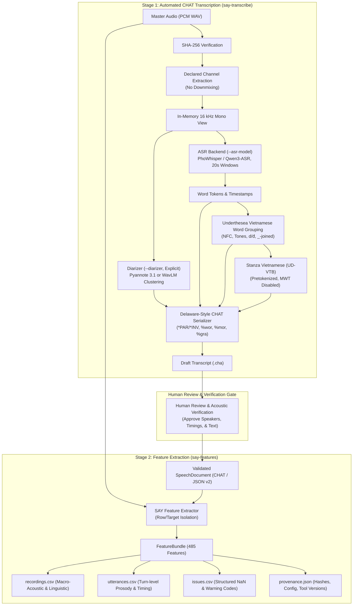

# Speech Analysis for You (SAY)

SAY is a **research/descriptive, Python-first library** for speech and sound
analysis of **reviewed Vietnamese speech data**. It pairs two complementary, baseline-aligned pipelines:

1. **Automated Clinical Transcription (`say_transcribe`):** Transforms master clinical audio into TalkBank Batchalign and DementiaBank Delaware-compliant CHAT (`.cha`) transcripts featuring utterance bullets, word timing (`%wor`), morphological tagging (`%mor`), and grammatical dependency relations (`%gra`). The ASR model (`--asr-model`) and the diarizer (`--diarizer`) are **explicit selections, never silent fallbacks**, and a `benchmark` subcommand scores either one against reference transcripts.
2. **Label-Free Speech Feature Extraction (`speech_features`):** Version 0.2.0 ships a versioned speech document model (JSON v2), a CLAN-compatible CHAT subset (it is **not** a CLAN clone and does not claim full CHAT compatibility), a label-free extraction pipeline, four built-in feature packs (`acoustic`, `adult_neuro`, `motor_neuro`, `standardized_acoustic`) with a generated 485-feature catalog, and the `say-features` command-line interface.

> **Research-only.** SAY is for cohort characterisation and hypothesis
> exploration. It is **not a diagnostic** and not for clinical
> decision-making: it gives **no diagnosis**, is **not a screening tool**,
> defines **no normative range** and **no screening or cutoff score**,
> makes **no treatment recommendation**, and offers **no fixed clinical
> performance**. No trained model is embedded in the core `speech_features` extractor.
> It performs **no ASR, diarization, forced alignment, or automatic morphosyntactic analysis** inside `speech_features`;
> automated tools in `say_transcribe` prepare draft annotations externally, but a **human reviews
> them before SAY consumes them**.

---

## System Architecture & Dual Pipeline Flow


```mermaid
flowchart TD
    subgraph STAGE_1 ["Stage 1: Automated CHAT Transcription (say-transcribe)"]
        WAV["Master Audio (PCM WAV)"] --> SHA["SHA-256 Verification"]
        SHA --> CH["Declared Channel Extraction\n(No Downmixing)"]
        CH --> MEM["In-Memory 16 kHz Mono View"]
        
        MEM --> ASR["ASR Backend (--asr-model)\nPhoWhisper / Qwen3-ASR, 20s Windows"]
        MEM --> DIAR["Diarizer (--diarizer, Explicit)\nPyannote 3.1 or WavLM Clustering"]
        
        ASR --> WORD_TS["Word Tokens & Timestamps"]
        WORD_TS --> GROUP["Underthesea Vietnamese Word Grouping\n(NFC, Tones, d/đ, _-joined)"]
        
        GROUP --> STANZA["Stanza Vietnamese (UD-VTB)\n(Pretokenized, MWT Disabled)"]
        
        DIAR & WORD_TS & GROUP & STANZA --> CHAT_GEN["Delaware-Style CHAT Serializer\n(*PAR/*INV, %wor, %mor, %gra)"]
        CHAT_GEN --> CHA_FILE["Draft Transcript (.cha)"]
    end

    subgraph STAGE_2 ["Human Review & Verification Gate"]
        CHA_FILE --> HUMAN["Human Review & Acoustic Verification\n(Approve Speakers, Timings, & Text)"]
    end

    subgraph STAGE_3 ["Stage 2: Feature Extraction (say-features)"]
        HUMAN --> DOC["Validated SpeechDocument (CHAT / JSON v2)"]
        WAV & DOC --> EXTRACT["SAY Feature Extractor\n(Row/Target Isolation)"]
        
        EXTRACT --> BUNDLE["FeatureBundle (485 Features)"]
        BUNDLE --> REC["recordings.csv (Macro-Acoustic & Linguistic)"]
        BUNDLE --> UTT["utterances.csv (Turn-level Prosody & Timing)"]
        BUNDLE --> ISS["issues.csv (Structured NaN & Warning Codes)"]
        BUNDLE --> PROV["provenance.json (Hashes, Config, Tool Versions)"]
    end
```

---

## Automated Transcription Pipeline (`say_transcribe`)

The `say_transcribe` module automates the generation of Delaware-compliant CHAT transcripts (`.cha`) adhering to upstream TalkBank Batchalign conventions adapted for Vietnamese.

### Models Used

| Pipeline Stage | Model / Toolkit | Authority / Repository | Function & Design Decisions |
|---|---|---|---|
| **ASR & Word Timings** (default) | **PhoWhisper-medium** | [`vinai/phowhisper-medium`](https://huggingface.co/vinai/phowhisper-medium) | 20s-windowed ASR bounded to 400 tokens per chunk. Implements Whisper temperature fallback and a repetition heuristic detector that maps degenerate acoustic loops to `xxx` rather than hallucinated text. Emits word timestamps. |
| **ASR (alternative)** | **PhoWhisper-large** | [`vinai/phowhisper-large`](https://huggingface.co/vinai/phowhisper-large) | Larger PhoWhisper checkpoint; the pinned ASR arm in **both** benchmark tasks so model comparisons hold the rest of the pipeline constant. |
| **ASR (alternative)** | **Qwen3-ASR** | [`Qwen/Qwen3-ASR-1.7B-hf`](https://huggingface.co/Qwen/Qwen3-ASR-1.7B-hf) | Transformers-native multimodal checkpoint selected with `--asr-model qwen3-asr`. Qwen3-ASR has **no Vietnamese forced aligner**, so its segments carry their decode-window span and *null* word timings; run it with `--align wav2vec2-vi` to time the words (96 to 97% of words timed on the pilot sessions). |
| **ASR (alternative)** | **Zipformer-vi** | [`csukuangfj/sherpa-onnx-zipformer-vi-2025-04-20`](https://huggingface.co/csukuangfj/sherpa-onnx-zipformer-vi-2025-04-20) | CPU-only sherpa-onnx model (no VRAM), selected with `--asr-model zipformer-vi`. Findings and the other tested arms: [`FINDINGS-2026-10-04.md`](docs/2026-10-04/vietnamese-cha-quality/1/FINDINGS-2026-10-04.md). |
| **Speaker Diarization** (default) | **Pyannote Audio 3.1** | [`pyannote/speaker-diarization-3.1`](https://huggingface.co/pyannote/speaker-diarization-3.1) | Identifies multi-speaker turns; assigns the speaker cluster with the dominant talk-time to `*PAR` (Participant) and the other to `*INV` (Investigator). Requires a Hugging Face token with accepted model conditions. |
| **Diarization (alternative)** | **WavLM Embedding Clustering** | [`microsoft/wavlm-base-plus-sv`](https://huggingface.co/microsoft/wavlm-base-plus-sv) | Gated-free segment-clipped WavLM embedding clustering, selected explicitly with `--diarizer wavlm`. |
| **Vietnamese Word Grouping** | **Underthesea** | `underthesea>=6.8.0` | Vietnamese compound word tokenization (`_`-joined words, e.g., `bệnh_nhân`). Strict preservation of NFC normalization, tone marks, and $d/đ$. Never groups across utterance boundaries. |
| **Morphosyntax & Dependencies** | **Stanza Vietnamese** | `stanza` (`UD-VTB` treebank) | Pretokenized UPOS tagging, lemma extraction (`%mor`), and dependency parsing (`%gra`) with Multi-Word Token (MWT) expansion disabled to preserve Vietnamese compound words. |
| **Speech Activity Detection** | **Silero VAD** | `silero-vad[onnx-cpu]==6.2.3` | ONNX CPU runtime speech detection used in `say-transcribe compare` to create speech-bounded ASR windows ($\le 20$s). |
| **Forced Alignment** | **Wav2Vec2 Vietnamese CTC** | [`nguyenvulebinh/wav2vec2-base-vi-vlsp2020`](https://huggingface.co/nguyenvulebinh/wav2vec2-base-vi-vlsp2020) | High-resolution forced alignment used in `say-transcribe compare` for syllable and word boundary refinement. |

### Flow of Transcript

1. **Master Audio Verification:** Computes the master WAV's SHA-256 checksum to ensure provenance tracking.
2. **Channel Selection (Anti-Downmixing):** Extracts the declared channel (`--channel N`) directly. Audio is **never** mean-downmixed ($[L+R]/2$) because silent channels would attenuate speech signals.
3. **In-Memory Resampling:** Maps PCM to an in-memory 16 kHz `float32` mono array without writing resampled audio to disk.
4. **ASR Inference (`--asr-model`):** Transcribes non-overlapping 20-second audio windows with the selected backend. Splits utterances on terminal punctuation or silence pauses $> 700$ ms.
5. **Diarization & Role Mapping (`--diarizer`):** Clusters speaker turns with the selected backend. Allocates the dominant talk-time cluster to `*PAR` and the other to `*INV`. The backend is explicit — **a diarization failure is an error, not a silent fallback**; if pyannote cannot run (`PYANNOTE_TOKEN_MISSING`), the CLI exits `3` and tells you to either provide a token or select `--diarizer wavlm`.
6. **Compound Word Grouping:** Underthesea joins Vietnamese syllables into `_`-compounds. Aggregates word start/end timestamps from the first syllable's start to the last syllable's end. Punctuation carries no timestamp.
7. **Universal Dependencies Projection:** Stanza UD-VTB maps words to `%mor` (`pos|lemma[-Feat]`, commas as `cm|cm`) and `%gra` (`index|head|REL`, root as `i|0|ROOT`, final punct attached to root).
8. **CHAT Serialization:** Emits standard headers (`@UTF8`, `@Languages: vie`, `@Participants`, `@ID`, `@Media`, `@Comment`), main tier lines with bullets (`•start_ms_end_ms•`), `%wor`, `%mor`, and `%gra`.
   - **Two-phase mode:** `%mor`/`%gra` describe the *reviewed* text, so `--no-morphosyntax` writes main tiers and `%wor` only (Stanza never loads); after hand-correction, `say-transcribe tag` adds `%mor`/`%gra` to a **new** file. It never overwrites, and `%wor` timings survive the round trip.
9. **Comparison, Benchmarking & Evaluation:**
   - `say-transcribe compare`: Generates baseline, VAD-guided, and CTC-aligned transcripts side-by-side for methodological comparison.
   - `say-transcribe evaluate`: Computes Character Error Rate (CER), Word Error Rate (WER), Syllable Error Rate (SyER), and Diarization Error Rate (DER) with seeded bootstrap confidence intervals. A prediction with untimed utterances is still scored strictly (they contribute no interval); one with no timing at all reports DER as absent (`null`, `der_sessions_scored: 0`) rather than 1.0. Word-level WER counts underthesea compounds as one unit, so it is higher than the `benchmark` WER, which is computed over whitespace tokens and therefore equals SyER.
   - `say-transcribe benchmark --task {asr,diarization}`: Scores ASR models (default `phowhisper-large`, `qwen3-asr`; choose any of the six with `--asr-models`) or diarizers (`pyannote`, `wavlm`) against reference transcripts over a study manifest, writing `benchmark-<task>.json` and `benchmark-<task>.md`. Both diarizers run over one fixed `phowhisper-large` front-end so the numbers isolate the diarization variable. Every row checks the source SHA-256 first, unmapped diarization clusters score as `UNKNOWN` rather than being attributed to `PAR`, and each failure is a stable error code. Each ASR cell records its device and, when pinned, its revision.
   - `say-transcribe preprocess-study`: Runs the opt-in preprocessing A/B study over a private manifest (arms N0 baseline, N1 `vad_asr`, P0 profile, PF/PD denoise) without re-implementing any ASR, VAD, or DSP stage.
   - `say-transcribe ablate --revision <sha>`: Runs six arms (`main`, `compatibility`, `quiet-vad`, `empty-retry`, `silence-cut`, `combined`) that switch the ported VAD boost, empty-retry and silence-snap behaviors on and off individually, scores every arm with the same uncapped spoken-domain metrics and coverage as `evaluate`, and writes `ablation.json` plus `ABLATION.md`. Rates are uncapped because a clamped rate hides the size of a regression. The revision is required — an unpinned arm result is not comparable — and arms that select identical VAD windows reuse one decode, so their runtime is reported as not measured rather than as a second measurement. Promotion is reported only for a strict accuracy gain over `main` with no content, coverage or timing regression; nothing is promoted automatically.

---

## Feature Extraction Pipeline (`speech_features`)

SAY provides a static, label-free extraction pipeline implementing **485 registered features** across four built-in packs.

### Feature Packs Architecture Map

For detailed module layouts, formulas, and feature definitions, consult the maps in each feature directory:

- [**Feature Packs Map**](src/speech_features/features/README.md) — top-level catalog map across all 485 features.
- [**Acoustic Pack Guide**](src/speech_features/features/acoustic/README.md) — **167 features**:
  - Quality (`audio_duration_s`, `audio_dc_offset`, `audio_clipping_ratio`, `audio_rms_dbfs`)
  - Timing (`time_speech_ratio`, `time_pause_rate_per_min`, `time_articulation_rate_syllables_per_s`, `time_words_per_min`)
  - Phonation ($F_0$ statistics, jitter, shimmer, HNR, vocal tremor)
  - Resonance (Formants $F_1$--$F_4$, formant dispersion, bandwidths)
  - Spectrum (Centroid, spread, skewness, kurtosis, roll-off, flux, alpha ratio, Hammarberg index)
  - Rhythm (Pairwise Variability Indices, Varco)
  - Advanced (Cepstral Peak Prominence CPP / CPPS)
- [**Adult-Neuro Linguistic Pack Guide**](src/speech_features/features/linguistic/README.md) — **183 features**:
  - Lexical diversity (TTR, MATTR-20, MTLD, HD-D-42, Brunet's W, Honoré's R, entropy for surface tokens and lemmas)
  - Disfluency (Fillers, fragments, immediate repetitions, revisions, retracings)
  - Morphosyntax (UD UPOS ratios, open-to-closed class ratio, noun-to-verb ratio, parse depth)
  - Task & Discourse (Causal/referential/temporal cohesion, information units, information efficiency per min, examiner prompts, concept scoring)
- [**Motor-Neuro Pack Guide**](src/speech_features/features/motor/README.md) — **47 features**:
  - Articulation (Vowel Space Area VSA, Vowel Articulation Index VAI, Formant Centralization Ratio FCR, VOT, stop gaps, fricative moments)
  - Rhythm (%V, VarcoV, VarcoC, rPVI, nPVI)
  - Diadochokinetic tasks (DDK syllable rates, inter-onset interval IOI regularity/CV, instability, acceleration, decay)
  - Respiration (Breath group counts, durations, pauses per breath, loudness decay)
- [**Standardized Acoustic Pack Guide**](src/speech_features/features/standardized/README.md) — **88 features**:
  - Standardized eGeMAPSv02 functionals via openSMILE adapter with graceful offline fallback.

---

## Source layout

Each package and subpackage carries its own description:

- [`src/say_transcribe/`](src/say_transcribe/README.md) — the automated transcription pipeline (CLI, ASR/diarization backend selection, benchmarks, two-phase tagging).
  - [`src/say_transcribe/workers/`](src/say_transcribe/workers/README.md) — isolated-environment denoise worker scripts and their PCM contract.
- [`src/speech_features/`](src/speech_features/README.md) — the label-free feature extraction library (document model, catalog, extraction pipeline, CLI).
  - [`src/speech_features/features/`](src/speech_features/features/README.md) — [acoustic](src/speech_features/features/acoustic/README.md), [linguistic](src/speech_features/features/linguistic/README.md), [motor](src/speech_features/features/motor/README.md), [standardized](src/speech_features/features/standardized/README.md) packs.
  - [`src/speech_features/formats/`](src/speech_features/formats/README.md) — the JSON v1/v2 and CHAT-subset codecs.
  - [`src/speech_features/legacy/`](src/speech_features/legacy/README.md) — the supported 0.2.x legacy AD namespace (removed in 0.3.0).

(`src/features` is a symlink to `src/speech_features/features`.)

---

## Documentation

- [Documentation index](docs/README.md) — current phase, active pipeline records,
  and links to the built foundation.
- [Feature extraction](docs/2026-08-06/say-vietnamese-speech-library/1/feature-extraction.md) — the label-free pipeline:
  PCM WAV input, target-speaker isolation, `FeatureBundle` tables, issues,
  provenance, pack/level selection, manifest v2, batch behavior, CLI exit
  codes, and all stable error codes.
- [Transcript formats](docs/2026-08-06/say-vietnamese-speech-library/1/transcript-formats.md) — JSON v2 and the CHAT
  subset, Vietnamese token/word grouping, normalization, annotation
  provenance, and the manual/automated transcription workflows.
- [Feature catalog v1](docs/2026-08-06/say-vietnamese-speech-library/1/feature-catalog-v1.md) — every registered feature
  key with unit, level, prerequisites, formula, and missing-data behavior.
- [Neurodegenerative feature guide](docs/2026-08-10/neurodegenerative-speech-feature-expansion/1/neurodegenerative-feature-guide.md) —
  pack/task selection, reviewed annotation layers, evidence scope, and
  Vietnamese validation limits.
- [Migrating to 0.2](docs/2026-08-06/say-vietnamese-speech-library/1/migration-0.2.md) — 0.1-to-0.2 API changes, legacy
  AD imports, the deprecation window, and notebook retirement.
- [Qwen3-ASR & benchmark run](docs/2026-10-01/add-qwen3-asr-github/1/SPEC-2026-10-01.md) — the
  [research](docs/2026-10-01/add-qwen3-asr-github/1/RESEARCH-2026-10-01.md),
  [specification](docs/2026-10-01/add-qwen3-asr-github/1/SPEC-2026-10-01.md),
  [plan](docs/2026-10-01/add-qwen3-asr-github/1/PLAN-2026-10-01.md), and
  [tasks](docs/2026-10-01/add-qwen3-asr-github/1/TASKS-2026-10-01.md) behind the Qwen3-ASR
  backend, the explicit `--diarizer` policy, two-phase tagging, and the benchmark subcommand.

---

## Installation

Requires Python **3.10–3.13**. Core dependencies are NumPy, SciPy, and
pandas. From a source checkout:

```bash
uv venv --python 3.10
source .venv/bin/activate
uv pip install -e ".[dev]"
```

Or install a built wheel:

```bash
uv build --wheel
uv pip install dist/speech_analysis_for_you-0.2.0-py3-none-any.whl
```

The `transcribe` extra installs speech transcription models:

```bash
uv pip install "speech-analysis-for-you[transcribe]"
```

The `standardized_acoustic` pack is optional and keeps openSMILE lazy:

```bash
uv pip install "speech-analysis-for-you[standardized-acoustic]"
```

Without that extra, core imports and extraction still work; selecting the
pack returns `NaN` eGeMAPS columns plus one `MISSING_OPTIONAL_DEPENDENCY`
issue.

---

## Python quick start

### Feature Extraction (`speech_features`)

```python
import speech_features as sf

document = sf.load_document("recording.json")          # JSON v2 (or CHAT)
features = sf.extract(                                 # choose any built-in packs
    "recording.wav",
    document,
    packs=("acoustic", "adult_neuro", "motor_neuro"),
    task_spec={
        "version": 1,
        "task": "picture_desc_1",
        "concept_aliases": {"cat": ["mèo"]},
        "entity_groups": {},
        "action_groups": {},
    },
)
print(features.recordings)                             # recording_id, speaker_id, feature columns
print(features.utterances)                             # + utterance_id, start_s, end_s
print(features.issues)                                 # structured warnings/issues
print(features.provenance)                             # hashes, config, versions

for definition in sf.list_features(pack="acoustic"):
    print(definition.key, definition.unit, definition.level)

for definition in sf.list_features(disorder="als", task="ddk"):
    print(definition.key, definition.evidence_level)
```

### Automated Transcription (`say_transcribe`)

```python
from pathlib import Path
from say_transcribe.asr import transcribe
from say_transcribe.chat_writer import UtteranceRecord, write_chat_file
from say_transcribe.diarize import PyannoteBackend, assign_speakers
from say_transcribe.morphosyntax import StanzaBackend, project_morphosyntax
from say_transcribe.word_grouping import group_utterance_words

audio_path = Path("session_001.wav")
asr_result = transcribe(audio_path, channel_index=0, device="cuda")
turns = PyannoteBackend(device="cuda").diarize(asr_result.audio_16k)
speaker_map = assign_speakers(asr_result.segments, turns)

records = []
stanza = StanzaBackend(device="cuda")
for i, seg in enumerate(asr_result.segments):
    words = group_utterance_words(seg)
    morphosyntax = project_morphosyntax(words, backend=stanza)
    records.append(
        UtteranceRecord(
            speaker=speaker_map.utterance_speakers[i],
            start_ms=seg.start_ms,
            end_ms=seg.end_ms,
            text=seg.text,
            words=words,
            morphosyntax=morphosyntax,
        )
    )

write_chat_file(Path("session_001.cha"), "session_001", asr_result.source_sha256, records)
```

---

## CLI quick start

### `say-features` CLI

```bash
say-features validate transcript.cha                 # validate a document or manifest v2
say-features convert transcript.cha transcript.json # convert between JSON v2 and CHAT (--force to overwrite)
say-features extract manifest.json output/ --task-spec task.json
say-features list-features --domain timing --disorder als
```

The `extract` command writes `recordings.csv`, `utterances.csv`,
`issues.csv`, and `provenance.json` into the output directory. Exit codes:
`0` success or warnings, `1` partial row failures, `2` invalid global
input/configuration.

### `say-transcribe` CLI

```bash
# 1. Inspect environment and model dependencies
say-transcribe diagnose

# 2. Transcribe master WAV on declared channel
say-transcribe run recording.wav --channel 0 --out output/ --device cuda

# 3. Choose the ASR model and diarizer explicitly (defaults: phowhisper-medium, pyannote)
say-transcribe run recording.wav --channel 0 --out output/ --asr-model qwen3-asr
say-transcribe run recording.wav --channel 0 --out output/ --diarizer wavlm

# 3b. Time the words of a word-less ASR (qwen3-asr, zipformer-vi) with Vietnamese CTC alignment,
#     or fit PhoWhisper-large on a 12 GB card with segment timestamps plus alignment
say-transcribe run recording.wav --channel 0 --out output/ --asr-model qwen3-asr --align wav2vec2-vi
say-transcribe run recording.wav --channel 0 --out output/ --asr-model phowhisper-large \
  --timestamps segment --align wav2vec2-vi

# 4. Phase 1 without morphosyntax (Stanza never loads), then tag the reviewed draft
say-transcribe run recording.wav --channel 0 --out draft/ --no-morphosyntax
say-transcribe tag draft/recording.cha --out final/recording.cha

# 5. Compare baseline vs VAD-guided vs CTC-aligned variants
say-transcribe compare recording.wav --channel 0 --out comparison/ \
  --expected-sha256 <64-hex-digest> --device cuda

# 6. Evaluate generated transcripts against gold annotations
say-transcribe evaluate gold_transcripts/ pred_transcripts/ --out eval_report.json

# 7. Benchmark ASR models or diarization backends over a study manifest
say-transcribe benchmark --task asr --manifest manifest.json --out reports/
say-transcribe benchmark --task asr --manifest manifest.json --out reports/ \
  --asr-models qwen3-asr,zipformer-vi,phowhisper-large   # any of the six ASR arms
```

`say-transcribe` exit codes: `0` success, `2` usage error, `3` environment/model
unavailable (for example `PYANNOTE_TOKEN_MISSING`), `4` pipeline failure.

---

## Outputs

Every extraction returns a `FeatureBundle` with three pandas tables and
JSON-serializable provenance:

- `recordings` — `recording_id`, `speaker_id`, then stable feature columns.
- `utterances` — the same identifiers plus `utterance_id`, `start_s`, `end_s`.
- `issues` — `recording_id`, `speaker_id`, `utterance_id`, `feature`, `code`,
  `severity`, `message`; unavailable values are `NaN` plus an issue, never a
  fabricated zero.
- `provenance` — input SHA-256 hashes, configuration, package/catalog
  versions, target speakers, and annotation sources.

---

## Architecture and extension boundary

- `load_document`/`save_document` — versioned document model
  (`SpeechDocument`, JSON v2 native; JSON v1 migrated deterministically;
  CHAT subset read/write).
- `extract`/`extract_batch` — label-free pipeline over manifest v2, with
  row/target isolation and provenance.
- `list_features` — catalog queries over static built-in pack registration.
- `PACKS` is a **static** built-in mapping in 0.2; a future built-in pack
  (for example a child pack) requires an intentional source change and validation —
  no dynamic registry or entry-point discovery (see the
  [catalog](docs/2026-08-06/say-vietnamese-speech-library/1/feature-catalog-v1.md) for the minimal example).
- Legacy AD evaluation and task scorers remain available through
  `speech_features.legacy.ad` with a `DeprecationWarning`; see
  [migration-0.2](docs/2026-08-06/say-vietnamese-speech-library/1/migration-0.2.md).

---

## Transcript automation and validation boundary

SAY provides automated transcription via `say_transcribe` as a draft companion pipeline. Automated transcription remains strictly segregated from the core feature extractor:

- **Validation:** Automated transcription models must be evaluated against held-out human ground truth transcripts using character and word error rates (CER, WER, SyER), plus diarization error rate (DER) and timestamp accuracy.
- **Human Review:** Transcripts produced by automated transcription are drafts; human review and verification are strictly required before SAY consumes the transcript for clinical feature extraction.
- **Annotation Provenance:** All transcripts must record audio SHA-256 and annotation provenance.
- **Future Companion Extensions:** Future pipeline enhancements continue to preserve the boundary between automated transcription drafts and verified ground truth feature extraction.

---

## Development

```bash
uv run pytest tests/speech_features
uv run pytest tests/say_transcribe
uv run ruff check src tests
uv run ruff format --check src/speech_features tests/speech_features
```

`vibe-checks.yaml` declares the same checks as a plan: an offline `unit` run
(`HF_HUB_OFFLINE=1 TRANSFORMERS_OFFLINE=1 pytest tests`), an offline `e2e` run
over the CLI and CHAT serialization tests, and the `lint` run. The pull-request
gates `pr_open`, `ci`, `reviews`, and `main_ci` are read from the GitHub REST
API by [`tools/ci_api_check.py`](tools/ci_api_check.py) — not from logs — and
report facts as exit codes (`0` established, `1` not established, `2` stable
error code).

Tests run **offline**: no model downloads, no GPU, and no network.

---

## License

MIT — see the [LICENSE](LICENSE) file.
