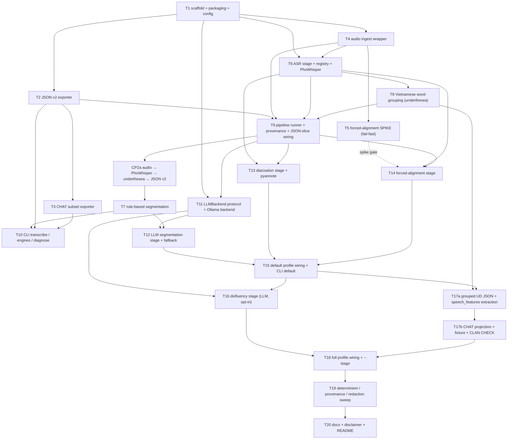

# Implementation Plan: `say_transcribe` — local-only Vietnamese speech→transcript pipeline

**Slug:** `vietnamese-transcription-pipeline` · **Date:** 2026-09-02 · **Version:** 2
**Inputs:** [`SPEC-2026-09-02.md`](./SPEC-2026-09-02.md), [`RESEARCH-2026-09-02.md`](./RESEARCH-2026-09-02.md)
**Artifacts:** [`TASKS-2026-09-02.md`](./TASKS-2026-09-02.md) · [`tasks-2026-09-02.json`](./tasks-2026-09-02.json)

## Overview

`speech_features` (SAY) is deliberately a feature-extraction library only: it consumes
**human-reviewed** Vietnamese transcripts (JSON v2 / CHAT subset) and performs no ASR,
diarization, or forced alignment. Producing those transcripts by hand is the bottleneck.
This plan builds `say_transcribe`, a companion package in the same repo that adapts
batchalign2's *design* (in-memory document, ordered processing stages, CHAT output) to
turn a Vietnamese speech recording into a **draft** transcript for human review, which is
then fed to `say-features`. The pipeline is local-only, deterministic by default, and
ships heavy ML dependencies in an optional extra so the SAY core stays
NumPy/SciPy/pandas-only.

The work is 21 vertically-sliced tasks across six phases. The first useful slice
is `audio → PhoWhisper → underthesea → JSON v2 → say-features validate`;
rule-based segmentation follows instead of hiding that path inside the larger
`lite` milestone. The **forced-alignment spike (T5)** remains an early fail-fast
gate because research §F5 flags Vietnamese forced alignment as fragile.

## Architecture Decisions

1. **New package, isolated dependencies.** `src/say_transcribe/`, console script
   `say-transcribe`. Heavy deps (`torch`, `transformers`, `faster-whisper`,
   `pyannote.audio`, `underthesea`, `soundfile`) live in a `transcribe` optional-dependency
   group; `stanza` in `transcribe-morphosyntax`. `speech_features` core keeps only
   NumPy/SciPy/pandas and its **754 tests must still pass** without the extra. `pyproject.toml`
   `[tool.setuptools.packages.find] include` gains `say_transcribe*`.
2. **Integration only through files.** `say_transcribe` emits JSON v2 / CHAT that
   `speech_features.document.validate_document` and `load_document` accept unchanged. The
   only code reuse across the boundary is `say_transcribe` calling
   `speech_features.audio.read_wav`. Exporters are tested *against the real SAY loaders*,
   not a mock.
3. **A working model mutated by stages.** `model.py` frozen dataclasses
   `Recording → Segment → Token`, converted once at export. Mirrors batchalign2's
   stage-mutated document; drops Pydantic (SAY uses dataclasses).
4. **Static registries.** `ENGINES` (ASR + LLM backends) and the per-profile stage lists
   are plain `MappingProxyType` — no entry-point / plugin discovery (mirrors SAY's static
   `PACKS`).
5. **Skip-and-issue, never fabricate.** Any stage that cannot run appends a
   `TranscribeIssue` with a stable code and the pipeline continues. Output is always a
   *draft*: every annotation `source` is `"<engine>@<model>@<version>"`, never `human`; the
   CLI never chains into `say-features extract`.
6. **Local-only, deterministic.** No network egress in v1 (no cloud STT, no hosted LLM, no
   telemetry). Fixed seed / `temperature 0` / fixed `num_ctx`. `provenance.json` records
   input SHA-256, resolved config, engine + model + prompt-template versions, ordered stage
   list, and per-stage wall-clock — never audio samples, transcript text, or secrets.
7. **Protocols in front of every model.** `ASREngine`, `LLMBackend`, `DiarizerBackend`,
   `WordSegmenter`, `Aligner`, `Parser`. Unit tests inject fakes and do **no** network I/O
   and **no** model downloads. Real-model tests are `@pytest.mark.integration`, skipped by
   default, opt-in with `-m integration`.
8. **Profiles (SPEC §12 Q1).** `lite` = `asr → segment → wordgroup`;
   **`default`** = `+ diarize + align` (the usual run — SAY's acoustic/timing packs need
   aligned, speaker-attributed intervals); `full` = `+ disfluency + morphosyntax`.
   Morphosyntax is always opt-in and needs the `transcribe-morphosyntax` extra.
9. **Resolved tool choices (SPEC §12 / research §8).** Default ASR = **PhoWhisper**
   small/medium (`faster-whisper` = low-VRAM fallback). Word segmenter = **`underthesea`**.
   LLM backend = **Ollama** over `localhost` via stdlib `urllib` (no new Python dep), with a
   deterministic rule-based fallback. Reference LLM = **`Qwen2.5-7B-Instruct`**. Forced
   alignment primary = `nguyenvulebinh/wav2vec2-base-vi-vlsp2020` CTC + `torchaudio` FA API,
   fallback `ctc-forced-aligner`. Diarization = `pyannote/speaker-diarization-3.1` (HF token
   for one-time download only).
10. **Resolved follow-up boundaries (research §9).** JSON v2 is authoritative
    for UD-VTB morphosyntax; CHAT `%mor` / `%gra` requires a T17 CLAN fixture and
    may be omitted as a pair. `say_transcribe` does not generate task specs.
    Canonical pipeline records are tracked through a narrow `.gitignore`
    allow-list; unrelated docs remain local.
11. **Out of v1 scope.** Batch/manifest input (one recording per invocation), cloud
    engines, diacritic/tone restoration, re-running on an already-reviewed transcript,
    ELAN/Praat exporters.

## Dependency graph



Diagram verification: Mermaid docs checked (https://mermaid.js.org/intro/,
https://mermaid.js.org/syntax/flowchart.html). UNVERIFIED: render not checked — no Mermaid
renderer in this environment (`mmdc` / python `mermaid` absent; per diagram-authoring §8,
not installing one without approval). Kept to plain `flowchart TD`, `-->`, one `-. text .->`
edge, no styling.

## Phases and checkpoints

| Phase | Tasks | Checkpoint |
|---|---|---|
| 0 — Contract | T1–T3 | **CP1:** exporters validate against real `speech_features` loaders; core 754 tests still green; `ruff` clean |
| 0.5 — Risk spike | T4–T5 | **CP1.5 (human gate):** review `SPIKE-forced-alignment.md`; record the `align` posture decision (default-on / opt-in / degrade-to-ASR-timings) in this file |
| 1a — First vertical slice | T6, T8–T9 | **CP2a — JSON slice:** `audio → PhoWhisper → underthesea → JSON v2 → say-features validate` exit 0 through the Python API (fakes + opt-in real PhoWhisper) |
| 1b — `lite` profile | T7, T10 | **CP2 — `lite` milestone:** add rule segmentation and CLI; `wav → say-transcribe --profile lite → say-features validate` exit 0; unit suite green |
| 2 — LLM path | T11–T12 | **CP3:** LLM segmentation and the rule fallback both produce validating output |
| 3 — `default` | T13–T15 | **CP4 — `default` milestone (primary deliverable):** speaker turns + aligned (or explicitly degraded) times + `word_id` groups; `say-features validate` exit 0 on `.json` and `.cha` |
| 4 — `full` | T16–T18 | **CP5 — `full` milestone:** SPEC §11 success criteria 1–11 each map to a passing test; T17a keeps JSON annotations representative-only and T17b gates CHAT projection |
| 5 — Harden | T19–T20 | **CP6:** determinism/redaction sweep green; docs + disclaimer done; `pytest` + `ruff check src tests` + `git diff --check` clean; ready for human review |

A reviewer can stop after **CP2** (quick-draft tool), **CP4** (the useful milestone), or
**CP5** (full spec scope).

### CP1.5 decision record

*(filled in after T5)* — forced-alignment posture for T14: **TBD** · rationale: **TBD** ·
reference: `SPIKE-forced-alignment.md`.

## Task list

Tick a box here when that task's status reaches `done` in both `TASKS-2026-09-02.md` and `tasks-2026-09-02.json`.

### Phase 0: Contract
- [ ] T1: Package scaffold, packaging wiring, config + profiles
- [ ] T2: Working model + JSON v2 exporter
- [ ] T3: CHAT subset exporter
- [ ] **CP1**

### Phase 0.5: Risk spike
- [ ] T4: Audio ingest wrapper
- [ ] T5: Forced-alignment spike (timeboxed)
- [ ] **CP1.5 — spike gate (human)**

### Phase 1: `lite` slice
- [ ] T6: ASR stage + engine registry + PhoWhisper engine
- [ ] T7: Rule-based segmentation stage
- [ ] T8: Vietnamese word-grouping stage (underthesea)
- [ ] T9: Pipeline runner + provenance + `lite` wiring
- [ ] T10: CLI `transcribe` / `engines` / `diagnose`
- [ ] **CP2 — `lite` milestone**

### Phase 2: LLM path
- [ ] T11: `LLMBackend` protocol + Ollama backend
- [ ] T12: LLM segmentation stage + rule fallback
- [ ] **CP3**

### Phase 3: `default` profile
- [ ] T13: Diarization stage + `DiarizerBackend` + pyannote
- [ ] T14: Forced-alignment stage
- [ ] T15: `default` profile wiring + CLI default
- [ ] **CP4 — `default` milestone (primary deliverable)**

### Phase 4: `full` profile
- [ ] T16: Disfluency stage (LLM, opt-in)
- [ ] T17a: Grouped UD morphosyntax JSON + `speech_features` compatibility
- [ ] T17b: Conditional CHAT morphosyntax projection
- [ ] T18: `full` profile wiring + `--stage` override
- [ ] **CP5 — `full` milestone**

### Phase 5: Harden
- [ ] T19: Determinism / provenance / redaction test sweep
- [ ] T20: Package docs + research-only disclaimer + README
- [ ] **CP6 — ready for review**

## Risks and Mitigations

| Risk | Impact | Mitigation |
|------|--------|------------|
| Vietnamese forced alignment does not reach usable accuracy (research §F5) | High | **T5 spike before any `align` code.** Fallbacks: `ctc-forced-aligner` (MMS), then degrade to ASR timings + `FORCED_ALIGNMENT_UNAVAILABLE`. `default` completes without `align`. CP1.5 is a human gate. |
| `underthesea` install weight / native `underthesea_core` wheel on the target platform | Med | Isolated in the `transcribe` extra; `WordSegmenter` protocol lets `pyvi` or a stub slot in; unit tests use a fake segmenter. |
| pyannote needs an HF token + licence acceptance | Med | Token used for one-time **download** only; documented; `DiarizerBackend` protocol + `sherpa-onnx` noted as token-free alt; import failure → single-speaker fallback + issue. |
| Ollama not installed / not running | Med | Rule-based segmentation fallback (T7) keeps `lite`/`default` working; `LLM_BACKEND_UNAVAILABLE` issue; `diagnose` reports availability. |
| Heavy deps leak into `speech_features` core release | High | T1 acceptance re-runs the 754 core tests with only core deps; `python -c "import speech_features"` in a core-only env. |
| Non-deterministic model output breaks the byte-identical guarantee | Med | `seed` + `temp 0` + `num_ctx`; record model digest + params in provenance; SPEC §A10 states cross-host bit-reproducibility is not promised; T19 asserts determinism with **fakes**, not real models. |
| Secrets (HF token, endpoint URL) or transcript text land in logs/provenance | High | Observable redaction acceptance criteria on T6/T9/T10/T11/T13; T19 sweep asserts provenance + `diagnose` carry no token/transcript substrings. |

## Resolved follow-ups

Q8–Q10 are closed and do not block the first slice.

- **Q8** JSON uses UD-VTB; CHAT is a conditional, lossy projection implemented
  by T17a/T17b with grouped-word, escaping, fixture, and CLAN CHECK gates.
  projection.
- **Q9** Keep task specs researcher-authored; use explicit `--single-speaker`
  when diarization is bypassed. No generated stub.
- **Q10** Track the canonical pipeline records through the narrow `.gitignore`
  allow-list, including `USAGE.md` and `SPIKE-*.md`.

## End-to-end verification (once T1–T15 land)

```bash
# core untouched
python -c "import speech_features"                         # only numpy/scipy/pandas installed
pytest tests/speech_features -q                            # 754 pass

# new package
uv pip install -e ".[dev,transcribe]"
pytest tests/say_transcribe -q                             # unit: fakes only, no network
ruff check src/say_transcribe tests/say_transcribe

# real end-to-end (opt-in)
pytest tests/say_transcribe -q -m integration              # PhoWhisper-small on a checked-in VN clip
say-transcribe transcribe tests/say_transcribe/data/sample_vi.wav /tmp/out/ --profile default --format both
say-features validate /tmp/out/sample_vi.json              # exit 0
say-features validate /tmp/out/sample_vi.cha               # exit 0, no UNSUPPORTED_CHAT_TIER on known data
python - <<'PY'                                            # provenance carries no content/secrets
import json; p = json.load(open("/tmp/out/provenance.json"))
blob = json.dumps(p).lower()
assert "sha256" in json.dumps(p) and "token" not in blob and "hf_" not in blob
PY
```

**Status:** plan approved 2026-09-02. `TASKS-2026-09-02.md` and `tasks-2026-09-02.json` capture the
implementation order. The first slice is T6 + T8 + T9; the forced-alignment
spike remains a separate checkpoint before T14.
