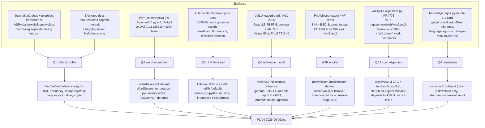
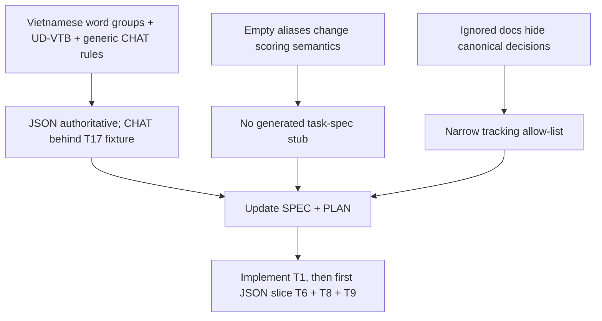

# Research digest — Vietnamese transcription pipeline: resolving SPEC §12 Q1–Q10

**Date:** 2026-09-02 · **Slug:** `vietnamese-transcription-pipeline` · **Feeds:** `docs/2026-09-02/vietnamese-transcription-pipeline/1/SPEC-2026-09-02.md` → PLAN
**Scope:** local-only, offline; adapt batchalign2's design; output SAY JSON v2 / CHAT for `speech_features`.
**Applicability target:** resolve Q1–Q10, including the follow-up decisions for Vietnamese CHAT morphosyntax, task-spec ownership, and repository tracking.

---

## 1. Scoped question breakdown

| # | Question | Sub-questions the evidence must answer |
|---|---|---|
| **Q1** | Default run profile: minimal (`asr+segment+wordgroup`) vs. full? | What does batchalign2's own `transcribe` run by default? What do SAY's downstream features actually require (aligned intervals? speaker turns?)? What is cheap vs. expensive to run for Vietnamese? |
| **Q2** | Word segmenter default: `underthesea` vs. `pyvi` (vs. deferred VnCoreNLP)? | Segmentation accuracy on the Vietnamese treebank; dependency weight; maintenance status; license; Python-version fit; does it also give POS (helps morphosyntax)? |
| **Q3** | Local-LLM backend default: Ollama HTTP vs. in-process `transformers`? | Schema-constrained JSON decoding support; determinism controls (seed/temp); new dependency cost; is it still "local-only"; operational friction? |
| **Q4** | Reference Vietnamese instruct model for the LLM stages (segment / disfluency / speaker cleanup)? | Vietnamese instruction-following quality (VMLU or similar); is a *Vietnamese-specific* model actually better than a strong multilingual one for this task type; availability on the chosen backend; license; size/RAM? |
| Q5 (adj.) | Forced-alignment backend for Vietnamese | Is there a validated Vietnamese CTC alignment model? Diacritic handling? Known failure reports? |
| Q6 (adj.) | Diarization backend | Token-gated? Offline? Language-agnostic? Token-free alternative? |
| Q7 (adj.) | Is a diacritic/tone-restoration stage needed? | Do the recommended ASR engines emit fully toned Vietnamese? |

---

## 2. Findings with citations

### F1 — batchalign2's default `transcribe` is *more* than "minimal": ASR + diarization + disfluency + word alignment (not morphosyntax)

The batchalign2 docs state that `transcribe` "performs ASR on the audio, diarizes utterances, identifies some basic conversational features like retracing and filled pauses, and generates word-level alignments." Morphosyntax is a **separate** `morphotag` command backed by Stanza. [TalkBank/batchalign2 README; talkbank.org BA2-usage.pdf]

batchalign2 `0.7.19` (2025-07-13) depends on `torch>=2.7`, `torchaudio>=2.7`, `transformers>=4.38.2`, `stanza[transformers]>=1.10.1`, `pyannote.audio>=3.4.0`, `openai-whisper`, `rev_ai>=2.18.0`, `pydantic>=2.4`, plus `praatio`, `praat-parselmouth`, `click`, `rich`, `nltk`, `numba`, `sentencepiece`, `onnxruntime`, `pycantonese`, `googletrans`. Requires Python ≥3.11. [pypi.org/pypi/batchalign/json]

- **Implication for Q1:** batchalign's own "transcribe" default already includes diarization and alignment. Its precedent argues the pipeline default should produce a *time-aligned, speaker-attributed, review-ready* transcript — not just raw ASR text. Morphosyntax being a separate command supports keeping it opt-in.
- **Implication for stack (SPEC §3):** batchalign's ISO code for Vietnamese is `vie` and it takes a `--lang` flag; no Vietnamese-specific handling is documented anywhere in its README. Our Vietnamese-specific value (word segmentation, LLM segmentation, Vietnamese alignment model) is genuinely additive, not a re-tread.

### F2 — SAY's downstream features need aligned intervals and speaker turns, or they emit `NaN` + an issue

From the SAY docs already in this repo: acoustic features "analyze only the target speaker's aligned intervals"; utterance-level rows carry `start_s`/`end_s`; unavailable values become `NaN` + a structured issue, "never a fabricated zero." The CHAT subset carries `%xaud` media bullets with "utterance or word time pairs." [`docs/built-features/transcript-formats.md`, `docs/built-features/feature-extraction.md`, `docs/built-features/neurodegenerative-feature-guide.md` in this repo]

- **Implication for Q1:** a transcript with only ASR-guessed timings and no speaker separation yields degraded acoustic + timing features. Diarization + forced alignment are not "nice to have" for the SAY use case; they are what makes the transcript useful beyond the lexical packs.

### F3 — Vietnamese ASR: a Vietnamese-specific Whisper fine-tune (PhoWhisper) clearly beats generic multilingual Whisper and wav2vec2 baselines

PhoWhisper (VinAI, ICLR 2024 Tiny Papers; arXiv 2406.02555) is fine-tuned from multilingual Whisper on an **844-hour** Vietnamese set (CMV‑Vi/Common Voice, VIVOS, VLSP 2020, plus a private 26,000‑speaker/63‑province corpus). WER (%), lower is better:

| Model | Params | CMV‑Vi | VIVOS | VLSP‑2020 T1 | VLSP‑2020 T2 |
|---|---|---|---|---|---|
| PhoWhisper‑tiny | 39M | 19.05 | 10.41 | 20.74 | 49.85 |
| PhoWhisper‑base | 74M | 16.19 | 8.46 | 19.70 | 43.01 |
| PhoWhisper‑small | 244M | 11.08 | 6.33 | 15.93 | 32.96 |
| PhoWhisper‑medium | 769M | 8.27 | 4.97 | 14.12 | 26.85 |
| PhoWhisper‑large | 1.55B | 8.14 | 4.67 | 13.75 | 26.68 |

The paper reports PhoWhisper‑small/medium/large "outperform all the wav2vec2-based baselines," with PhoWhisper‑large setting "a new state-of-the-art WER score on each benchmark dataset," and PhoWhisper‑Small improving over Whisper‑Small / PhoWhisper‑Large improving over Whisper‑Large‑v3. Model licence: **BSD‑3‑Clause**; base = multilingual Whisper; language = Vietnamese; models on HF as `vinai/PhoWhisper-{tiny,base,small,medium,large}`. [arXiv 2406.02555; themoonlight.io review of same; huggingface.co/vinai/PhoWhisper-medium]

- PhoWhisper is trained on toned Vietnamese transcripts → **outputs full diacritics/tone marks** (bears on Q7).

### F4 — Vietnamese word segmentation: `underthesea` is maintained, light, Apache-2.0, Python ≥3.10; `pyvi` is unmaintained since 2021 and pulls scikit-learn

| Tool | Latest | Licence | `requires_python` | Runtime deps for word segmentation | Maintenance |
|---|---|---|---|---|---|
| **underthesea** | 9.5.0 | Apache‑2.0 | **>=3.10** | `click`, `tqdm`, `requests`, `joblib`, `PyYAML`, `underthesea_core` (Rust ext), `huggingface-hub`. `torch`/`transformers` only in the optional `deep` extra — **not needed** for `word_tokenize`. | Active (v9.x, 2025) |
| **pyvi** | 0.1.1 | MIT | none declared | `scikit-learn`, `sklearn-crfsuite` | **Last release 2021-06-30** |
| VnCoreNLP (RDRsegmenter) | — | — | JVM required | Java toolkit | Stable but Java |

Accuracy on the Vietnamese treebank (VLSP 2013 / benchmark corpora), segmentation F1: RDRsegmenter/VnCoreNLP **97.90%**; UETSegmenter 98.82%; hybrid VnCoreNLP+BPE 98.1%; NlpHUST segmenter 98.3%. One sentiment-classification study found "RDRsegmenter … the most stable toolkit … among the uitnlp, pyvi, and underthesea toolkits." Head-to-head F1 for `pyvi` vs `underthesea` on one identical benchmark was **not** found in a single source; both are widely cited in the high‑90s F1 range and are CRF-based. [undertheseanlp/NLP-Vietnamese-progress; VnCoreNLP arXiv 1801.01331; arXiv 2301.00418 "Is word segmentation necessary…"; pypi.org/pypi/underthesea/json; pypi.org/pypi/pyvi/json]

- `underthesea` also provides `pos_tag` and `dependency_parse` from the same install — useful redundancy for the optional morphosyntax stage.

### F5 — Vietnamese forced alignment: whisperX now ships a Vietnamese entry, but Vietnamese alignment is reported as fragile

whisperX `main` maps `"vi"` → **`nguyenvulebinh/wav2vec2-base-vi-vlsp2020`** in `DEFAULT_ALIGN_MODELS_HF` (added via PR #776 by `nguyenvulebinh`, the model's author; merged **2025‑10‑03**). Vietnamese is one of ~38 languages with a default alignment model. [github.com/m-bain/whisperX `whisperx/alignment.py`; whisperX PR #776]

Caveats from the same thread: the generic pretrained `wav2vec2-base-vietnamese` "won't work with alignment tasks" (needs a **fine-tuned CTC ASR** head, not a bare pretrained model), and a later commenter reported the recommended fine-tuned model "still doesn't work with alignment tasks" — i.e. non-trivial integration friction. No diacritic-handling or alignment-accuracy numbers were given. [whisperX PR #776 discussion; whisperX issue #834]

- torchaudio's own multilingual `MMS_FA` head has **no Vietnamese-specific model**; it relies on romanization (`uroman`), which strips tone marks for the acoustic match while token→time mapping is preserved.

### F6 — Diarization (`pyannote.audio`) is language-agnostic but gated for model *download*; token-free offline alternatives exist

batchalign2 depends on `pyannote.audio>=3.4.0` and simply documents the Hugging Face token / licence-acceptance step. `pyannote/speaker-diarization-3.1` requires accepting user conditions and an HF token to **download** the weights; inference is then fully offline and language-independent. Token-free fully-offline options: `sherpa-onnx` speaker diarization (Apache‑2.0, ONNX segmentation + embedding models, no HF token) and NVIDIA NeMo diarization. [pypi.org/pypi/batchalign/json; sherpa-onnx docs]

### F7 — Local LLM serving: Ollama gives schema-constrained JSON + seed/temperature determinism with zero new Python deps

Ollama's `format` parameter accepts a full **JSON Schema object**; it then "activates grammar-constrained decoding … the token sampler is restricted to tokens that can legally continue a valid JSON document." Recommended determinism knobs: `temperature: 0`, and `options.seed` is a supported key (alongside `num_ctx`, `top_k`, `top_p`, `repeat_penalty`, …). llama.cpp-based reproducibility wants a **fixed `seed` + `temperature 0` + fixed `num_ctx`**. Ollama speaks an OpenAI-compatible `/v1` API too. Known issue: residual nondeterminism reports even with seed+temp (ollama/ollama#5321). [docs.ollama.com/capabilities/structured-outputs; ollama.com/blog/structured-outputs; tspi.at Ollama params; ollama/ollama#5321]

- Ollama runs as a `localhost:11434` daemon → **"local-only" is preserved**; nothing leaves the machine. It is installed out-of-band (not via pip), so it is an *operational* dependency, not a Python one. `urllib.request` is enough to call it.
- In-process alternatives: `llama-cpp-python` (GGUF, GBNF grammars, no daemon) and `transformers` (already a dep for PhoWhisper/wav2vec2, but slow on CPU and needs `outlines`/`lm-format-enforcer` bolted on for schema constraints).

### F8 — Reference instruct model: for instruction/JSON tasks, a strong *multilingual* model beats the Vietnamese-*specific* small LLMs; PhoGPT is weak here

VMLU (Vietnamese Multitask Language Understanding; Zalo AI × JAIST; ACL 2025) leaderboard, average score, open-weight models under ~15B:

| Model | VMLU avg | Notes |
|---|---|---|
| **gemma-2-9b-it** | **59.04** | Google, permissive Gemma licence, 9B |
| **Qwen2.5-7B-Instruct** | **57.51** | Apache-2.0, 7B, ubiquitous on Ollama, 128K ctx |
| BloomVN-8B-chat | 56.56 | VN fine-tune |
| Ml4uLLM-7B-Chat | 52.08 | VN fine-tune |
| Vistral-7B-Chat | 50.07 | VN-tuned Mistral-7B |
| SeaLLM-7b-v2 | 45.79 | SEA-focused (v3 newer, not on this cut) |
| **PhoGPT-7B5-Instruct** | **24.01** | Vietnamese-specific — near the bottom |
| gemma-7b-it | 41.90 | |
| Llama-2-7b-hf | 22.95 | |

[vmlu.ai/leaderboard; aclanthology.org/2025.acl-long.563]

- Sailor2 (Sea AI Lab, arXiv 2502.12982) is explicitly SEA-inclusive and benchmarks its Vietnamese against Qwen2.5 baselines; the 20B "comparable or superior … vs Qwen2.5-32B / Gemma2-27B" for SEA languages. SeaLLMs-v3-7B is the current SEA-specialist 7B but a directly comparable VMLU number wasn't retrieved. [sea-sailor.github.io/blog/sailor2; huggingface.co/SeaLLMs/SeaLLMs-v3-7B]
- **Contrast with ASR:** for *ASR*, Vietnamese-specific (PhoWhisper) decisively wins (F3). For *instruction-following + JSON*, Vietnamese-specific small LLMs (PhoGPT) do **not** win — general capability and format-adherence dominate, and Vietnamese *comprehension* at 7B is adequate in the top multilingual models.

---

## 3. Conflicts across sources

| Topic | Source A | Source B | Resolution |
|---|---|---|---|
| Vietnamese forced alignment "just works" | whisperX ships `vi` → `nguyenvulebinh/wav2vec2-base-vi-vlsp2020` as a default (PR #776 merged) | Thread commenters: recommended model "still doesn't work with alignment tasks"; bare pretrained wav2vec2 unusable for alignment | Treat Vietnamese FA as **available but requiring a validation spike**. A fine-tuned CTC head is mandatory; budget integration time; keep `ctc-forced-aligner` (MMS) as fallback. |
| "Best" Vietnamese word segmenter | VnCoreNLP/RDRsegmenter cited as most stable / 97.9% F1 | UETSegmenter 98.82%, NlpHUST 98.3% score higher | Accuracy differences are ~1 F1 point and benchmark-dependent; **maintenance + dependency weight + Python fit** are the deciding factors here, not the last F1 point. |
| Vietnamese-specific model is better | PhoWhisper (ASR) strongly better than multilingual Whisper | PhoGPT (LLM) far *worse* than multilingual Qwen2.5/Gemma2 on VMLU | Not a real conflict: the pattern is task-type-dependent. Adopt Vietnamese-specific for **ASR**, multilingual for the **LLM** stages. |
| Ollama determinism | Docs: temp 0 (+ seed key exists) → deterministic | ollama/ollama#5321: users see nondeterminism despite seed+temp | Set `seed` + `temperature 0` + fixed `num_ctx`; **record the model digest + params in provenance** and document that byte-exact reproducibility across hosts/GPUs is not guaranteed (SPEC §A10 already anticipates this). |
| Ollama recommendation for LLM VN model | siliconflow guide pushes Qwen3-8B / Llama-3.1-8B (no benchmarks) | VMLU leaderboard (measured) puts Qwen2.5-7B-Instruct / gemma-2-9b-it on top of sub-15B | Prefer the **measured VMLU ranking** over the vendor-style guide. Qwen3-8B is plausible but unverified on VMLU in retrieved sources. |

---

## 4. Applicability (MUST) — source → this pipeline

| Source | Verdict | How it applies |
|---|---|---|
| batchalign2 README / BA2-usage.pdf (default `transcribe` = ASR+diarize+disfluency+align; `morphotag` separate) | **Reuse (design)** | Adopt the same default *scope*: produce a time-aligned, speaker-attributed transcript; keep morphosyntax a separate opt-in. Answers **Q1**. |
| batchalign `pyproject` deps (`pydantic`, `torch`, `stanza`, `pyannote`, `praatio`, `googletrans`, `pycantonese`, `rich`, …) | **Reject (mostly) / Reuse (subset)** | Confirms which heavy deps are unavoidable (`torch`/`torchaudio`/`transformers`/`pyannote`/`stanza`). Reject `googletrans` (network), `pycantonese`, `praat-parselmouth`, `rich`/`rich-click`, `pydantic` (SPEC uses dataclasses). Keeps SPEC §3's extras list honest. |
| PhoWhisper paper + HF cards (BSD-3, 844h, toned output, SOTA WER) | **Reuse** | `phowhisper` is the recommended default ASR engine; `small`/`medium` are the practical picks (WER 6–11 vs `large` 4–8 at 2× cost). Feeds SPEC §3 engine list and **Q7** (toned output ⇒ no restoration stage needed). |
| Original multilingual Whisper (`faster-whisper`) | **Reuse (secondary)** | Keep as a portable/low-VRAM fallback engine, not the default; PhoWhisper wins on Vietnamese WER. Minor revision to SPEC §3 (PhoWhisper becomes default). |
| `underthesea` (Apache-2.0, py≥3.10, light core, active, +POS/dep) | **Reuse** | v1 default word segmenter. Answers **Q2**. Python floor matches SAY exactly. |
| `pyvi` (MIT, unmaintained since 2021, pulls scikit-learn) | **Reject (as default)** | Not worth a 4-year-stale dep + scikit-learn for ~equal accuracy. Optionally keep behind `WordSegmenter` protocol for users who want it; do not depend on it. |
| VnCoreNLP / RDRsegmenter (97.9% F1, Java) | **Gap / defer** | Best-cited accuracy but needs a JVM — violates the "no heavyweight runtime" posture. Keep as a documented future backend. |
| whisperX `alignment.py` + PR #776 (`vi` → `nguyenvulebinh/wav2vec2-base-vi-vlsp2020`) | **Reuse (pattern) + Gap (robustness)** | Mirror whisperX's approach: Vietnamese wav2vec2 **CTC** model + torchaudio forced-alignment API. Answers **Q5** direction; flags a required spike (F5 conflict). |
| `ctc-forced-aligner` (MMS mms-300m multilingual) | **Reuse (fallback)** | Second FA backend if the wav2vec2-vi head misbehaves on diacritics. |
| `pyannote.audio` 3.1 (gated download, offline inference, language-agnostic) | **Reuse** | Default diarizer; document the one-time HF token for *download only*. Answers **Q6** direction. |
| `sherpa-onnx` diarization (Apache-2.0, no token, offline) | **Reuse (alternative)** | Token-free `DiarizerBackend` for users who can't/won't use an HF token. |
| Ollama structured-outputs docs + params | **Reuse** | v1 default `LLMBackend`: JSON-Schema-constrained decoding, `seed`+`temp 0`+`num_ctx`, called over `localhost` with stdlib `urllib`. Answers **Q3**. |
| ollama/ollama#5321 (nondeterminism) | **Reuse (caveat)** | Provenance records model digest + sampling params; SPEC §A10 wording stands. |
| VMLU leaderboard + ACL 2025 paper | **Reuse** | Evidence base for **Q4**: `Qwen2.5-7B-Instruct` (57.51) primary, `gemma-2-9b-it` (59.04) higher-accuracy alt, PhoGPT rejected (24.01). |
| Sailor2 report / SeaLLMs-v3 card | **Gap** | Promising SEA specialists; no retrieved VMLU number for the 7–8B instruct variants. List as "evaluate during PLAN," not the default. |
| siliconflow "best LLM for Vietnamese" guide | **Reject** | Vendor-style, no benchmarks, recommends models (Qwen3-235B) irrelevant to a local 7–9B budget. |

---

## 5. Refine (MUST) — changes to make before/into planning

1. **Q1 → revise SPEC §12.1 and the profile design.** Replace "minimal default" with **three profiles**:
   - `lite` = `asr → segment → wordgroup` (quick drafts, single-speaker `sustained_vowel`/`ddk`).
   - `default` = `asr → diarize → segment → wordgroup → align` (matches batchalign2's `transcribe` scope minus morphosyntax; produces what SAY's acoustic/timing packs actually need — F2).
   - `full` = `default` + `disfluency` + `morphosyntax` (adds the `transcribe-morphosyntax` extra).
   Morphosyntax stays opt-in in every case.
2. **Q2 → lock `underthesea` (>=6.8, ideally >=9.5)** as the sole v1 word-segmentation dependency; expose a `WordSegmenter` protocol; note `pyvi` as an unsupported drop-in and VnCoreNLP as a future JVM backend. Update SPEC §3 extras and §12.2.
3. **Q3 → lock Ollama HTTP as the default `LLMBackend`**, called with stdlib `urllib` (no new Python dep); document the out-of-band Ollama install; add `llama-cpp-python` (in-process, no daemon) as the named alternative; drop in-process `transformers` from the LLM path. Update SPEC §3 and §12.3. Pass `format`=JSON Schema, `options={temperature:0, seed:<fixed>, num_ctx:<fixed>}`; record `model` digest + these params in `provenance.json`.
4. **Q4 → lock `Qwen2.5-7B-Instruct` as the reference model** for prompt development (Apache-2.0, VMLU 57.51, `ollama pull qwen2.5:7b-instruct`, 128K ctx, strong JSON adherence). Document `gemma-2-9b-it` as the higher-accuracy option and `SeaLLMs-v3-7B` / `Sailor2` as candidates to benchmark in PLAN. **Explicitly reject PhoGPT** for the LLM stages (VMLU 24.01). Prompts must be model-agnostic (system + user + JSON schema), tuned against the reference but not depending on it.
5. **Q5 (feeds PLAN, not blocking) → make forced alignment a spike task.** Primary: `nguyenvulebinh/wav2vec2-base-vi-vlsp2020` CTC + torchaudio FA API (whisperX-validated pattern). Fallback: `ctc-forced-aligner` (MMS). Acceptance: token/utterance timings within a tolerance on a hand-aligned Vietnamese clip **with tone marks preserved in the emitted text**. If both fail the tolerance, `align` degrades to ASR timings + a `FORCED_ALIGNMENT_UNAVAILABLE` issue (SAY-style), and `default` profile still completes.
6. **Q6 → default diarizer `pyannote/speaker-diarization-3.1`; `DiarizerBackend` protocol; `sherpa-onnx` as the token-free alternative.** Document the one-time HF token as *download-only*; the pipeline itself makes no network calls at run time (SPEC §8 "Never" holds).
7. **Q7 → no diacritic-restoration stage in v1.** The recommended engines (PhoWhisper, wav2vec2-vi VLSP) emit fully toned Vietnamese. Add a `NON_TONED_ASR_OUTPUT` detector (heuristic: implausibly low diacritic density) that emits an issue rather than silently passing bad text downstream. Revisit if a non-toned engine is ever added.
8. **Stack correction in SPEC §3:** default ASR engine = **`phowhisper` (small/medium)**, not `faster-whisper`; keep `faster-whisper` as the low-VRAM fallback. Add `ctc-forced-aligner` and `sherpa-onnx` to the extras discussion as optional alternates. Drop the implication that a cloud/`transformers` LLM path exists in v1.
9. **First vertical slice (PLAN):** `audio → phowhisper(small) → wordgroup(underthesea) → export json_v2`, proven by `say-features validate` exit 0, before adding `diarize`, `segment`, `align`, `disfluency`, `morphosyntax`. (Matches SPEC §13; unchanged.)
10. **Determinism test data:** capture one short (<30 s) toned Vietnamese clip with a hand-checked reference transcript + reference alignment into `tests/say_transcribe/data/` for the FA spike, the golden export tests, and the opt-in integration test.

---

## 6. Literature map / claim → decision

Diagram verification: Mermaid docs checked (https://mermaid.js.org/intro/, https://mermaid.js.org/syntax/flowchart.html). UNVERIFIED: render not checked — no Mermaid renderer available in this environment (`mmdc` / python `mermaid` absent; per diagram-authoring §8, not installing one without approval). Kept to plain `flowchart TD`, one subgraph, `-->` edges, ` ` in quoted labels, no styling.

---

## 7. UNVERIFIED items

- **U1** — PhoWhisper WER table is transcribed from a secondary digest (themoonlight.io) of arXiv 2406.02555; the arXiv PDF text layer would not parse in this environment. Numbers are consistent with the HF card's "SOTA" claim but should be spot-checked against the PDF's Tables 1–2 before quoting externally.
- **U2** — No single benchmark directly pits `underthesea` vs `pyvi` word-segmentation F1 on identical data in the retrieved sources; the "both high-90s F1" claim is an aggregate across sources. The decision rests on maintenance/deps/licence, which *are* verified.
- **U3** — SeaLLMs-v3-7B and Sailor2-8B instruct VMLU scores were not retrieved; their ranking vs Qwen2.5-7B-Instruct for *this* task is an open PLAN-time benchmark, not a settled fact.
- **U4** — whisperX PR #776 merge date (2025-10-03) and the `DEFAULT_ALIGN_MODELS_HF` `vi` mapping come from fetched GitHub views; confirm against the installed whisperX version at implementation time (the map changes between releases).
- **U5** — Ollama `options.seed` semantics and residual nondeterminism are as of docs/issues retrieved 2026-09; behaviour varies by Ollama version, model quant, and CPU/GPU backend. Treat cross-host bit-reproducibility as not guaranteed.
- **U6** — `sherpa-onnx` diarization quality vs `pyannote` 3.1 on 2-party clinical Vietnamese audio is unmeasured here; it is listed as an *option*, not a validated equal.
- **U7** — batchalign2's Vietnamese behaviour for utterance segmentation is inferred from "no Vietnamese model documented" + its use of `talkbank/CHATUtterance-*` models; not confirmed by running it.
- **U8** — VMLU is a multiple-choice knowledge/reasoning benchmark; it is a *proxy* for the segmentation/punctuation/disfluency-tagging instruction-following we actually need, not a direct measure. Prompt-level eval on held-out Vietnamese transcripts is still required (Refine §4).

---

## 8. Interim digest — Q1–Q7

**Q1 — Default profile: NOT "minimal". Ship three profiles; default includes diarization + forced alignment.**
batchalign2's own `transcribe` runs ASR + diarization + disfluency + word alignment by default (morphosyntax is separate), and SAY's acoustic/timing features need target-speaker aligned intervals or they emit `NaN` + an issue. So: `lite` (`asr+segment+wordgroup`) for quick/single-speaker drafts; **`default` = `asr+diarize+segment+wordgroup+align`**; `full` adds `disfluency` + `morphosyntax`. Morphosyntax is always opt-in and pulls the `transcribe-morphosyntax` extra.

**Q2 — Word segmenter: `underthesea`.**
Apache-2.0, `requires_python >=3.10` (exact match to SAY), actively maintained (v9.5.0, 2025), light core install (no torch/sklearn for `word_tokenize`), and it also gives POS + dependency parses for the optional morphosyntax stage. `pyvi` is unmaintained since June 2021 and drags in scikit-learn for no accuracy gain. Put a `WordSegmenter` protocol in front of it; keep VnCoreNLP (97.9% F1, JVM) as a documented future backend.

**Q3 — Local-LLM backend: Ollama over `localhost` HTTP, called with stdlib `urllib` (zero new Python deps).**
It provides JSON-Schema-constrained (grammar) decoding and `seed` + `temperature 0` + fixed `num_ctx` determinism controls; the daemon is localhost-only so "local-only" holds; Ollama is installed out-of-band (documented, not pip). Expose an `LLMBackend` protocol; name `llama-cpp-python` (in-process, no daemon) as the alternative. Do **not** use in-process `transformers` for this path (most code, slowest, needs a bolt-on constrainer). Record model digest + sampling params in provenance; do not promise cross-host bit-reproducibility.

**Q4 — Reference instruct model: `Qwen2.5-7B-Instruct` (`ollama pull qwen2.5:7b-instruct`).**
VMLU 57.51 among sub-15B open models (2nd only to `gemma-2-9b-it` at 59.04), Apache-2.0, 128K context, strong structured-output adherence, ubiquitous on Ollama. Document `gemma-2-9b-it` as the higher-accuracy alternative and `SeaLLMs-v3-7B` / `Sailor2-8B` as PLAN-time benchmark candidates. **Reject PhoGPT** for these stages (VMLU 24.01 — Vietnamese-specific ≠ better at instruction-following + JSON, in sharp contrast to PhoWhisper for ASR). Prompt templates stay model-agnostic (system + user + JSON schema), tuned against the reference model but not bound to it.

**Adjacent, so PLAN isn't blocked later:**
- **ASR engine (SPEC §3 correction):** default = **PhoWhisper small/medium** (BSD-3, toned output, SOTA Vietnamese WER); `faster-whisper` demoted to low-VRAM fallback.
- **Q5 forced alignment:** spike `nguyenvulebinh/wav2vec2-base-vi-vlsp2020` CTC + torchaudio FA (whisperX's merged Vietnamese pattern); fallback `ctc-forced-aligner` (MMS); degrade to ASR timings + `FORCED_ALIGNMENT_UNAVAILABLE` issue if both miss tolerance.
- **Q6 diarization:** `pyannote/speaker-diarization-3.1` default (HF token needed for *download* only, inference offline); `sherpa-onnx` token-free alternative behind a `DiarizerBackend` protocol.
- **Q7 diacritic restoration:** not needed in v1 (recommended engines emit toned text); add a `NON_TONED_ASR_OUTPUT` heuristic issue instead.

**Status at this pass:** `SPEC-2026-09-02.md` and `PLAN-2026-09-02.md` exist; the follow-up pass below resolves Q8–Q10 and makes the first vertical slice explicit in the plan.

---

### Sources

- TalkBank/batchalign2 — README, `talkbank.org/0info/BA2-usage.pdf`, `pypi.org/pypi/batchalign/json`
- PhoWhisper — arXiv 2406.02555; `openreview.net/pdf?id=x3c3MkJfpG`; `themoonlight.io/en/review/phowhisper-automatic-speech-recognition-for-vietnamese`; `huggingface.co/vinai/PhoWhisper-medium` (+ `-base`, `-large`)
- Vietnamese word segmentation — `github.com/undertheseanlp/NLP-Vietnamese-progress` (tasks/word_segmentation.md); VnCoreNLP arXiv 1801.01331; arXiv 2301.00418; `pypi.org/pypi/underthesea/json`; `pypi.org/pypi/pyvi/json`
- Forced alignment — `github.com/m-bain/whisperX` (`whisperx/alignment.py`, PR #776, issue #834)
- Diarization — `pypi.org/pypi/batchalign/json`; pyannote 3.1 model card; sherpa-onnx docs
- Local LLM serving — `docs.ollama.com/capabilities/structured-outputs`; `ollama.com/blog/structured-outputs`; `tspi.at/2025/08/10/ollamaparams.html`; `github.com/ollama/ollama/issues/5321`
- Vietnamese LLM benchmarks — `vmlu.ai/leaderboard`; `aclanthology.org/2025.acl-long.563` (VMLU, ACL 2025); Sailor2 arXiv 2502.12982; `sea-sailor.github.io/blog/sailor2`; `huggingface.co/SeaLLMs/SeaLLMs-v3-7B`; `siliconflow.com/articles/en/best-open-source-LLM-for-Vietnamese` (rejected)
- This repo — `docs/built-features/transcript-formats.md`, `docs/built-features/feature-extraction.md`, `docs/built-features/neurodegenerative-feature-guide.md`, `docs/2026-09-02/vietnamese-transcription-pipeline/1/SPEC-2026-09-02.md`

---

## 9. Follow-up research — Q8–Q10

### 9.1 Scoped question breakdown

| # | Question | Evidence needed |
|---|---|---|
| **Q8** | Which Vietnamese tagset and CHAT serialization should `%mor` / `%gra` use? | Vietnamese tokenization and UD inventory; official CHAT tier grammar; a Vietnamese TalkBank convention or fixture; compatibility with SAY's syllable-token model. |
| **Q9** | Should transcription create a task-spec stub? | Ownership of scoring references; behavior when aliases are empty; whether transcription needs task metadata for control flow. |
| **Q10** | Which docs should Git track? | Existing ignore/history intent; reproducibility value; privacy risk; broken tracked references. |

### 9.2 Findings with citations

#### F9 — Use UD-VTB as the canonical Vietnamese analysis; treat CHAT as a lossy projection

- Vietnamese spaces separate syllables, not reliably linguistic words, according
  to the [UD Vietnamese overview](https://universaldependencies.org/vi/index.html).
  The pipeline must therefore parse `word_id` groups, not raw whitespace tokens.
- The current [UD Vietnamese VTB statistics](https://github.com/UniversalDependencies/UD_Vietnamese-VTB/blob/master/stats.xml)
  report all 17 universal POS tags, zero feature bundles, and zero fused tokens.
  Those are properties of this treebank revision, not invariants to hard-code for
  future parsers or conversational data. Preserve any parser output the JSON
  contract supports rather than deleting it because the training corpus lacks it.
- CHAT defines morphology in POS-before-lemma form and dependency triples on
  aligned dependent tiers; see the [CHAT manual](https://talkbank.org/0info/manuals/CHAT.html)
  and [CLAN manual](https://talkbank.org/0info/manuals/CLAN.pdf). Batchalign's
  [UD converter](https://github.com/TalkBank/batchalign2/blob/master/batchalign/pipelines/morphosyntax/ud.py)
  supplies a concrete generic projection: lowercase UPOS in `%mor`, 1-based
  dependency positions in `%gra`, root head `0`, uppercase relations, and `:`
  normalized to `-`.
- TalkBank's published [UD grammar list](https://talkbank.org/0info/mor/) does not
  list Vietnamese. This pass found no authoritative tagged Vietnamese CHAT fixture.
  Therefore a project fixture plus CLAN CHECK is an implementation gate; the
  research does not invent a Vietnamese-specific legacy MOR tagset.
- SAY's current [CHAT adapter](../../../../src/speech_features/formats/chat.py) stores
  `%mor` / `%gra` values against whitespace-aligned content tokens, while the
  Vietnamese contract groups syllables with `word_id`. A grouped-word round trip
  is not proved. JSON v2 must remain authoritative for word groups and timings.

#### F10 — An empty task spec is semantically unsafe

- `task_spec` is an optional, researcher-supplied extraction input in
  [extraction.py](../../../../src/speech_features/extraction.py) and
  [schema.py](../../../../src/speech_features/schema.py), not part of the transcript
  artifact contract.
- Task scoring in
  [task_scores.py](../../../../src/speech_features/features/linguistic/task_scores.py)
  depends on populated alias/reference groups. Empty groups can turn missing
  reference knowledge into plausible zeros, and an empty valid-item vocabulary
  can classify every fluency response as an intrusion. A generated empty file is
  therefore worse than an explicit missing annotation.
- A shared, populated spec can already be passed with `say-features --task-spec`
  or a manifest `task_spec_path`. Diarization bypass is a transcription concern
  and should be an explicit `--single-speaker` option, not inferred from a scoring
  spec. A task-spec generator is YAGNI until an authoring workflow is requested.

#### F11 — Track the decision records, not all ignored docs

- [`.gitignore`](../../../../.gitignore) deliberately ignored the whole `docs/` tree;
  commit `81ffff0` records the earlier removal as “stop tracking local docs”.
- The tracked [README](../../../../README.md) still links into that tree, so a fresh
  clone cannot inspect the decisions those links rely on. The repository analysis
  already records that conflict in
  [repo-analysis-2026-09.md](../../../built-features/repo-analysis-2026-09.md).
- A narrow allow-list for this pipeline's `SPEC`, `PLAN`, dated `RESEARCH-*`,
  `TASKS-*.md`, `tasks-*.json`, `USAGE-*.md`, and `SPIKE-*.md` restores
  reproducibility without exposing unrelated local
  docs. Broadly unignoring or relocating `docs/` requires a separate content and
  privacy audit.

### 9.3 Conflicts across sources and contracts

| Conflict | Resolution |
|---|---|
| UD analyzes linguistic words; SAY times syllables; CHAT aligns dependent-tier items to main-tier words. | Keep JSON v2 lossless. Emit paired CHAT tiers only after a complete one-to-one grouped-word projection passes a fixture and CLAN CHECK. |
| Generic Batchalign can serialize UD, but TalkBank publishes no Vietnamese grammar/fixture. | Reuse its generic syntax; do not claim official Vietnamese MOR coverage. Keep exact UD relations in JSON. |
| A nearby task-spec stub looks convenient, but empty references change score meaning. | Do not generate it. Require a populated researcher-owned spec at extraction time. |
| Repository history intentionally ignores docs, but canonical tracked files point into them. | Add the smallest allow-list for this pipeline only; preserve the broader ignore policy. |

### 9.4 Applicability — reuse, reject, gap

| Evidence | Reuse | Reject / gap |
|---|---|---|
| UD-VTB | UPOS, lemma, dependency relation inventory and Vietnamese word segmentation semantics. | Do not generalize its zero `FEATS` / zero fused-token counts beyond this revision. |
| CHAT / CLAN + Batchalign UD converter | `pos|lemma`, 1-based `dependent|head|REL`, root `0`, uppercase relation with `:` → `-`. | No verified Vietnamese fixture; punctuation, CHAT escaping, and grouped-word round trip remain a T17 gate. |
| SAY task-score contract | Existing populated shared spec via CLI/manifest. | Reject empty generated aliases and transcription ownership. |
| Git history + repository analysis | Preserve default ignored-local-doc policy. | The reason for every historical doc removal is not recoverable from the commit title alone. |

### 9.5 Refine — changes to SPEC and PLAN

1. Make UD-VTB annotations in JSON v2 canonical and prohibit copying one
   word-level analysis onto every syllable token in a `word_id` group.
2. Make T17 begin with a compatibility fixture such as `chúng tôi đang ở thành
   phố .`: grouped words → Stanza pretokenized parse → JSON annotations → CHAT
   projection → CLAN CHECK → SAY reload. Emit both `%mor` and `%gra`, or neither
   plus `CHAT_MORPHOSYNTAX_UNAVAILABLE`.
3. Keep task-spec creation out of `say_transcribe`; add `--single-speaker` for
   explicit diarization bypass and document the existing extraction hand-off.
4. Add a narrow `.gitignore` exception for only the canonical pipeline records.
5. Put the first vertical slice before segmentation:
   `audio → PhoWhisper → underthesea → JSON v2 → say-features validate`.

### 9.5.1 Implementation correction found during repository re-check

The existing `speech_features` linguistic consumers previously required
annotations on every syllable token. That conflicts with the resolved Vietnamese
contract: `word_id` groups represent one linguistic word, so the parser should
annotate only the first representative token while timing remains syllable-level.
The shared lemma and morphosyntax consumers now use the same representative
rule; a regression test covers grouped `thành phố` with UD dependencies.

### 9.6 Claim-to-decision map

Diagram verification: syntax references re-checked against
[Mermaid introduction](https://mermaid.js.org/intro/) and
[flowchart syntax](https://mermaid.js.org/syntax/flowchart.html). **UNVERIFIED:**
render not checked because no local Mermaid CLI/package is installed. The graph
uses only `flowchart TD`, quoted labels, and `-->` edges; no styling.

### 9.7 UNVERIFIED

- **U9** — Actual CLAN CHECK and SAY reload of the Vietnamese T17 fixture; CLAN
  is not installed in this environment.
- **U10** — Exact escaping/punctuation behavior and whether underscore-joined
  Vietnamese words round-trip without losing syllable timings or `word_id`.
- **U11** — Conversational Vietnamese behavior of the pinned Stanza model,
  including unexpected multiword-token output; test at implementation time.
- **U12** — Best scope/granularity for shared study task specs; resolve with the
  study owner, not by emitting empty per-recording files.
- **U13** — Repository-wide suitability of ignored docs for tracking and the full
  historical rationale behind commit `81ffff0`; outside this decision's scope.
- **U14** — Mermaid rendering. Documentation syntax was checked, not rendered.

### 9.8 Final digest — answers to Q8–Q10

- **Q8:** Canonical tagset is UD-VTB in JSON v2. CHAT uses the generic
  TalkBank/Batchalign `pos|lemma` and `dependent|head|REL` projection only after
  T17 proves grouped-word alignment, punctuation, CLAN CHECK, and SAY reload.
- **Q9:** Do not generate a task-spec stub. Require a populated researcher-owned
  spec at extraction time; use `--single-speaker` for transcription control.
- **Q10:** Track only this pipeline's canonical decision/task files through a
  narrow `.gitignore` exception. Leave the rest of `docs/` ignored pending audit.

**Next:** implement T1, then the first JSON slice (T6 + T8 + T9). T5 remains
an explicit forced-alignment checkpoint before T14; T17a/T17b retain the
conditional CHAT gate. The first slice does not wait for morphosyntax, task
spec generation, or broad docs cleanup.
