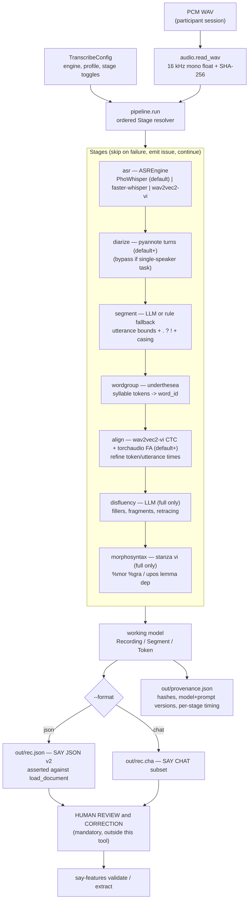
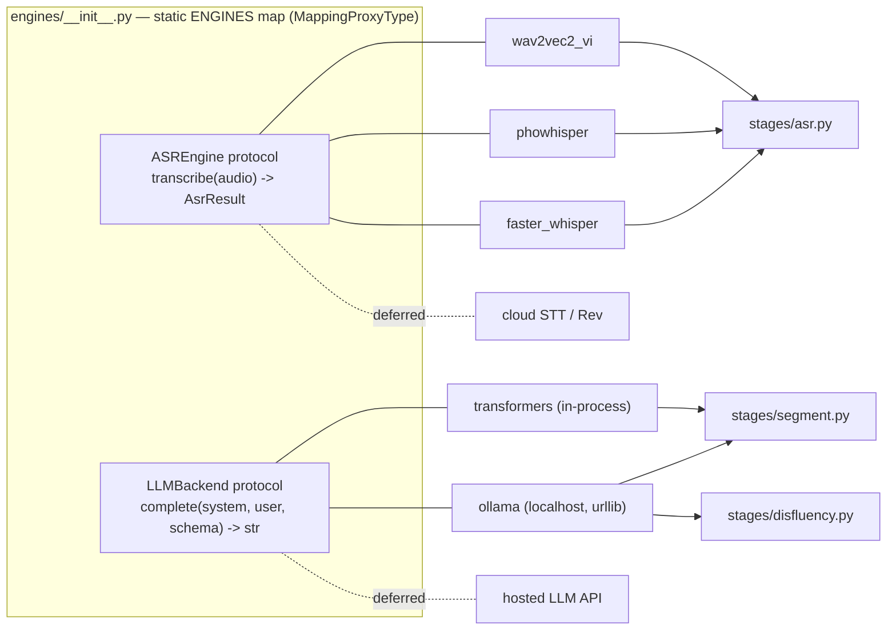

# Spec: Vietnamese Transcription Pipeline (`say_transcribe`)

**Slug:** `vietnamese-transcription-pipeline` · **Status:** draft, pre-implementation ·
**Date:** 2026-09-02 · **Depends on:** `speech-analysis-for-you` 0.2.0 (`speech_features`)

A local-only pipeline that turns raw Vietnamese speech recordings into **draft**
SAY transcripts (JSON v2 / CHAT subset) for human review, before
`say-features` consumes them. Design is adapted from TalkBank's
[batchalign2](https://github.com/TalkBank/batchalign2) and
[talkbank-tools](https://github.com/TalkBank/talkbank-tools); no upstream code
is copied.

---

## Assumptions

Correct any of these now or implementation proceeds on them.

- **A1.** The only consumer of the output is `speech_features` (`say-features
  validate` / `load_document` / `extract`). Output MUST be a valid SAY **JSON v2**
  document and/or **CHAT subset** file as defined in
  [`SpeechDocument`](../../../../src/speech_features/document.py). No other transcript
  format is a target.
- **A2.** Output is always a *draft*. A human reviews and corrects it before
  `say-features` runs. The pipeline never chains into `say-features extract` and
  never re-processes an already-reviewed transcript.
- **A3.** v1 is **fully offline**. No cloud STT, no hosted LLM API, no telemetry,
  no crash reporting. A "local LLM" means a process on the user's own machine or
  LAN (e.g. Ollama on `localhost`). Remote backends are deferred to a later
  version behind the same interfaces.
- **A4.** Input audio is a single-channel or stereo **PCM WAV** file, consistent
  with `speech_features.audio.read_wav`. Non-WAV containers are out of scope for
  v1 (convert upstream).
- **A5.** v1 targets **2-party clinical elicitation** (one participant `PAR`,
  one examiner `EXA`) for the SAY task set (`picture_description`,
  `story_recall`, `semantic_fluency`, `phonemic_fluency`, `reading`,
  `sustained_vowel`, `ddk`, `connected_speech`). Arbitrary N-speaker diarization
  is a nice-to-have, not a requirement.
- **A6.** Language is Vietnamese (`vie`, ISO 639-3) only. Foreign-language tokens
  inside an utterance are tagged per-token (`token.language`), not routed to a
  different pipeline.
- **A7.** "Word boundary" in Vietnamese is decided by a **word segmenter**, never
  by whitespace. Time-aligned tokens are syllables; a `word_id` groups syllables
  into a word. This matches the SAY document model exactly.
- **A8.** Heavy ML dependencies (torch, transformers, faster-whisper, pyannote,
  stanza) live in a new optional extra. Installing `speech_features` core stays
  NumPy/SciPy/pandas-only, and its existing 754 tests still pass without the
  extra.
- **A9.** Canonical decision records in `docs/<date>/<slug>/<version>/` are
  tracked through a narrow `.gitignore` exception. Other `docs/` content remains
  ignored pending a separate privacy/content audit.
- **A10.** Determinism is required by default: fixed seeds, LLM temperature 0,
  greedy decoding. Where a backend cannot guarantee bit-identical output, that is
  documented and surfaced in provenance.

---

## 1. Objective

**Users.** Vietnamese clinical-linguistics / neurodegenerative-speech
researchers who record participant sessions and currently transcribe by hand
before running SAY feature extraction.

**Problem.** SAY deliberately does no ASR, diarization, forced alignment, or
morphosyntax — it only consumes reviewed transcripts. Producing those
transcripts by hand is the bottleneck. TalkBank's batchalign2 automates this for
English and other languages, but (a) its Vietnamese path is weak (generic
multilingual Whisper, no Vietnamese utterance/punctuation model, no Vietnamese
word segmentation) and (b) it is hard-wired to a small set of ASR engines.

**Solution.** A separate, installable package `say_transcribe` in this repo that
reproduces batchalign2's *architecture* (in-memory document, ordered processing
stages, CHAT output) with:

1. a **pluggable ASR engine** interface — Whisper is one option among several
   local Vietnamese-capable engines;
2. **LLM-driven post-ASR stages** (utterance segmentation, punctuation/casing,
   disfluency & retracing tagging, speaker-label cleanup) via a pluggable local
   LLM backend, since no Vietnamese `CHATUtterance` model exists to reuse;
3. **Vietnamese word segmentation** producing `word_id` groups;
4. an **exporter** that writes SAY JSON v2 / CHAT that passes `say-features
   validate`.

**Success (one line).** `say-transcribe transcribe rec.wav out/` yields
`out/rec.json` that `say-features validate` accepts with exit 0, carrying
Vietnamese word groups, restored punctuation, speaker turns, and full
provenance — with every value traceable to a local model, and every annotation
marked as machine-produced pending human review.

---

## 2. Analysis of the source projects

| Capability | batchalign2 / talkbank-tools approach | `say_transcribe` v1 decision |
|---|---|---|
| In-memory model | Pydantic `Document` / `Utterance` / `Form` mutated across processors | Reuse the **idea**: lightweight `dataclass` working model (`Recording` → `Segment` → `Token`), mutated by stages, converted once at export. No Pydantic (match `speech_features`). |
| Pipeline | `BatchalignPipeline` composes `BatchalignProcessor` by `Task` enum | Reuse: ordered `Stage` objects with declared `requires` / `produces`; a resolver runs them in dependency order. Static list, no entry-point plugin discovery (mirrors SAY's static `PACKS`). |
| ASR | `WhisperEngine` (local), `RevEngine` (cloud), NeMo | Generalize to an `ASREngine` protocol. v1 engines: **faster-whisper** (default), **PhoWhisper** (HF), **wav2vec2-vi** (HF). All local. Rev/cloud deferred. |
| Utterance segmentation + punctuation/casing | fine-tuned `talkbank/CHATUtterance-{en,zh_CN,…}` BERT models — **no Vietnamese model** | Replace with an **LLM stage** over a pluggable local `LLMBackend`, plus a deterministic rule-based fallback when no backend is configured. |
| Speaker attribution / diarization | NeMo / pyannote | `pyannote.audio` diarization stage; LLM cleanup of turn boundaries; single-speaker bypass for `sustained_vowel` / `ddk`. |
| Forced alignment | `torchaudio` Wav2Vec2 / MMS forced alignment | `torchaudio` **MMS_FA** multilingual head for Vietnamese; refine token/utterance `start_s`/`end_s`. Optional stage. |
| Morphosyntax `%mor` / `%gra` | `stanza` UD (POS, lemma, features, depparse) → CHAT tiers | Keep `stanza` (`vi`, UD_Vietnamese-VTB); optional stage behind a sub-extra. **Not** LLM-driven in v1. |
| Vietnamese word segmentation | not handled (whitespace = token) | **New**: `underthesea` word tokenizer produces `word_id` groups. `pyvi` as a lighter fallback. VnCoreNLP (Java) deferred. |
| Output format | CLAN CHAT (`.cha`), ELAN, plain text | SAY **JSON v2** (native) + **CHAT subset**. Round-trip through `speech_features` loaders is the acceptance test. |
| Config / secrets | `~/.batchalign.ini` for API keys | v1 has no API keys. Optional: `HF_TOKEN` from env for gated model *downloads* only; local LLM endpoint URL from env/config. Never persisted to provenance or logs. |
| CLI | `click` + `rich`: `batchalign transcribe/align/morphotag/bulk` | stdlib `argparse` (match `speech_features.cli`): `say-transcribe transcribe/engines/diagnose`. |

**What we deliberately do not take:** Pydantic, `rich`, cloud engines,
entry-point plugin discovery, the multi-format (ELAN/Praat) exporters, `nemo`
as a hard dependency, and batchalign2's language-model-per-language utterance
segmentation.

---

## 3. Tech stack

**Language / runtime.** Python 3.10–3.13 (match core). `from __future__ import
annotations`, `dataclasses` (not Pydantic), stdlib `argparse`, ruff line-length
100, target `py310`.

**New distribution target.** Same repo, same wheel
(`speech-analysis-for-you`), new import package `say_transcribe`, new console
script `say-transcribe`. Heavy deps behind extras — **not** in
`[project.dependencies]`.

```toml
# pyproject.toml additions (illustrative)
[project.scripts]
say-transcribe = "say_transcribe.cli:main"

[project.optional-dependencies]
transcribe = [
  "transformers>=4.44",       # PhoWhisper (default ASR), wav2vec2-vi CTC (alignment)
  "torch>=2.2",               # transformers + torchaudio backends
  "torchaudio>=2.2",          # forced-alignment API
  "faster-whisper>=1.0",      # low-VRAM fallback ASR engine (CTranslate2)
  "pyannote.audio>=3.1",      # diarization (default)
  "underthesea>=9.5",         # Vietnamese word segmentation (locked, res. §12 Q2)
  "soundfile>=0.12",          # WAV I/O for ML backends that want a path/array
]
transcribe-morphosyntax = [
  "stanza>=1.8",              # optional %mor / %gra (UD_Vietnamese-VTB)
]
# optional alternates, not installed by default:
#   ctc-forced-aligner  — MMS fallback aligner (res. §12 Q5)
#   sherpa-onnx         — token-free diarizer (res. §12 Q6)
#   llama-cpp-python    — in-process LLM backend (no daemon)
```

- **Default ASR engine:** **PhoWhisper** (`vinai/PhoWhisper-small` or `-medium`,
  BSD-3-Clause, toned output, SOTA Vietnamese WER — res. §12 Q4 / research F3).
  `faster-whisper` is the low-VRAM portable fallback, not the default.
- **Local LLM backend (res. §12 Q3):** default is **Ollama over
  `http://localhost:11434`**, called with stdlib `urllib.request` — **no new
  Python dependency**. Ollama itself is installed out-of-band (documented).
  Requests pass `format` = a JSON Schema and `options = {temperature: 0,
  seed: <fixed>, num_ctx: <fixed>}`; the model digest + these params go into
  provenance. Named alternative: `llama-cpp-python` (in-process, no daemon).
  In-process `transformers` is **not** used for the LLM path.
- **Reference LLM (res. §12 Q4):** `Qwen2.5-7B-Instruct`
  (`ollama pull qwen2.5:7b-instruct`, Apache-2.0, VMLU 57.5). Prompts are
  model-agnostic (system + user + JSON schema); `gemma-2-9b-it` is the
  higher-accuracy alternative. **PhoGPT is rejected** for these stages
  (VMLU 24.0 — see research digest §F8).
- **No** librosa, spaCy, openSMILE, or embeddings in this package (consistent
  with SAY's stated constraints).

> Decisions for §12 Q1–Q7 are recorded in
> [`RESEARCH-2026-09-02.md`](./RESEARCH-2026-09-02.md) (§8) with citations.

**Stack profiles / AGENTS.md.** No `.vibe-agent/` or `AGENTS.md` in this repo;
toolkit is standalone. No stack profile applies. Constraints come from
`pyproject.toml`, `README.md`, and the existing `src/speech_features/`
conventions.

---

## 4. Commands

Real commands in this workspace (uv + stdlib argparse):

```bash
# install (adds the transcription extra to the existing dev setup)
uv pip install -e ".[dev,transcribe]"
uv pip install -e ".[dev,transcribe,transcribe-morphosyntax]"   # + stanza

# run the pipeline (profiles, res. §12 Q1: lite | default | full)
say-transcribe transcribe recording.wav out/ --profile lite --format json
say-transcribe transcribe recording.wav out/ \
    --engine phowhisper --model small --profile default --format json
say-transcribe transcribe recording.wav out/ --profile full --format both

# inspect
say-transcribe engines            # registered ASR + LLM backends, availability
say-transcribe diagnose           # optional deps / model caches / LLM endpoint;
                                  # secrets reported as set / not-set only

# hand off to the existing library (manual review happens between these two)
say-features validate out/recording.json
say-features convert out/recording.json out/recording.cha

# quality gate
pytest tests/say_transcribe
ruff check src/say_transcribe tests/say_transcribe
python -m pytest            # full suite, core + say_transcribe
git diff --check
```

`transcribe` exit codes mirror `say-features`: `0` success or warnings, `1`
per-recording partial failure in a batch, `2` invalid global input/config.

---

## 5. Project structure

New pipeline code lives under `src/say_transcribe/` and `tests/say_transcribe/`.
The packages communicate through the on-disk JSON v2 / CHAT contract. The only
permitted `src/speech_features/` change is a narrowly scoped CHAT compatibility
fix proven necessary by the T17 `%mor` / `%gra` fixture; otherwise it is out of
scope.

```
src/say_transcribe/
  __init__.py              # public API: transcribe(), TranscribeConfig, list_engines()
  cli.py                   # argparse: transcribe | engines | diagnose  (exit 0/1/2)
  config.py                # dataclasses: TranscribeConfig, EngineSpec, stage toggles, profiles
  pipeline.py              # Stage resolver + runner; provenance + issue collection
  model.py                 # working model: Recording / Segment / Token dataclasses
  audio.py                 # thin wrapper over speech_features.audio.read_wav (16 kHz mono)
  errors.py                # TranscribeError(code=...) base; STABLE_ERROR_CODES / STABLE_ISSUE_CODES
  stages/
    __init__.py            # PROFILES: lite / default / full -> ordered STAGE list
    base.py                # Stage protocol: name, requires, produces, run(state) -> state
    asr.py                 # dispatch to an ASREngine -> raw tokens + timings + per-token language
    diarize.py             # pyannote turns -> speaker_id; single-speaker bypass  (default+)
    segment.py             # utterance boundaries + terminators + casing (LLM | rule fallback)
    wordgroup.py           # Vietnamese syllable tokens -> word_id groups (underthesea)
    align.py               # wav2vec2-vi CTC + torchaudio FA -> refined start_s/end_s  (default+)
    disfluency.py          # fillers, fragments, retracing tags (LLM, full only)
    morphosyntax.py        # stanza vi -> %mor/%gra + upos/lemma/dep_head/dep_rel (full only, extra)
  engines/
    __init__.py            # ENGINES: static name -> factory mapping (ASR + LLM)
    asr_base.py            # ASREngine protocol -> AsrResult(tokens, words, language, meta)
    asr_phowhisper.py      # default (transformers)
    asr_faster_whisper.py  # low-VRAM fallback
    asr_wav2vec2_vi.py     # also reused by stages/align.py as the CTC head
    llm_base.py            # LLMBackend protocol: complete(system, user, *, schema) -> str
    llm_ollama.py          # urllib POST to localhost; format=JSON schema; temp 0, seed, num_ctx
    llm_llamacpp.py        # in-process GGUF backend (optional; no daemon)
  export/
    __init__.py
    json_v2.py             # working model -> SAY JSON v2 dict; asserts speech_features.load_document accepts it
    chat.py                # working model -> SAY CHAT subset text
  prompts/
    segment.vi.txt         # versioned; sha256 recorded in provenance
    disfluency.vi.txt
    speaker_cleanup.vi.txt

tests/say_transcribe/
  test_config.py  test_pipeline.py  test_model.py
  test_stage_asr.py  test_stage_segment.py  test_stage_wordgroup.py
  test_stage_align.py  test_stage_diarize.py  test_stage_morphosyntax.py
  test_engines_registry.py  test_export_json_v2.py  test_export_chat.py
  test_cli.py  test_provenance.py  test_vietnamese.py  test_determinism.py
  data/                    # tiny synthetic WAV + canned AsrResult JSON + golden JSON v2 / CHAT
  fakes.py                 # FakeASREngine, FakeLLM (no network, no model downloads)

docs/2026-09-02/vietnamese-transcription-pipeline/1/
  SPEC-2026-09-02.md   PLAN-2026-09-02.md   TASKS-2026-09-02.md
```

---

## 6. Code style

Match the existing `src/speech_features/` conventions, specifically:

- stdlib `argparse` subcommands with exit codes `0` / `1` / `2` and one concise
  stderr line, no traceback (`speech_features/cli.py`);
- error classes carry a stable `.code` string and subclass one base
  (`FeatureExtractionError` pattern in `speech_features/audio.py`);
- "**empty value + structured issue, never a fabricated one**" — if a stage
  cannot run, skip it, append an issue with a stable code, keep going;
- `dataclass` + explicit validation, `from __future__ import annotations`,
  `MappingProxyType` for registries that must not mutate;
- provenance records SHA-256 of inputs + config + versions (`schema.py`).

Example (stage skip, mirroring SAY's issue discipline):

```python
def run(self, state: PipelineState) -> PipelineState:
    if self.backend is None:
        state.issues.append(Issue(
            code="LLM_BACKEND_UNAVAILABLE", severity="warning", stage=self.name,
            message="no local LLM configured; used rule-based segmentation",
        ))
        return _rule_based_segment(state)
    return _llm_segment(state, self.backend)
```

---

## 7. Testing strategy

Runner: `pytest` (already configured: `pythonpath=["src"]`, `testpaths=["tests"]`).
Layout mirrors source, one `test_*.py` per module (SAY convention).

**Hard rule: unit tests do no network I/O and download no models.** ASR engines
and LLM backends sit behind protocols; tests inject `FakeASREngine` /
`FakeLLM` from `tests/say_transcribe/fakes.py`.

| Layer | Coverage |
|---|---|
| Unit | config validation & profiles; stage `requires`/`produces` resolution and ordering; `errors` code stability; rule-based segmentation fallback; per-stage skip → issue emission. |
| Export contract | working model → JSON v2 **must pass `speech_features.load_document`**; working model → CHAT **must round-trip** through the SAY CHAT reader without an `UNSUPPORTED_CHAT_TIER` on known data; `--force` overwrite guard; path-containment guard (reuse SAY's `_contained_output_path` semantics). |
| Vietnamese | NFC normalization on all text; diacritics / tone marks / `d`↔`đ` preserved through every stage; multi-syllable `word_id` grouping; code-switching sets `token.language`; casefold-only equality (no diacritic stripping). |
| Provenance / determinism | `provenance.json` shape; input audio SHA-256; engine+model+prompt-template versions present; **no** audio bytes, transcript text, or secrets in it; same fake inputs + config ⇒ byte-identical output files. |
| CLI | `transcribe` / `engines` / `diagnose` exit codes; `diagnose` shows secrets as `set` / `not set` only; concise stderr on bad input. |
| Golden | committed synthetic WAV + canned `AsrResult` → committed golden `*.json` / `*.cha` under `tests/say_transcribe/data/`. |
| Integration (opt-in, `-m integration`, skipped by default) | real `faster-whisper` tiny model on a short checked-in Vietnamese clip → output validates; loose WER ceiling; runs with networking disabled once models are cached. |

Full gate before any merge: `pytest` (core + new) green, `ruff check src tests`
clean, `git diff --check` clean, `speech_features` core still importable and its
754 tests still pass with **only** NumPy/SciPy/pandas installed.

---

## 8. Boundaries

### Always
- Emit a **draft**: every `AnnotationLayer` / token annotation has `source` =
  `"<engine-or-backend-id>@<model>@<version>"` and a model/heuristic
  `confidence`; **never `source: "human"`**.
- Emit SAY-valid JSON v2 and/or CHAT subset, or refuse with a structured issue
  naming the exact violation.
- NFC-normalize text; preserve diacritics, tone marks, and `d`/`đ`; compare only
  casefolded forms.
- Group Vietnamese syllables into words via `word_id` from the segmenter — never
  split on whitespace.
- Write `provenance.json`: audio SHA-256, full config, engine/model/prompt
  versions, stage list, per-stage wall-clock, package + catalog versions.
- On a stage failure: skip the stage, append an issue with a stable code,
  continue (partial output beats no output).
- Run deterministically (fixed seed, temperature 0, greedy) by default.
- Keep every heavy dep in the `transcribe` / `transcribe-morphosyntax` extra.
- Run fully offline after model caches exist.
- Carry SAY's research-only disclaimer in package docstring and CLI `--help`.

### Ask first (explicit flag or interactive confirm)
- Overwriting an existing output file → require `--force` (mirror
  `save_document`).
- Downloading model weights on first run → print size and require `--download`
  (or an interactive yes) unless already cached.
- Running output-changing optional stages (`morphosyntax`, `disfluency`) →
  opt-in via `--profile full` or explicit `--stage`.
- Writing outside the current working directory → reject unless the user passes
  an explicit absolute-path opt-in flag.
- Adding any new runtime dependency to `[project.dependencies]` (core stays
  NumPy/SciPy/pandas).

### Never
- Send audio, transcript text, or any derived text to a network service in v1 —
  no cloud STT, no hosted LLM, no telemetry, no crash reporting. (Local
  `localhost`/LAN LLM is allowed.)
- Chain pipeline output straight into `say-features extract`; a human-review
  step is mandatory and the CLI must not bypass it.
- Re-run on, merge, or mutate a transcript already marked human-reviewed.
- Guess a participant's real name; default speakers to role IDs (`PAR`, `EXA`)
  with empty `name`.
- Write PII, transcript text, or secrets to logs, `provenance.json`, or stdout
  (except an explicit `--print` action to the user's terminal).
- Claim diagnostic, screening, prognostic, or normative validity.
- Introduce dynamic plugin / entry-point discovery — the engine registry is a
  static `MappingProxyType`.
- Add librosa, spaCy, openSMILE, or embedding models to this package.

---

## 9. Data classification (MUST)

| Data class | Sensitivity | Allowed to appear in | Never in |
|---|---|---|---|
| **Participant speech audio** (WAV, waveform arrays) | Personal data; effectively special-category **health data** in this research context | On disk under the user's `data/` (gitignored) and chosen output dir; RAM during a run; passed to **local** models (faster-whisper, HF PhoWhisper / wav2vec2, `torchaudio` FA, `pyannote`) and a `localhost`/LAN LLM | Any network egress; logs (log duration / path / SHA-256 only, never sample values or waveform dumps); git; `provenance.json` beyond a SHA-256 + the path the user supplied |
| **Transcript text** (Vietnamese utterances — may contain spoken names, addresses, health details) | Personal data | Output `*.json` / `*.cha` in the user's output dir; passed to local word segmenter, local LLM stages, and (optional) stanza | Network egress; git; verbatim inside errors that leave local stderr; `provenance.json` (store hashes + token/utterance counts only); stdout unless the user runs an explicit `--print` |
| **Speaker identity** — diarization labels, participant `name` in `@Participants` / `speakers[].name` | Personal data | The output document, where the user controls it; role IDs (`PAR`, `EXA`) by default | Inferred/guessed real names; logs; `provenance.json` |
| **Credentials** — `HF_TOKEN` / `HUGGING_FACE_HUB_TOKEN` (gated model *download* only), local LLM endpoint URL | Secret | Read from environment or the user's HF CLI cache at runtime; `diagnose` reports only `set` / `not set` | Source, `provenance.json`, logs, stdout/stderr, git, error messages; being echoed back by any command |
| **Internal structure** — absolute filesystem paths, home dir, machine name | Low | Local logs and `provenance.json` may hold paths **as the user supplied them** | Do not expand `~` or resolve to absolute in any file meant to be shared; no machine/host identifiers |
| **Model weights / HF cache** | Not sensitive (large) | Standard HF cache dir | The repo / wheel |

A field whose secrecy this table does not name is treated as **personal data**
by default (fail closed).

---

## 10. Pipeline design

### 10.1 Data flow



Caption: one recording, top-to-bottom. Profiles (res. §12 Q1): `lite` =
`asr → segment → wordgroup`; **`default`** adds `diarize` + `align` (this is the
usual run — SAY's acoustic/timing packs need aligned, speaker-attributed
intervals); `full` adds `disfluency` + `morphosyntax` (the latter needs the
`transcribe-morphosyntax` extra). The boundary from export to `say-features` is a
**human** review step; the CLI never crosses it automatically.

### 10.2 Plug points



Caption: adding an engine = one module + one line in the static map. Dotted
nodes are post-v1 and require the network boundary in §8 to be revisited.

Diagram verification: Mermaid docs checked
(https://mermaid.js.org/intro/, https://mermaid.js.org/syntax/flowchart.html).
UNVERIFIED: render not checked — no Mermaid renderer available in this
environment (`mmdc` / python `mermaid` absent; per diagram-authoring §8, not
installing one without approval). Syntax kept to plain `flowchart` nodes/edges,
subgraphs, one decision node, and `-. text .-` dotted links; no styling.

---

## 11. Success criteria

1. `say-transcribe transcribe <wav> <dir>` writes `<dir>/<name>.json` (JSON v2)
   and/or `.cha` that `say-features validate` accepts with **exit 0**.
2. ≥ 3 interchangeable **local** ASR engines registered (`faster-whisper`,
   `phowhisper`, `wav2vec2-vi`), selected by `--engine`; `say-transcribe engines`
   lists them with availability.
3. `segment` runs via a pluggable **local** `LLMBackend` (restored `. ? !`,
   casing, utterance boundaries, speaker turns) **and** falls back to
   deterministic rules with a `LLM_BACKEND_UNAVAILABLE` issue when none is
   configured — output still validates in both paths.
4. Every content token belongs to a `word_id` group from the Vietnamese
   segmenter; no code path splits Vietnamese text on whitespace; NFC + diacritic
   + tone + `đ` preserved end-to-end (asserted in `test_vietnamese.py`).
5. Optional `morphosyntax` writes lossless UD-VTB `upos` / `lemma` /
   `dep_head` / `dep_rel` annotations to JSON v2 once per Vietnamese `word_id`
   group. It emits paired CHAT `%mor` / `%gra` tiers only when a one-to-one
   linguistic-word projection passes the T17 CLAN fixture; otherwise it emits
   neither tier and records `CHAT_MORPHOSYNTAX_UNAVAILABLE`. JSON remains
   authoritative and the document still validates.
6. `provenance.json` carries audio SHA-256, engine + model + prompt-template
   versions, stage list, and per-stage wall-clock; a test asserts it contains
   **no** audio/transcript/secret substrings.
7. With only `numpy scipy pandas` installed, `import speech_features` works and
   its existing **754 tests still pass**; the `transcribe` extra is never
   required by core.
8. A full run and `pytest` complete with outbound networking disabled (models
   pre-cached).
9. `ruff check src/say_transcribe tests/say_transcribe` clean; `pytest` green
   overall; `git diff --check` clean.
10. Output is always a draft (`source` ≠ `human`); no command chains into
    `say-features extract`.
11. Determinism: two runs on the same input + config produce byte-identical
    `*.json` / `*.cha` (documented exceptions listed in provenance).

---

## 12. Resolved decisions

Q1–Q10 are resolved by [`RESEARCH-2026-09-02.md`](./RESEARCH-2026-09-02.md)
(2026-09-02, citation-first). The implementation-time verification gates below
remain; none blocks the first JSON slice.

1. **Default profile.** ✅ *Resolved: three profiles — `lite`
   (`asr+segment+wordgroup`), **`default`** (`+diarize+align`), `full`
   (`+disfluency+morphosyntax`). Morphosyntax always opt-in.* batchalign2's own
   `transcribe` includes diarization + alignment by default, and SAY's
   acoustic/timing packs need aligned, target-speaker intervals or they emit
   `NaN` + an issue. (research §F1, §F2, §8)
2. **Word segmenter.** ✅ *Resolved: `underthesea` (>=9.5).* Apache-2.0,
   `requires_python >=3.10` (exact SAY match), actively maintained, light core
   install, also gives POS/dep. `pyvi` unmaintained since 2021 + pulls
   scikit-learn for no accuracy gain → not a dependency (allowed behind the
   `WordSegmenter` protocol). VnCoreNLP (JVM) stays deferred. (research §F4, §8)
3. **LLM backend default.** ✅ *Resolved: Ollama over `localhost` HTTP via stdlib
   `urllib` (no new Python dep).* JSON-Schema grammar-constrained decoding;
   `temperature 0` + `seed` + fixed `num_ctx`; daemon is localhost-only so
   "local-only" holds. `llama-cpp-python` is the named in-process alternative;
   in-process `transformers` is not used for this path. (research §F7, §8)
4. **Reference Vietnamese instruct model.** ✅ *Resolved: `Qwen2.5-7B-Instruct`*
   (`ollama pull qwen2.5:7b-instruct`, Apache-2.0, VMLU 57.5). `gemma-2-9b-it`
   (VMLU 59.0) is the higher-accuracy alternative; `SeaLLMs-v3-7B` / `Sailor2-8B`
   are PLAN-time benchmark candidates. **PhoGPT rejected** for these stages
   (VMLU 24.0 — Vietnamese-specific helps ASR, not instruction-following/JSON).
   Prompts stay model-agnostic. (research §F8, §3-conflict, §8)
5. **Forced-alignment backend.** ✅ *Resolved (direction): make it a spike.*
   Primary = `nguyenvulebinh/wav2vec2-base-vi-vlsp2020` CTC + torchaudio FA API
   (the pattern whisperX merged for `vi` in Oct 2025); fallback =
   `ctc-forced-aligner` (MMS). Community reports friction with Vietnamese FA, so
   the spike must confirm token timings within tolerance **and** tone marks
   preserved; if both backends miss, `align` degrades to ASR timings +
   `FORCED_ALIGNMENT_UNAVAILABLE` and `default` still completes. (research §F5,
   §8)
6. **Diarization model access.** ✅ *Resolved: `pyannote/speaker-diarization-3.1`
   default*; HF token needed for the one-time **download** only, inference is
   offline and language-agnostic (batchalign2 does the same). `sherpa-onnx`
   (Apache-2.0, no token) is the token-free alternative behind a
   `DiarizerBackend` protocol. (research §F6, §8)
7. **Diacritic/tone restoration stage.** ✅ *Resolved: not in v1.* PhoWhisper and
   `wav2vec2-base-vi-vlsp2020` emit fully toned Vietnamese. Add a
   `NON_TONED_ASR_OUTPUT` heuristic issue instead of a restoration stage;
   revisit only if a non-toned engine is added. (research §F3, §8)
8. **CHAT `%mor` tagset for Vietnamese.** ✅ *Resolved: UD-VTB is canonical;
   CHAT is a tested, lossy projection.* JSON preserves uppercase UD `upos`, NFC
   lemma, token-id `dep_head`, and exact lowercase `dep_rel`. CHAT follows the
   TalkBank/Batchalign convention (`upos.lower()|lemma`; 1-based
   `dependent|head|REL`, root head `0`, relation uppercased with `:` mapped to
   `-`). The public TalkBank grammar list has no Vietnamese grammar or fixture,
   so T17 must prove grouped-word alignment, punctuation, and CHAT escaping
   with a checked-in fixture plus CLAN CHECK before emitting either tier. JSON
   remains authoritative: annotate one representative token per `word_id`
   group and never duplicate word-level analysis across syllable tokens. If a
   CHAT utterance cannot project both tiers completely, omit both and emit
   `CHAT_MORPHOSYNTAX_UNAVAILABLE`. *(Only affects `full`.)*
9. **Task-spec scaffold.** ✅ *Resolved: do not generate one.* Task specs are
   researcher-authored scoring references, not transcript artifacts. Empty alias
   groups can silently produce zeros or classify valid responses as intrusions.
   Extraction receives a populated shared spec through `--task-spec` or
   `task_spec_path`; transcription uses the explicit `--single-speaker` option
   when diarization should be bypassed. A generator remains out of scope until a
   real authoring workflow demonstrates the need.
10. **`docs/` tracking.** ✅ *Resolved: narrow exception.* Track only the
    canonical pipeline records: dated `SPEC-*.md`, `PLAN-*.md`, `RESEARCH-*.md`,
    `TASKS-*.md`, `tasks-*.json`, `USAGE-*.md`, and `SPIKE-*.md`. Keep unrelated
    `docs/` ignored until a separate privacy/content audit; do not broadly
    unignore or relocate them.

---

## 13. Next phases (per `spec-driven-development`)

`SPECIFY` (this doc + `RESEARCH-2026-09-02.md`) → **PLAN**
(`docs/2026-09-02/vietnamese-transcription-pipeline/1/PLAN-2026-09-02.md`, now updated) → **TASKS**
(`TASKS-2026-09-02.md`: discrete test-first tasks, each with an acceptance command) →
**IMPLEMENT**. The first vertical slice is:
`audio → asr (phowhisper small) → wordgroup (underthesea) → export json_v2`,
proven by `say-features validate` on the output, before adding `segment`,
`diarize`, `align`, `disfluency`, `morphosyntax`.

**Q1–Q10 are resolved. `TASKS-2026-09-02.md` and `tasks-2026-09-02.json` capture the implementation
order; the forced-alignment spike remains an explicit checkpoint before the
alignment stage.**
