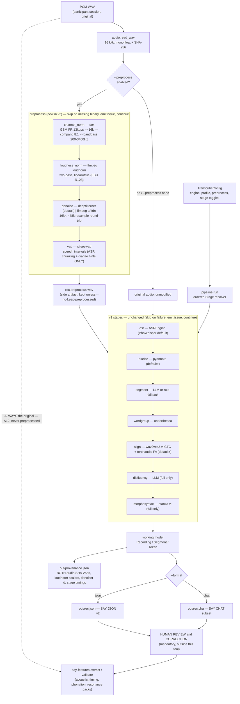
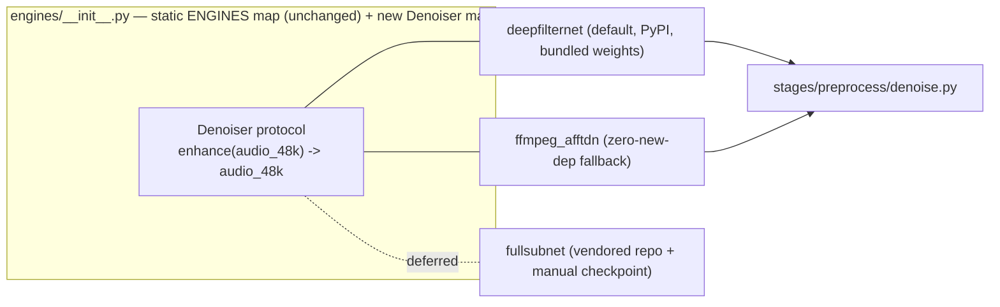

# Spec: Vietnamese Transcription Pipeline (`say_transcribe`) — v2

**Slug:** `vietnamese-transcription-pipeline` · **Version:** 2 · **Status:** draft,
pre-implementation · **Date:** 2026-09-20 · **Supersedes:**
[`SPEC-2026-09-02.md`](../../2026-09-02/vietnamese-transcription-pipeline/1/SPEC-2026-09-02.md)
(v1, Q1–Q10 resolved, kept as a historical decision record — do not edit it) ·
**Depends on:** `speech-analysis-for-you` 0.2.0 (`speech_features`)

A local-only pipeline that turns raw Vietnamese speech recordings into **draft**
SAY transcripts (JSON v2 / CHAT subset) for human review, before
`say-features` consumes them. Design is adapted from TalkBank's
[batchalign2](https://github.com/TalkBank/batchalign2),
[talkbank-tools](https://github.com/FranklinChen/talkbank-tools), and
[batchalign](https://github.com/TalkBank/batchalign); no upstream code is
copied. **New in v2:** a four-step audio preprocessing stage group adapted
from the TELL paper's "Audio preprocessing" section (channel normalization,
loudness normalization, denoising, VAD), feeding only the ASR/diarization
branch — never the acoustic-feature branch.

---

## What changed from v1 (read this first if you know v1)

- Everything in v1 §§1–13 (objective, source-project analysis, ASR engines,
  LLM backend, word segmentation, alignment, morphosyntax, CHAT export,
  provenance, determinism, Q1–Q10) is **carried forward unchanged** and is not
  restated in full below except where a preprocessing stage touches it. Read
  v1 for those decisions; this document is self-contained for what's new.
- **New:** stage group `preprocess` (§10.0), a `Denoiser` protocol, two new
  optional extras, three new CLI flags, four new resolved questions (Q11–Q14,
  §12), and two new assumptions (A11, A12).
- **Unchanged invariant, now load-bearing:** `say-features` continues to read
  `audio_path` as a caller-supplied argument, never derived from the document
  (`src/speech_features/extraction.py:375`). This is what makes the
  original/preprocessed branch (A12) a zero-core-change decision.

---

## Assumptions

A1–A10 are v1's, unchanged (offline-only, draft-only, WAV input, 2-party
elicitation, `vie` only, segmenter-defined word boundaries, heavy deps behind
extras, narrow `docs/` gitignore exception, deterministic by default). Two new
assumptions for v2:

- **A11.** External binaries (`sox`, `ffmpeg`) are **runtime prerequisites**,
  documented and probed by `say-transcribe diagnose`, never vendored or
  bundled into the wheel. `ffmpeg` is already required in practice (this
  machine has 6.1.1 with `libgsm`, `loudnorm`, `highpass`/`lowpass`,
  `acompressor`, `afftdn`); `sox` is a **new** external prerequisite this
  version introduces and is **not installed** on the reference machine as of
  this writing — install it before running `preprocess` (`apt install sox
  libsox-fmt-all` on Debian/Ubuntu; confirm GSM support via `sox -h` per
  research §Q13).
- **A12.** The preprocessed audio branch feeds **only** `asr`, `diarize`,
  `align`, and `vad`-derived chunking hints. `say-features` (acoustic /
  timing / phonation / resonance packs) always reads the **original**,
  unmodified WAV via its own `audio_path` argument — never the preprocessed
  file. Preprocessing is deliberately lossy (narrowband, compressed,
  denoised) by TELL's own design; the existing acoustic pack measures F0,
  jitter, shimmer, HNR, and formants that a 200–3400 Hz GSM-degraded signal
  cannot represent.

---

## 1. Objective

Unchanged from v1: Vietnamese clinical-linguistics researchers need automated
draft transcription (ASR → segmentation → word grouping → export) so they stop
transcribing by hand before running `say-features`. v2 adds one upstream
capability: **channel-normalized, loudness-normalized, denoised, VAD-chunked**
audio specifically to make the ASR/diarization/alignment stages more robust
across heterogeneous recording devices and rooms — without touching the signal
`say-features` measures.

**Success (one line), extended.** `say-transcribe transcribe rec.wav out/`
first writes `out/rec.preprocess.wav` (16 kHz mono, channel- and
loudness-normalized, denoised, with VAD speech intervals) purely as ASR/
diarization input, then proceeds exactly as v1 to `out/rec.json` — which
`say-features extract` still points at **`rec.wav`**, the original file, for
every acoustic measurement.

---

## 2. Analysis of the source projects (delta only)

v1's table (ASR, segmentation, diarization, alignment, morphosyntax, word
segmentation, output format, config, CLI) is unchanged; see v1 §2. One row is
new because none of the three source repos implement it:

| Capability | batchalign2 / talkbank-tools / batchalign | `say_transcribe` v2 decision |
|---|---|---|
| Audio preprocessing | **Not present in any of the three source repos** — they consume whatever WAV is given, with no channel/loudness normalization, denoising, or VAD stage of their own. | New `preprocess` stage group, adapted from the TELL paper (not from the TalkBank repos): SoX channel normalization → ffmpeg two-pass EBU R128 loudness → DeepFilterNet3 denoise → Silero VAD. Runs before `asr`; output is a side artifact, never the file `say-features` reads (A12). |

---

## 3. Tech stack (delta only)

v1's language/runtime/distribution decisions are unchanged (Python 3.10–3.13,
dataclasses, argparse, same wheel, heavy deps behind extras). New:

```toml
[project.optional-dependencies]
transcribe-preprocess = [
  "deepfilternet>=0.5",   # DeepFilterNet3 denoiser (default); needs torch/torchaudio
                          # (already pulled by the `transcribe` extra)
  "silero-vad>=5.1",      # Silero VAD; speech-interval detection only
  "soundfile>=0.12",      # shared with `transcribe`; WAV I/O for the 48kHz denoise round-trip
]
```

**External binary prerequisites (not Python packages, not bundled):**
- `sox` (with GSM format support) — channel normalization. New in v2.
- `ffmpeg` — loudness normalization (two-pass `loudnorm`). Already assumed
  available in practice; now load-bearing for a spec-required step.

**Deferred, named alternative:** FullSubNet (`Audio-WestlakeU/FullSubNet`) —
not on PyPI, checkpoints on GitHub Releases only, requires a vendored clone
and a pinned older torch (research §Q11). Stays behind the `Denoiser`
protocol as a documented future option; not installed by default.

**No librosa, spaCy, openSMILE, or embeddings** — unchanged from v1.

> Q11–Q14 decisions are recorded in
> [`RESEARCH-2026-09-20.md`](./RESEARCH-2026-09-20.md) with citations.

---

## 4. Commands (delta only)

v1's commands (`say-transcribe transcribe/engines/diagnose`, `say-features
validate/convert`, `pytest`, `ruff check`) are unchanged. New flags on
`transcribe`:

```bash
# install (adds the preprocessing extra on top of v1's `transcribe` extra)
uv pip install -e ".[dev,transcribe,transcribe-preprocess]"

# preprocessing is on by default in the default/full profiles (§10.0);
# disable it, or pick a non-default denoiser:
say-transcribe transcribe recording.wav out/ --preprocess none
say-transcribe transcribe recording.wav out/ --denoiser ffmpeg_afftdn
say-transcribe transcribe recording.wav out/ --keep-preprocessed   # (default)
say-transcribe transcribe recording.wav out/ --no-keep-preprocessed

# diagnose now also probes the new external prerequisites
say-transcribe diagnose
#   sox: found (gsm: supported) | found (gsm: NOT built in) | not found
#   ffmpeg: found (loudnorm: available) | not found
#   deepfilternet: importable (weights cached) | not installed

# unchanged: manual review, then
say-features validate out/recording.json
```

`--preprocess` accepts a comma list of step names (`channel,loudness,denoise,
vad`) or the literal `none`; there is no per-step CLI override beyond
`--denoiser` — finer control is a config-file concern (`TranscribeConfig`),
not a flag explosion. Exit codes (`0`/`1`/`2`) are unchanged from v1.

---

## 5. Project structure (delta only)

v1's `src/say_transcribe/` layout is unchanged (`stages/asr.py`,
`stages/diarize.py`, `stages/segment.py`, `stages/wordgroup.py`,
`stages/align.py`, `stages/disfluency.py`, `stages/morphosyntax.py`,
`engines/`, `export/`, `prompts/`). New subpackage:

```
src/say_transcribe/
  stages/
    preprocess/
      __init__.py           # PreprocessStage: runs the 4 steps in order, writes side artifact
      channel_norm.py        # shells out to `sox`: mono -> GSM FR 13kbps -> decode -> 16k -> compand -> bandpass 200-3400Hz
      loudness.py             # shells out to `ffmpeg`: two-pass loudnorm, linear=true (res. Q12)
      denoise.py              # Denoiser protocol + `deepfilternet` (default) / `ffmpeg_afftdn` (fallback)
      vad.py                   # Silero VAD -> speech intervals; ASR chunking + diarization hints only (res. Q14)
      base.py                   # Denoiser protocol: enhance(audio_48k) -> audio_48k

tests/say_transcribe/
  test_stage_preprocess.py    # step ordering, side-artifact path, two-pass loudnorm determinism
  test_denoiser_registry.py   # protocol conformance, fallback selection
  test_vad.py                  # speech-interval shape; asserts no pause/voiced-segment feature emitted
  data/
    fakes.py additions: FakeDenoiser, FakeSubprocessRunner (no sox/ffmpeg/torch calls in unit layer)
```

Everything else in v1 §5 (model.py, pipeline.py, errors.py, config.py, cli.py)
is unchanged; `TranscribeConfig` gains a `preprocess: PreprocessConfig` field
and `PipelineState` gains an optional `preprocessed_audio_path`.

---

## 6. Code style

Unchanged from v1 — stdlib `argparse`, stable `.code` error classes, "empty
value + structured issue, never a fabricated one," `dataclass` + explicit
validation, `MappingProxyType` registries, provenance SHA-256 discipline. The
`Denoiser` protocol follows the same shape as v1's `ASREngine`/`LLMBackend`:

```python
class Denoiser(Protocol):
    def enhance(self, audio_48k: np.ndarray) -> np.ndarray: ...
```

Stage skip on a missing external binary mirrors v1's LLM-fallback pattern
exactly:

```python
def run(self, state: PipelineState) -> PipelineState:
    if not _binary_available("sox"):
        state.issues.append(Issue(
            code="SOX_UNAVAILABLE", severity="warning", stage="channel_norm",
            message="sox not found; channel normalization skipped, ASR runs on original audio",
        ))
        return state  # ASR falls back to the original WAV, not a half-processed one
    return _run_sox_chain(state)
```

---

## 7. Testing strategy (delta only)

v1's layers (unit, export contract, Vietnamese-specific, provenance/
determinism, CLI, golden, opt-in integration) are unchanged. New coverage
required for `preprocess`:

| Layer | Coverage |
|---|---|
| Unit | Step ordering (`channel → loudness → denoise → vad`); `--preprocess none` bypasses the whole group with no side artifact written; `Denoiser` protocol conformance for both registered implementations; missing-binary → issue code, not exception, and ASR proceeds on original audio (never a partially-processed file). |
| Determinism | Two-pass `loudnorm` on the same fixture WAV + same config produces byte-identical measured values *and* byte-identical output audio across two runs (res. Q12) — this is the one step in the whole pipeline where a naive single-pass implementation would silently break v1's success criterion #11, so it gets its own dedicated test. |
| Branch invariant | A test asserts `say-features validate`/`extract` is never invoked with the preprocessed path in any code path — the CLI takes exactly one `audio_path`, uses it unchanged for the export step, and only ever swaps in the preprocessed path for `asr`/`diarize`/`align`/`vad`. |
| Contract | `vad.py` output (speech intervals) is asserted to influence only ASR chunking / diarization turn hints — a test fails if any `AnnotationLayer` or timing field it writes overlaps the names already owned by `speech_features.features.acoustic.timing` (`time_pause_*`, `time_voiced_segment_*`), guarding research §Q14's non-goal. |
| Subprocess isolation | All `sox`/`ffmpeg` calls in the unit layer go through an injected `FakeSubprocessRunner`; `deepfilternet`/`silero-vad` model loading is behind `FakeDenoiser`. No unit test shells out or downloads weights. |
| Integration (opt-in, `-m integration`, skipped by default) | Real `sox` + `ffmpeg` + `deepfilternet` + `silero-vad` chain on a short checked-in Vietnamese clip; asserts output is 16 kHz mono PCM, non-silent, and that `say-transcribe diagnose` correctly reports all four tools' availability on the CI/dev machine. |

Full gate is unchanged from v1: `pytest` green, `ruff check` clean, `git diff
--check` clean, core `speech_features` unaffected (still importable and
green with only NumPy/SciPy/pandas installed — the `transcribe-preprocess`
extra is never required by core or by the base `transcribe` extra).

---

## 8. Boundaries (delta only)

v1's boundaries (draft-only output, SAY-valid export, NFC normalization,
`word_id` grouping, provenance discipline, stage-skip-on-failure, determinism,
extras discipline, offline-only, research disclaimer) are unchanged and
apply to the new stages too. New:

### Always
- Feed `asr`/`diarize`/`align`/VAD-chunking from the **preprocessed** branch
  when preprocessing is enabled; feed `say-features extract`'s `audio_path`
  from the **original** file, always (A12) — this routing is not
  user-configurable per-recording; it is a fixed architectural boundary.
- Run `loudnorm` two-pass with `linear=true` only (res. Q12); never ship a
  single-pass mode as an option, since it would silently break the
  determinism success criterion.
- Record both audio SHA-256s (original and preprocessed, when written) in
  `provenance.json`, plus the `loudnorm` measured `I`/`LRA`/`TP`/`thresh`
  scalars and the denoiser id + version.

### Ask first
- Same triggers as v1 (`--force` overwrite, `--download` for first-run model
  weights, `--stage`/`--profile full` for optional stages, absolute-path
  writes). `preprocess` participates in the existing `--download` gate for
  DeepFilterNet3/Silero VAD's first-run weight fetch — no new confirmation
  mechanism.

### Never
- Never let `vad.py` write pause-count or voiced-segment-duration values into
  the draft document — those features are `speech_features`'s, computed from
  the original audio (res. Q14). Silero VAD output is ASR/diarization input
  only.
- Never treat the preprocessed WAV as a replacement for the original in any
  downstream command, log line, or default file name — it is always a
  clearly-suffixed side artifact (`*.preprocess.wav`), deleted unless
  `--keep-preprocessed`.
- Never add FullSubNet as a hard or default dependency (deferred, res. Q11).

---

## 9. Data classification (MUST) — delta only

v1's table (participant audio, transcript text, speaker identity,
credentials, internal structure, model weights) is unchanged; those
protections apply identically to the preprocessed WAV. New rows:

| Data class | Sensitivity | Allowed to appear in | Never in |
|---|---|---|---|
| **Preprocessed audio** (`*.preprocess.wav`) | Personal data / health data — a lossy derivative of participant audio, same classification as the original | On disk in the output dir (gitignored, same as the original); RAM during a run; passed to local ASR/diarization/alignment/VAD models only | Network egress; git; passed to `say-features` (A12); any treatment looser than the original audio it derives from |
| **VAD speech intervals** (from Silero VAD) | Personal data — pause structure is clinically meaningful even before it becomes a named feature | Internal pipeline state feeding ASR chunking / diarization hints; not persisted as a named document field | Written into the draft document as a competing pause/voiced-segment feature (res. Q14); `provenance.json` beyond a count of intervals |
| **`loudnorm` measured scalars** (I, LRA, TP, thresh) | Not sensitive — aggregate acoustic levels, not identifying | `provenance.json` | — |
| **SoX / ffmpeg command lines, stderr** | Low, but paths inside them are personal-data-adjacent (A11 of v1: internal structure) | Provenance/logs with paths **as the user supplied them** | Expanded `~` or machine-resolved absolute paths in anything meant to be shared |

A field this table does not name is treated as **personal data** by default,
per v1's fail-closed rule.

---

## 10. Pipeline design

### 10.0 New: preprocessing stage group

Four steps, run in the paper's own order, each behind an issue-on-failure
guard (never a hard crash — mirrors v1's stage discipline):

| Step | Tool | What it does | Failure behavior |
|---|---|---|---|
| 1. `channel_norm` | `sox` (external binary) | mono → GSM Full Rate 13 kbps encode (inherently 8 kHz) → decode back to 16-bit → resample to 16 kHz → 8:1 dynamic-range `compand` → 200–3400 Hz `bandpass` (two-pole Butterworth) | `SOX_UNAVAILABLE` issue; ASR proceeds on the original WAV (no partial chain) |
| 2. `loudness_norm` | `ffmpeg` two-pass `loudnorm` | Pass 1: measure (`print_format=json` → `input_i/tp/lra/thresh`). Pass 2: apply with `measured_*` + `linear=true` (EBU R128) | `FFMPEG_LOUDNORM_UNAVAILABLE` issue; carries forward the channel-normalized (or original) audio unmodified |
| 3. `denoise` | `deepfilternet` (default) / `ffmpeg afftdn` (fallback) | Resample 16k→48k, run DeepFilterNet3 (eval mode, fixed seed), resample 48k→16k | `DENOISER_UNAVAILABLE` issue; falls back one rung (`deepfilternet` → `ffmpeg afftdn` → skip) |
| 4. `vad` | `silero-vad` | Speech/non-speech interval detection at 16 kHz on the fully preprocessed signal | `VAD_UNAVAILABLE` issue; ASR runs on the full unsegmented audio (slower, not wrong) |

Interpretation notes carried into research §Q11–Q14: "compression with a
factor of 8" is read as an 8:1 dynamic-range `compand` ratio, not file-size
compression; GSM Full Rate is inherently 8 kHz so "resampling to 16 kHz"
necessarily happens *after* decode, matching the paper's own "decoded back to
16 bits" sentence.

### 10.1 Data flow (extends v1 §10.1)



Caption: `preprocess` is a fork, not a splice — its output only ever reaches
`asr`/`diarize`/`align`/`vad`-chunking. The dotted edge from the original WAV
straight to `say-features` is the architectural invariant from A12: it exists
regardless of whether `preprocess` ran, and regardless of `--profile`.

### 10.2 Plug points (extends v1 §10.2)



Caption: adding a denoiser is one module + one line in the static map, same
discipline as v1's `ASREngine`/`LLMBackend` registries — no entry-point
plugin discovery here either.

Diagram verification: Mermaid syntax kept to plain `flowchart` nodes/edges,
subgraphs, decision nodes, and dotted deferred-links, matching v1's verified
subset. **UNVERIFIED: render not checked** — no Mermaid renderer available in
this environment, same as v1 (per `diagram-authoring`, not installing one
without approval).

---

## 11. Success criteria (delta only)

v1's eleven criteria (§11, JSON v2 validity, ≥3 ASR engines, LLM segmentation
+ rule fallback, `word_id` grouping, optional morphosyntax, provenance
content, core-import-without-extras, offline `pytest`, lint/format
cleanliness, draft-only output, determinism) are unchanged and still apply.
New:

12. `--preprocess channel,loudness,denoise,vad` (the default when the
    `transcribe-preprocess` extra and both external binaries are present)
    writes a 16 kHz mono `*.preprocess.wav` side artifact; `--preprocess
    none` skips the group entirely with zero side artifacts.
13. Two runs of `preprocess` on the same input + config produce
    byte-identical output audio and byte-identical `loudnorm` measured
    scalars in `provenance.json` (res. Q12) — extends v1's criterion #11 to
    the new stage group explicitly.
14. `say-features extract`/`validate` is never invoked, in any code path,
    with a path ending in the preprocessed-audio suffix; a test enforces
    this (§7, branch invariant).
15. `vad.py` writes no field whose name collides with
    `speech_features.features.acoustic.timing`'s `time_pause_*` /
    `time_voiced_segment_*` outputs (res. Q14).
16. `say-transcribe diagnose` reports `sox` and `ffmpeg` availability
    (including GSM support for `sox`) as `found` / `not found`, never
    crashing when either is absent.

---

## 12. Resolved decisions

Q1–Q10 are v1's and are unchanged (default profile, word segmenter, LLM
backend, reference LLM, forced-alignment backend, diarization model access,
diacritic restoration, CHAT `%mor` tagset, task-spec scaffold, `docs/`
tracking) — see v1 §12. New for v2, resolved in
[`RESEARCH-2026-09-20.md`](./RESEARCH-2026-09-20.md):

11. **Denoiser.** ✅ *Resolved: `deepfilternet` (DeepFilterNet3) default,
    `ffmpeg afftdn` fallback, `fullsubnet` deferred.* FullSubNet has no PyPI
    package, manual checkpoint download, pinned legacy torch; DeepFilterNet3
    installs from PyPI with bundled weights and covers the same full-band
    motivation. (research §Q11)
12. **Loudness normalization determinism.** ✅ *Resolved: two-pass `loudnorm`
    with `linear=true` only; single-pass dynamic mode is not exposed.*
    Dynamic mode's adaptive gain is not guaranteed byte-identical across
    runs in the way the spec's determinism criterion requires; linear mode
    with pre-measured values is. (research §Q12)
13. **Channel-normalization tool.** ✅ *Resolved: `sox`, paper-faithful,
    documented as a new external prerequisite and probed by `diagnose`.*
    ffmpeg alone could cover steps 1–2 with one binary, but the user chose
    fidelity to the TELL paper's tool choice over consolidation (decision D3,
    this session). SoX's GSM support is conditional on the build having
    `libgsm`; `diagnose` checks this explicitly rather than assuming it.
    (research §Q13)
14. **VAD scope vs. existing pause features.** ✅ *Resolved: Silero VAD feeds
    ASR chunking and diarization turn hints only; it never writes pause or
    voiced-segment features.* Those features already exist in
    `speech_features.features.acoustic.timing`, computed from the original
    audio. Duplicating them from the preprocessed branch would create two
    disagreeing implementations. (research §Q14)

---

## 13. Next phases (per `spec-driven-development`)

`SPECIFY` (this doc + `RESEARCH-2026-09-20.md`, superseding v1's `SPECIFY`
phase) → **PLAN** (a v2 `PLAN-2026-09-20.md`, not yet written) → **TASKS**
(a v2 `TASKS-2026-09-20.md` + `tasks-2026-09-20.json`, not yet written) →
**IMPLEMENT**. `src/say_transcribe/` still does not exist (Phase 0, unchanged
from v1's status). The first vertical slice remains v1's:
`audio → asr (phowhisper small) → wordgroup (underthesea) → export json_v2`,
extended by one prerequisite check: confirm `preprocess` can be **disabled**
(`--preprocess none`) so that slice ships without requiring `sox`/ffmpeg
two-pass/DeepFilterNet3/Silero VAD all at once. Preprocessing is added as its
own vertical slice immediately after, proven by the branch-invariant test
(§7) before `diarize`/`align`/`disfluency`/`morphosyntax` are touched.
