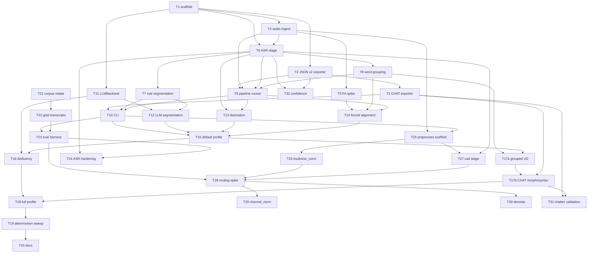

# Plan: `say_transcribe` — Vietnamese transcription pipeline (v3)

**Slug:** `vietnamese-transcription-pipeline` · **Date:** 2026-09-20 · **Version:** 3
**Spec:** [`../2/SPEC-2026-09-20.md`](../2/SPEC-2026-09-20.md) (v2, still authoritative for
anything this plan doesn't change)
**Research:** [`RESEARCH-2026-09-20.md`](./RESEARCH-2026-09-20.md) (v3, includes the F3
addendum)
**Tasks:** [`TASKS-2026-09-20.md`](./TASKS-2026-09-20.md) · [`tasks-2026-09-20.json`](./tasks-2026-09-20.json)
**Supersedes:** [`../../../2026-09-02/vietnamese-transcription-pipeline/1/PLAN-2026-09-02.md`](../../../2026-09-02/vietnamese-transcription-pipeline/1/PLAN-2026-09-02.md)
(v1, kept as a historical decision record — do not edit it)

## Overview

`say_transcribe` turns Vietnamese audio into a draft JSON v2 or CHAT transcript that a
human reviews before it feeds the existing `speech_features` extractor. `src/say_transcribe/`
does not exist yet — this plan covers the full unbuilt scope: v1's 21-task ASR/CHAT/LLM
design, v2's TELL-derived preprocessing stage group, and v3's reliability work (corpus
intake, a measurement harness, decode hardening, a routing spike, and CHAT/confidence
hardening).

Three decisions were made in this planning session (recorded below as D5–D7), and checking
the third against the actual codebase surfaced four findings (F1–F4) that reshape the task
list beyond a mechanical translation of the v2 spec. Both are folded into the 33-task list
that follows.

## Architecture decisions

1. **One task → one branch → one PR** (unchanged from v1). Branch pattern
   `feature/vietnamese-transcription-pipeline-task-<N>-<short>`; spikes and human-annotation
   tasks use `chore/…`.
2. **Fakes-first testing** (unchanged from v1). Every external dependency (ASR engine, LLM
   backend, diarizer, aligner, word segmenter, morphosyntax parser, denoiser) sits behind a
   small protocol with a `Fake*` test double, so the unit suite never needs network access,
   a GPU, or a downloaded model.
3. **Degrade, don't fail** (unchanged from v1). A missing optional dependency or an
   unreachable local service produces one `*_UNAVAILABLE` issue and the pipeline continues
   on the next-best path — never a hard crash on an otherwise-working recording.
4. **JSON v2 is authoritative; CHAT is a projection** (unchanged from v1). Every feature is
   designed against `speech_features`'s JSON v2 document model first; CHAT export only
   emits a field when it has a complete, valid representation.
5. **D5 — resolve C1 by measurement, not by literature alone.** The v3 research found
   `channel_norm`/`denoise` plausibly harmful to ASR per cited literature, but literature
   from other corpora doesn't settle this corpus. Both steps are gated behind a timeboxed
   measurement spike (T28) with a human checkpoint, mirroring v1's existing T5
   forced-alignment spike pattern.
6. **D6 — plan against the real corpus, not a hypothetical one.** 5 participants, one
   continuous recording each, 11 elicitation tasks per participant, 44.1 kHz / 12-bit,
   with a second recording device planned for the future. This is checked against the
   code in F1–F4 below rather than taken as a given.
7. **D7 — one canonical plan, full scope.** `tasks-2026-09-20.json` carries all 33 tasks
   (v1's 21 unchanged + v2's preprocessing + v3's reliability work) so `tasks_remaining`
   stays accurate; nothing is invisible to a task runner.
8. **F1 — the corpus doesn't fit the data model yet.** `speech_features`'s batch manifest
   is one-recording-per-task
   (`{recording_id, audio_path, transcript_path, target_speakers, task_spec_path}`,
   `src/speech_features/extraction.py:62`), and `validate_task_spec`
   (`src/speech_features/schema.py:454`) describes a task's *content*, never its time
   boundaries. 5 continuous WAVs × 11 tasks must become 55 per-task clips + 55 manifest
   rows before anything downstream is runnable. New task: T21.
9. **F2 — 12-bit depth needs a probe before anything else runs.**
   `src/speech_features/audio.py:22`'s `_SCALE_BY_WIDTH = {2: 32768.0, 3: 8388608.0,
   4: 2147483648.0}` and its width check at `:96` mean a 12-bit WAV is ambiguous: if
   byte-aligned in a 16-bit container it loads silently ~24 dB below full scale, biasing
   every amplitude feature and the `_energy_vad` thresholds that feed all
   `time_pause_*`/`time_voiced_segment_*` features; if packed 12-bit (1.5 bytes/sample),
   `wave` produces garbage. Folded into T21's acceptance criteria, ahead of the split.
10. **F3 — the planned device change partially reverses the v3 research's C1 conclusion.**
    TELL's channel normalization exists to standardize *heterogeneous acquisition
    conditions*; a second recording device creates exactly that heterogeneity, so
    `channel_norm` has no consumer today (one device, and it measurably hurts ASR) but may
    gain one later (cross-device comparability). Response: build it, ship default **off**,
    and record an explicit re-evaluation trigger rather than deleting or enabling it.
    Written up as an addendum to `RESEARCH-2026-09-20.md`; task T29 records the trigger.
11. **F4 — loudness normalization ships enabled by default.** It directly fixes the F2
    level-inconsistency problem and has no evidence of ASR harm in the v3 research, so it
    is not gated behind the T28 spike the way `channel_norm`/`denoise` are. Task T26.
12. **Preprocessing never touches feature extraction** (unchanged from v2, A12). The
    `preprocess` stage group output feeds only ASR/diarization/alignment;
    `say-features extract`/`validate` always receives the original, unmodified audio path.
    T25's branch-invariant test enforces this before any preprocessing step exists.

## Dependency graph



## Phases and checkpoints

| Phase | Tasks | Checkpoint |
|---|---|---|
| 0 — Contract | T1, T2, T3 | **CP1** exporters validate against real SAY loaders; core `speech_features` tests unaffected |
| 0.25 — Corpus *(parallel with Phase 0)* | T21, T22 | **CP0.5 (human gate)** real format confirmed; 55 clips + manifest exist; gold subset transcribed |
| 0.5 — Risk spike | T4, T5 | **CP1.5 (human gate)** forced-alignment posture recorded |
| 1a — First slice | T6, T8, T9 | **CP2a** audio → PhoWhisper → underthesea → JSON v2 → `say-features validate` exit 0 |
| 1b — `lite` | T7, T10 | **CP2** `lite` milestone via CLI |
| 1c — Measurement | T23, T24 | **CP2b** baseline WER/CER + CHAT-validity recorded for the gold set; hardening delta measured |
| 1d — Preprocessing | T25, T26, T27, T28 | **CP2c (human gate)** routing decision from `SPIKE-preprocess-routing.md`; T29/T30 built or canceled accordingly |
| 2 — LLM path | T11, T12 | **CP3** LLM and rule segmentation both produce validating output |
| 3 — `default` | T13, T14, T15 | **CP4** primary deliverable — full `default` run validates with and without optional backends |
| 4 — `full` | T16, T17a, T17b, T18 | **CP5** SPEC §11 criteria 1–11 each have a passing test |
| 4.5 — Reliability | T31, T32 | **CP5b** CHAT validity enforced by `chatter`; confidence surfaced to a review queue |
| 5 — Harden | T19, T20 | **CP6** determinism/redaction sweep; docs; ready for human review |

Corpus work (0.25) runs in parallel with Phase 0 scaffolding — it is the long-pole,
human-dependent item and blocks every later measurement, but needs no `say_transcribe`
code to start. A reviewer can stop at **CP2** (quick-draft tool), **CP2c** (preprocessing
question settled), **CP4** (the useful milestone), or **CP5** (full feature set).

## Task list

### Phase 0 — Contract
- [ ] T1 Package scaffold, packaging wiring, config + profiles
- [ ] T2 Working model + JSON v2 exporter
- [ ] T3 CHAT subset exporter

### Phase 0.25 — Corpus (parallel with Phase 0)
- [ ] T21 Corpus intake: format probe + continuous-recording split + manifest
- [ ] T22 Reference transcripts for a held-out gold subset

### Phase 0.5 — Risk spike
- [ ] T4 Audio ingest wrapper
- [ ] T5 Forced-alignment spike (timeboxed)

### Phase 1a — First slice
- [ ] T6 ASR stage + engine registry + PhoWhisper engine
- [ ] T8 Vietnamese word-grouping stage (underthesea)
- [ ] T9 Pipeline runner + provenance + JSON-slice wiring

### Phase 1b — `lite`
- [ ] T7 Rule-based segmentation stage
- [ ] T10 CLI `transcribe` / `engines` / `diagnose`

### Phase 1c — Measurement
- [ ] T23 Eval harness: WER/CER + CHAT-validity scorer
- [ ] T24 ASR decode hardening (hallucination mitigation)

### Phase 1d — Preprocessing
- [ ] T25 Preprocess stage-group scaffold + branch-invariant test
- [ ] T26 `loudness_norm` stage (ffmpeg two-pass EBU R128)
- [ ] T27 `vad` stage (Silero VAD, ASR/diarization input only)
- [ ] T28 Routing spike: measure `channel_norm`/`denoise` WER delta (timeboxed)

### Phase 2 — LLM path
- [ ] T11 LLMBackend protocol + Ollama backend
- [ ] T12 LLM segmentation stage + rule fallback

### Phase 3 — `default`
- [ ] T13 Diarization stage + DiarizerBackend + pyannote
- [ ] T14 Forced-alignment stage
- [ ] T15 `default` profile wiring + CLI default

### Phase 4 — `full`
- [ ] T16 Disfluency stage (LLM, opt-in)
- [ ] T17a Grouped UD morphosyntax JSON + `speech_features` compatibility
- [ ] T17b Conditional CHAT morphosyntax projection
- [ ] T18 `full` profile wiring + `--stage` override

### Phase 4.5 — Reliability
- [ ] T29 `channel_norm` stage (sox GSM chain), default off — gated by T28
- [ ] T30 `denoise` stage (`Denoiser` protocol), default off — gated by T28
- [ ] T31 `chatter` subprocess CHAT validation
- [ ] T32 Word-level confidence surfacing + review queue

### Phase 5 — Harden
- [ ] T19 Determinism / provenance / redaction test sweep
- [ ] T20 Package docs + research-only disclaimer + README

**Deliberately out of scope, named:** ROVER/MOVER ensembling and LLM generative error
correction. Highest cost and fabrication risk, with gains reported only on non-Vietnamese
corpora in the v3 research — revisit once T23's harness can prove or disprove them on this
corpus.

## CP1.5 decision record

*(unchanged placeholder from v1 — fill in once T5's spike runs)*

- Backend evaluated: —
- Mean / max token-time error: —
- Tone-mark pass/fail: —
- Recommendation: —

## CP2c decision record

*(fill in once T28's spike runs)*

- WER delta, `channel_norm` on vs. off: —
- WER delta, `denoise` on vs. off: —
- Decision rule applied (pre-registered in `SPIKE-preprocess-routing.md`): —
- `channel_norm` default: — (built-off / canceled)
- `denoise` default: — (built-off / canceled)

## Risks and mitigations

| Risk | Impact | Mitigation |
|---|---|---|
| 12-bit audio is packed, or right-justified and 24 dB down (F2) | High — silently skews every amplitude feature and the energy-VAD pause features | T21 probes before anything else; T26 loudness normalization corrects level; if packed, add an explicit pre-convert step and an `UNSUPPORTED_AUDIO` guard |
| Gold transcription (T22) is slow human work | High — blocks CP2b and CP2c | Scope to a deliberately small held-out subset, not all 55 clips; T23 runs on whatever exists |
| Routing spike (T28) is inconclusive on a small gold set | Medium | Pre-register the decision rule before running it: if the WER delta's confidence interval includes zero, default to off |
| Recording device change invalidates the corpus mid-project (D6/F3) | Medium | T29 exists and stays off; the re-evaluation trigger is written down, so recorder #2's first session is a scheduled check, not a surprise |
| Vietnamese forced alignment has no mature off-the-shelf model | Medium | T5 spike with an explicit go/no-go before T14 is built |
| `underthesea`/`pyannote`/`stanza` install friction on some platforms | Medium | Each sits behind a protocol with a Fake* test double; missing dependency degrades to one `*_UNAVAILABLE` issue, never a hard failure |
| Ollama absent at runtime | Low | LLM stages fall back to the rule-based path with one issue, per architecture decision 3 |
| Heavy ML deps (torch, transformers) leaking into `speech_features` core | Medium | All heavy imports stay inside `say_transcribe`'s extras; core package's own test count must stay unchanged (checked in every task's acceptance) |
| Non-determinism from model sampling | Medium | Fixed seeds + temperature 0 for every optional backend; T19 sweeps for it explicitly |
| Secret/PII leakage into logs or provenance | High | Every stage's acceptance criteria bans secret values and transcript text from logs/provenance; T19 greps for known patterns |

## Resolved follow-ups

- **C1 (v3 research, channel_norm/denoise ASR harm):** not resolved by re-speccing on
  literature — resolved by decision D5 (timeboxed measurement spike, T28) plus a human gate
  at CP2c.
- **F3 correction (device-change reverses part of C1):** resolved by decision to build
  `channel_norm` regardless of T28's outcome unless the spike explicitly recommends against
  it, ship it off, and record the re-evaluation trigger (T29) — not deleted, not enabled.
- **Corpus/task-spec mismatch (F1) and 12-bit ambiguity (F2):** resolved by adding T21
  ahead of every other new task, with the format probe as its first acceptance criterion.

## End-to-end verification

Documentation-only this round — no `src`/`tests` changes. Verification is consistency
between the three new documents and the existing conventions:

```bash
cd /home/ducvu/Heigat-home/project/speech-analysis-for-you

# 1. All three new docs are tracked by the existing /3/ .gitignore exception
for f in PLAN TASKS; do
  git add -n "docs/2026-09-20/vietnamese-transcription-pipeline/3/$f-2026-09-20.md"
done
git add -n docs/2026-09-20/vietnamese-transcription-pipeline/3/tasks-2026-09-20.json
#    each must print "add '<path>'"

# 2. tasks.json validates against the schema and has 33 tasks
python - <<'PY'
import json, pathlib
p = pathlib.Path("docs/2026-09-20/vietnamese-transcription-pipeline/3/tasks-2026-09-20.json")
d = json.loads(p.read_text())
ids = [t["id"] for t in d["tasks"]]
assert len(ids) == len(set(ids)) == 33, (len(ids), len(set(ids)))
assert d["slug"] == "vietnamese-transcription-pipeline" and d["version"] == 3
assert all(t["status"] in {"queued","in_progress","blocked","done","canceled"} for t in d["tasks"])
known = set(ids)
for t in d["tasks"]:
    assert set(t.get("dependsOn", [])) <= known, t["id"]
print("ok", len(ids), "tasks")
PY

# 3. TASKS.md and tasks.json agree on count
grep -c '^### T' docs/2026-09-20/vietnamese-transcription-pipeline/3/TASKS-2026-09-20.md   # -> 33

# 4. No source changes
git diff --stat -- src tests pyproject.toml    # must be empty

# 5. Suite unchanged
python -m pytest -q
#    baseline: pre-existing unrelated failures only, no new regressions
```

## Status

Plan approved. `tasks-2026-09-20.json` written and schema-validated (33/33 tasks, no
dangling dependencies). `PLAN-2026-09-20.md` and `TASKS-2026-09-20.md` written this turn.
Next: F3 research addendum, `docs/README.md` repoint, then full verification pass.
No `src/say_transcribe/` code exists yet — Phase 0 has not started.
