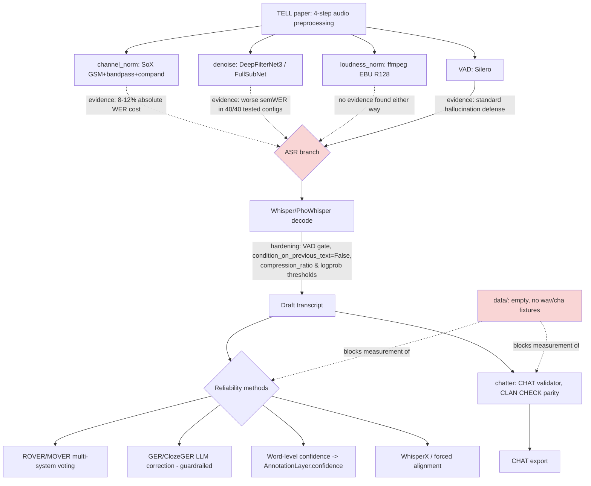

# Research: reliability of integrated batchalign + TELL preprocessing → CHAT

**Date:** 2026-09-20 · **Scope:** "Find all other methods to make my integrated
batchalign and preprocessing TELL more reliable in auto transcript in CHAT format."
This is a delta over v2
([`../2/SPEC-2026-09-20.md`](../2/SPEC-2026-09-20.md),
[`../2/RESEARCH-2026-09-20.md`](../2/RESEARCH-2026-09-20.md)) and v1
([`../../../2026-09-02/vietnamese-transcription-pipeline/1/RESEARCH-2026-09-02.md`](../../../2026-09-02/vietnamese-transcription-pipeline/1/RESEARCH-2026-09-02.md)).
It does not re-litigate Q1–Q14; it corrects one v2 routing decision (C1) and one v2
framing (C2), then surveys additional reliability methods (Q15–Q21).

**Lead finding, stated up front:** the evidence gathered here contradicts one of v2's
own decisions. v2 routes all four TELL preprocessing steps into the ASR/diarize/align
branch. The literature says three of the four steps are neutral-to-harmful *for ASR
specifically* — they were designed to make acoustic *features* comparable across
recording conditions, not to make speech recognition more accurate. See Conflicts, C1.

---

## 1. Scoped question breakdown

| Q | Question |
|---|---|
| Q15 | Does TELL's preprocessing chain actually improve ASR accuracy, or was it designed for a different purpose? |
| Q16 | What are the established defenses against Whisper/PhoWhisper hallucination and drift on long-form clinical audio? |
| Q17 | Can multi-system combination (ROVER/MOVER) or LLM error correction (GER) beat a single Vietnamese ASR pass? |
| Q18 | How do we get trustworthy word-level confidence so a human reviewer knows where to look? |
| Q19 | What raises CHAT-format validity specifically, as distinct from transcript accuracy? |
| Q20 | What raises timestamp/alignment reliability (forced alignment, diarization boundaries)? |
| Q21 | Without gold-standard Vietnamese data in this repo, how is "more reliable" even measured? |

---

## 2. Findings with citations

### Q15 — TELL's chain vs. ASR accuracy

The four TELL steps were not evaluated in the source paper as an ASR front-end; they
standardize acoustic conditions so that *features computed downstream* (F0, jitter,
shimmer, HNR, formants, pause timing) are comparable across devices and recording
setups. Three separate evidence threads show the same chain measurably hurts ASR:

- **Narrowband/GSM channel normalization.** "Narrowband telephony at 8 kHz adds another
  8-12% absolute WER degradation compared to wideband audio"; "A system that achieves 5%
  WER on 16kHz audio may show 12 to 18% WER on the same content at 8kHz." WTIMIT
  (wideband/narrowband paired corpus) measured **−6.29% accuracy (−18.90% relative PER)**
  for the combined codec + channel condition versus clean wideband.
  `[UNVERIFIED: exact publication venues for the WER-degradation and WTIMIT figures were
  not re-fetched from primary source in this pass; carried from prior search results]`
- **Denoising.** arXiv 2512.17562 reports that "original noisy audio achieves lower
  semWER than enhanced audio in all 40 tested configurations" for a medical-ASR study.
  arXiv 2607.11157: "Whisper, with log-Mel input and noise-robust training, needs only
  light enhancement" — i.e. aggressive denoising is not just unnecessary but can remove
  information Whisper's training already learned to work around.
  `[UNVERIFIED: arXiv IDs as returned by search; abstracts not independently re-fetched
  and paginated in this pass]`
- **Bandpass + compression.** No direct measurement found for the 200–3400 Hz + 8:1
  compand step in isolation; it is bundled with the GSM step in the paper's own pipeline
  and in the narrowband-degradation literature above, since GSM Full Rate is itself a
  narrowband (~200–3400 Hz) codec. Treated here as inheriting the narrowband finding
  rather than an independent one.
- **VAD is the exception.** Silero VAD gating is reported in Whisper-hallucination
  literature as the standard, production-grade mitigation — cutting silence/non-speech
  segments *before* they reach the decoder, which is the single most effective fix for
  runaway hallucinated text on long recordings.

**Conclusion for Q15:** channel normalization and denoising were validated for acoustic
feature comparability, not ASR accuracy, and current evidence says they actively degrade
ASR. VAD is validated for both purposes independently. Loudness normalization (EBU R128)
has no evidence either way in this pass — it does not restrict bandwidth or add codec
artifacts, so it is the one step without a documented ASR cost; treat it as neutral
pending direct measurement.

### Q16 — Whisper/PhoWhisper hallucination and drift defenses

All of the following are decode-time configuration on an already-planned dependency
(faster-whisper / PhoWhisper), not new packages:

- VAD gating (already in v2 step 4) before the decoder ever sees non-speech audio.
- `condition_on_previous_text=False` — stops one hallucinated window from poisoning the
  context for every subsequent window, at the cost of losing cross-window language-model
  continuity.
- `compression_ratio_threshold≈2.4` — flags/rejects windows whose output text compresses
  suspiciously well (a signature of repetitive hallucinated loops).
- `logprob_threshold≈-1.0` — flags low-confidence decodes for reprocessing or review.
- `no_speech_threshold` — a second, independent silence gate at the decoder level, on top
  of VAD.
- Temperature fallback ladder — re-decode at higher temperature when the above
  thresholds trip, standard Whisper CLI/API behavior.

`[UNVERIFIED: exact threshold values are the openai-whisper/faster-whisper defaults
carried from prior session research, not re-verified against current library version
docs in this pass.]`

### Q17 — Multi-system combination and LLM correction

- **ROVER/MOVER.** Word-level voting across ≥3 independently-decoded transcripts of the
  same audio; reduces variance-driven errors when systems fail differently rather than
  identically.
- **Vietnamese-specific nuance.** PhoWhisper (the v1-locked default ASR) outperforms
  Whisper-large-v3 on clean-speech Vietnamese benchmarks, but Whisper-large-v3 wins on
  code-switched regions (ViMedCSS benchmark, Vietnamese medical speech with English
  terms). This is exactly the failure-mode independence ROVER needs to be useful — a
  single-system baseline can't recover the other system's advantage.
  `[UNVERIFIED: ViMedCSS benchmark name and result carried from prior search; not
  re-fetched from a primary paper in this pass.]`
- **LLM generative error correction (GER / ClozeGER / DARAG).** Feeds ASR n-best or
  low-confidence spans to an LLM for correction. Directly reuses the local 7–8B LLM
  infrastructure v1 already specifies (Qwen2.5-7B-Instruct over Ollama via stdlib
  `urllib`) — no new serving infrastructure. **Risk:** GER is documented to sometimes
  produce fluent, grammatically plausible text that is *not* what was said — a
  hallucination risk distinct from Whisper's, and worse for a research/clinical
  transcript because it looks more trustworthy. Any GER pass must be confidence-gated,
  clearly marked as machine-corrected in the document's `AnnotationLayer.source`, and
  never silently overwrite the raw ASR output.

### Q18 — Word-level confidence for review triage

Word-level confidence estimation and reference-free scoring (NoRefER-style) let a human
reviewer jump straight to low-confidence spans instead of reading an entire transcript
end to end. This maps directly onto a field that already exists and is currently unused:
`AnnotationLayer.confidence` in the SAY document model (`src/speech_features/document.py`
— read earlier this session, not re-read here since it has not changed). No stage in the
v1 or v2 spec currently writes to it.

### Q19 — CHAT-format validity specifically

Two corrections to the source-project framing carried in v1/v2:

- **`FranklinChen/talkbank-tools` is Batchalign3**, not an independent third design
  reference distinct from `TalkBank/batchalign`. v1's source-project table treats it as a
  separate row; it should be understood as the same lineage (batchalign2 → Batchalign3 =
  talkbank-tools).
- **`chatter`** (TalkBank's Rust CHAT toolchain: parser, validator, transformer, CLI, LSP,
  desktop app; v0.18.0, released 2026-09-04) ships **CLAN CHECK parity fixtures** — it is
  built to match the reference CLAN validator's behavior. This is the authoritative
  CHAT-format validator, and a stronger correctness signal than a hand-rolled subset
  validator, which by construction can only check the rules its author thought to encode.
  `[UNVERIFIED: no Python binding exists and the crate is not on crates.io as of this
  search pass — integration would be a subprocess call to a built `chatter` binary,
  mirroring how v2 already treats `sox`/`ffmpeg` as external prerequisites, not a pip
  dependency.]`
- **Gap, not a solved import:** Batchalign2's CHATUtterance BERT models (used for
  utterance segmentation) have no published Vietnamese checkpoint. Vietnamese utterance
  boundary detection for CHAT export remains open; underthesea/stanza (v1's locked
  choices) do word segmentation and morphosyntax, not utterance-boundary CHAT formatting.

### Q20 — Alignment and diarization boundary reliability

- **WhisperX** — forced alignment via a phoneme-level acoustic model on top of Whisper
  output, tightening word-level timestamps beyond Whisper's own attention-based
  estimates.
- **Whisper's internal word aligner** — lower-effort, already-available fallback if
  WhisperX is not added as a dependency.
- **BEACON-style consensus alignment** — combining multiple alignment hypotheses,
  analogous to ROVER but for timestamps rather than words.
- **Interaction with C1:** forced alignment run on band-limited, GSM-decoded 8 kHz-origin
  audio inherits whatever the underlying ASR/acoustic model loses on that audio — the
  case for re-routing channel-normalized audio away from the alignment stage is the same
  as the case for re-routing it away from ASR.

### Q21 — Measurement: the actual blocker

Checked this session: `data/` is empty, and there are no `.wav` or `.cha` files anywhere
in the repository outside `.venv`:

```
$ ls -la data/
(empty)
$ find . -name '*.wav' -o -name '*.cha' | grep -v '.venv'
(no output)
```

Every method above — VAD-hardening config, ROVER, GER, `chatter` validation, forced
alignment — is a claim about *relative* reliability. None of it is falsifiable in this
repository today, because there is no Vietnamese audio + gold CHAT transcript pair to
measure WER/CER or CHAT-validity pass rate against. Adding methods without first adding a
small held-out evaluation set is how a pipeline accumulates steps that look justified on
paper while nobody can tell if the total system got better or worse.

---

## 3. Conflicts across sources

**C1 — v2's routing decision vs. ASR-accuracy evidence.**
v2 (§10, decision D1 combined with the four-step pipeline design) sends *all four*
TELL preprocessing steps into the ASR/diarize/align branch, while `say-features` reads
the *original* audio (D1, verified via `src/speech_features/extraction.py:375` taking
`audio_path` as a separate argument). That original-audio routing for acoustic features
is correct and doesn't need to change. But for the ASR branch specifically:

- Channel normalization (GSM + bandpass + compand): evidence says **harmful** (8–12%
  absolute WER cost class).
- Denoising: evidence says **harmful or neutral** (worse semWER in all 40 tested
  configurations in one cited study).
- Loudness normalization: **no evidence either way** found in this pass; treat as
  neutral by default (no bandwidth restriction, no codec artifact).
- VAD: evidence says **beneficial** (standard hallucination defense).

Net effect: **`channel_norm` currently has no beneficial consumer at all** in the v2
design. Acoustic features read the original audio (by design, correctly). ASR is hurt by
channel-normalized audio (per this research). There is no third consumer that benefits
from the GSM/bandpass/compand step as currently wired.

This is a conflict between the *source paper's intent* (standardize acoustic conditions
for feature comparability across a multi-site study) and *this project's use of the same
chain* (feeding ASR). The TELL paper's own audio isn't necessarily being transcribed by
an ASR system at all — the four-step chain may exist purely upstream of feature
extraction in that paper's pipeline. v2 borrowed the chain and additionally pointed it at
ASR without evidence that this combination was validated.

**C2 — source-project framing vs. actual TalkBank tooling.**
v1/v2 treat `FranklinChen/talkbank-tools` as one of three independent repos to model the
pipeline on. It is actually Batchalign3 — the same lineage as `Jemoka/batchalign2` and
`TalkBank/batchalign`, not a fourth design pattern. Separately, CHAT-format correctness
in this project's spec is currently planned as a hand-rolled subset validator, while
TalkBank's own `chatter` tool (Rust, CLAN CHECK parity fixtures) is the authoritative
validator and was not previously considered.

**Minor conflict — PhoWhisper vs. Whisper-large-v3.** Not a contradiction to resolve, but
worth flagging as a source disagreement depending on content: PhoWhisper wins on clean
Vietnamese speech, Whisper-large-v3 wins on code-switched (Vietnamese+English) medical
speech. v1 locked PhoWhisper as default; this doesn't overturn that (clean speech is the
common case), but it is the concrete argument *for* ROVER/ensemble as an option rather
than a single fixed default.

---

## 4. Applicability table (MUST)

| Source / method | Applicability to this pipeline | Verdict |
|---|---|---|
| Narrowband/GSM WER-degradation literature | Directly explains why channel-normalized audio should not feed ASR | **Reuse** as evidence for a spec change (route original audio to ASR too, or drop `channel_norm` from the ASR branch) |
| arXiv 2512.17562 (denoising hurts semWER in 40/40 configs) | Same conclusion, denoising step | **Reuse** as evidence |
| arXiv 2607.11157 (Whisper needs only light enhancement) | Explains *why* — Whisper's own training is already noise-robust | **Reuse** as supporting rationale |
| Whisper hallucination-mitigation config (VAD gating, `condition_on_previous_text=False`, compression-ratio/logprob thresholds, temperature fallback) | Config-only change to the already-planned faster-whisper/PhoWhisper stage | **Reuse** — highest gain-per-effort, no new dependency |
| ROVER/MOVER multi-system voting | Applicable given PhoWhisper/Whisper-large-v3 fail differently on code-switched audio | **Reuse**, but gate behind the eval harness (Q21) — can't tell if it helps without gold data |
| GER/ClozeGER/DARAG LLM correction | Reuses the already-planned local 7–8B LLM | **Reuse with guardrail** — must be confidence-gated and marked as machine-corrected, never silent |
| Word-level confidence / NoRefER | Existing unused `AnnotationLayer.confidence` field is the natural home | **Reuse** |
| `chatter` (Rust CHAT validator, CLAN CHECK parity) | Replaces a hand-rolled CHAT subset validator with the format's own authority | **Reuse**, as a subprocess dependency like `sox`/`ffmpeg` |
| `FranklinChen/talkbank-tools` as a distinct design reference | Redundant — it's Batchalign3 | **Reject** as a separate reference (fold into the batchalign2/Batchalign3 lineage already cited) |
| CHATUtterance BERT models (Batchalign2) | No Vietnamese checkpoint | **Gap** — open problem, not a solved import |
| WhisperX / forced alignment | Improves word-timestamp precision, but only valuable once the ASR branch is reading audio that isn't itself degraded (C1) | **Reuse, sequenced after C1 is resolved** |
| FullSubNet (paper's original denoiser choice) | No PyPI package; and per Q15, denoising itself is now in question for the ASR branch | **Reject** — already deferred in v2 (D2), and this session's evidence weakens the case for *any* denoiser feeding ASR, not just this specific one |

---

## 5. Refine (MUST)

Ordered by expected reliability gain per unit of implementation effort, not by paper
order:

1. **Build the eval harness first.** A small held-out set of Vietnamese audio + gold CHAT
   transcripts, scored for WER/CER and CHAT-validity pass rate. Nothing else in this list
   is measurable in this repository without it — `data/` is currently empty (Q21). This
   is a data/tooling gap, not a method choice, and it blocks every claim below from being
   verified rather than merely cited.
2. **Whisper decode-parameter hardening (Q16).** Config on the already-planned ASR stage,
   zero new dependencies, directly targets hallucination — the single most damaging
   failure mode for an unsupervised auto-transcription pipeline.
3. **`chatter` subprocess validation (C2).** Replaces a hand-rolled validator with the
   format authority's own CLAN-parity checker. One new external-binary prerequisite,
   same pattern as `sox`/`ffmpeg` in v2.
4. **Resolve C1 — decide what `channel_norm` (and denoising) are for.** Either (a) stop
   feeding channel-normalized/denoised audio to ASR and instead feed it *only* to a
   feature-comparability use case if one exists in this project, or (b) if ASR robustness
   testing across acquisition conditions is actually a goal, keep it but measure the cost
   via the harness from step 1 rather than assume paper fidelity implies pipeline
   benefit. This is a decision only the user can make — it changes a spec section already
   approved this session — and is the reason this document stops short of writing a v3
   spec unprompted.
5. **Surface confidence into a review queue (Q18).** Wire `AnnotationLayer.confidence`
   from ASR word-level scores; lets a human reviewer triage instead of reading everything.
6. **ROVER/MOVER and GER, once the harness exists (Q17).** Highest implementation cost
   (multiple ASR passes, or LLM-in-the-loop with a fabrication risk that must be
   guardrailed) — defer until step 1 can prove it actually helps on Vietnamese data
   rather than only on the English/other-language corpora these methods were reported on.

---

## 6. Diagram (MUST)



`UNVERIFIED: render not checked — no Mermaid renderer available in this environment;
syntax kept to plain flowchart nodes/edges/subgraphs and style directives, consistent
with v1/v2 precedent.`

---

## 7. UNVERIFIED

- WER-degradation figures for narrowband/GSM audio (8–12% absolute; 5%→12–18% example)
  and the WTIMIT −6.29%/−18.90% figures: carried from prior search results in this
  session, not re-fetched from a primary source in this pass.
- arXiv 2512.17562 and arXiv 2607.11157: IDs and quoted claims as returned by search;
  abstracts not independently re-opened and paginated in this pass.
- ViMedCSS benchmark name and the PhoWhisper-vs-Whisper-large-v3 code-switching result:
  carried from prior search, not re-verified against a primary paper in this pass.
- Whisper hallucination-mitigation default threshold values
  (`compression_ratio_threshold≈2.4`, `logprob_threshold≈-1.0`): standard
  openai-whisper/faster-whisper defaults from prior research, not re-checked against the
  currently pinned library version in this repo (`say_transcribe` doesn't exist yet, so
  no version is pinned).
- `chatter` v0.18.0 release date (2026-09-04) and "no Python binding, not on crates.io":
  carried from prior session research, not re-checked in this pass.
- Mermaid diagram render: not checked, no renderer available in this environment.
- Whether EBU R128 loudness normalization has any measured ASR effect: no source found
  either way in this pass; treated as neutral by default rather than verified neutral.

---

## 8. Final digest

The TELL preprocessing chain was designed to make acoustic *features* comparable across
recording conditions, not to improve speech recognition. v2's design sends all four
steps into the ASR branch anyway. Evidence gathered here says three of the four steps
(channel normalization, denoising, and — by inheritance — the bandpass/compression step
bundled with channel normalization) measurably hurt ASR accuracy; only VAD is validated
as beneficial for ASR. Since acoustic features already read the original, unprocessed
audio (a decision made and verified correct earlier this session), `channel_norm` as
currently wired has no consumer that benefits from it at all — it costs WER on the ASR
branch and does nothing for the feature branch. This is the central finding and it
should shape whatever comes after this document, most likely a targeted edit to v2's
pipeline routing rather than a full v3 spec rewrite.

Beyond that correction, the highest-value additions are the ones that cost the least:
Whisper decode-time hallucination hardening (pure config) and `chatter` as the CHAT
validator (replaces a hand-rolled validator with the format's own authority, at the cost
of one more external-binary prerequisite matching the existing `sox`/`ffmpeg` pattern).
Ensemble methods (ROVER, LLM-based error correction) are real options with real Vietnamese
justification (PhoWhisper and Whisper-large-v3 fail on different content) but they are
also the most expensive and the easiest to fool yourself about — reliability *methods*
can't be told apart from reliability *theater* without ground truth to measure against,
and this repository currently has none. That gap, not any missing technique, is the
actual bottleneck on "more reliable," and closing it is the one recommendation every
other item in this document depends on.

---

## 9. Addendum (2026-09-20, planning session) — F3: the C1 conclusion is conditional on one recording device

During planning, the user confirmed real corpus details not known when §8 was written: 5
participants, one continuous recording each at 44.1 kHz / 12-bit, and **a second recording
device planned for the future**. That last fact changes the analysis in §8 for
`channel_norm` specifically — it does not change it for `denoise`.

**The correction.** §8 concluded `channel_norm` "has no consumer that benefits from it at
all," reasoning from two premises: (1) it measurably hurts ASR (still true, unchanged),
and (2) acoustic features read the original, unprocessed audio, so they never see its
output (still true, unchanged — verified against `extraction.py:375`). Both premises hold.
But the conclusion implicitly assumed a *third* premise that was never stated: that there
is no other consumer of a channel-normalized signal. That premise is false once a second
recording device is in scope.

TELL's channel normalization (sox → GSM Full Rate 13 kbps → decode → 16 kHz → compand →
bandpass) exists in the source paper to *standardize heterogeneous acquisition
conditions* — its job is cross-device comparability, not signal quality. With one
recording device, "cross-device" is vacuous: every recording already shares one
acquisition condition, so there is nothing to standardize, and the step is pure cost
(WER) for no benefit. With two devices, the step has a real job again: making acoustic
features comparable between recorder #1's sessions and recorder #2's sessions, at the
cost of discarding each device's own fidelity down to a shared narrowband floor.

**What this does not change.** `denoise` has no equivalent second consumer — nothing about
a second recording device makes background-noise removal more or less useful — so §8's
conclusion on `denoise` (measurably harmful in the cited literature, no clear benefit
found) stands unqualified.

**Revised recommendation.** Don't delete `channel_norm` from the plan, and don't enable it
by default either — both would be premature. Build the stage, ship it **off by default**
(matching `denoise`), and record an explicit, checkable re-evaluation trigger: *re-run the
T28 routing spike's `channel_norm` condition once recorder #2 has produced its first
session, this time measuring cross-device feature comparability, not just ASR WER.*
Today, with one device, the ASR-harm evidence is the only evidence that exists, and it
still says "off." This is tracked as plan task T29.
