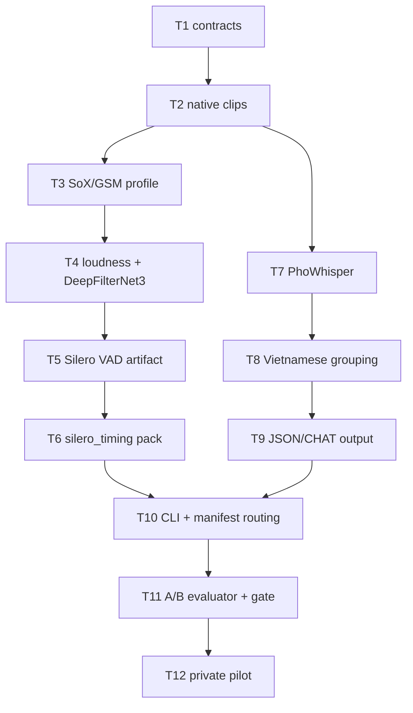

# Implementation plan: reliable Vietnamese transcription and audio profiles

**Specification:** [SPEC-2026-09-21.md](./SPEC-2026-09-21.md)  
**Research:** [RESEARCH-2026-09-21.md](./RESEARCH-2026-09-21.md)  
**Task detail:** [TASKS-2026-09-21.md](./TASKS-2026-09-21.md)  
**Dispatch:** [tasks-2026-09-21.json](./tasks-2026-09-21.json)

## Outcome and guardrails

Build one reviewable Vietnamese path from immutable continuous recordings to approved task clips, PhoWhisper-medium draft transcripts, Vietnamese word groups, SAY JSON/optional CHAT, and label-free `speech_features` output.

The existing native-rate, explicitly selected-channel audio remains the authoritative feature and ASR input. The new `tell-inspired-v1` profile is opt-in and runs in parallel for a controlled A/B comparison. It must never silently replace native audio, rewrite annotations, or publish processed acoustic features as if they were native measurements.

No task downloads private corpus files, invents task boundaries, maps diarization clusters to roles, or claims clinical accuracy. All tracked fixtures are synthetic.

## Dependency graph

Diagram verification: Mermaid introduction and flowchart syntax were checked on 2026-09-21. Render verification is **UNVERIFIED** because no Mermaid renderer is installed locally.

## Ordered work and checkpoints

### Phase 1 — immutable inputs and native baseline

1. **T1** defines immutable approved-annotation contracts and stable redacted errors.
2. **T2** creates explicit-channel native task clips and an in-memory 16 kHz ASR view.
3. **T7** can then add the fake-backed PhoWhisper path without touching the feature extractor.

**CP1:** synthetic annotation, silent-right-channel, and fake-ASR tests pass; native `speech_features` behavior is unchanged.

### Phase 2 — opt-in TELL-inspired processed branch

1. **T3** implements the deterministic SoX GSM Full Rate round-trip, 16 kHz conversion, and 200–3,400 Hz band limit.
2. **T4** adds FFmpeg EBU R128 two-pass loudness and pinned DeepFilterNet3 denoising.
3. **T5** runs pinned Silero VAD on processed PCM and writes integer-sample intervals.
4. **T6** consumes those intervals as a separate `silero_timing` feature family.

**CP2:** a synthetic clip produces a validated processed artifact plus sidecar; hashes, stage configuration, interval bounds, and privacy redaction pass. Native output is byte-for-byte unaffected.

### Phase 3 — Vietnamese participant-safe documents

1. **T8** adds Underthesea word grouping without changing surface syllables.
2. **T9** serializes existing JSON v2 and optional CHAT, preserving roles and diacritics.
3. **T10** exposes `preprocess`, `run --asr-audio native|tell-inspired-v1`, and optional manifest `preprocess_path`.

**CP3:** approved participant output is reloadable, CHAT is validated when requested, and the default run still uses native audio.

### Phase 4 — evidence before promotion

1. **T11** compares native and processed ASR and timing results on private development/held-out manifests.
2. **T12** is the real PhoWhisper GPU pilot and remains blocked until the host CUDA smoke test succeeds.

**CP4:** promote the processed profile only if the predeclared gate passes; otherwise retain it as an analysis-only branch.

## Code-reading map (pinned source)

These are implementation patterns, not evidence that either repository is Vietnamese clinical ground truth. Read the linked functions before writing the corresponding task.

| Planned feature | TalkBank/batchalign | FranklinChen/talkbank-tools | What to borrow / what to reject |
|---|---|---|---|
| Explicit mono PCM contract and channel handling (T2/T3) | [`utils.rs` PCM helpers](https://github.com/TalkBank/batchalign/blob/e88ab2ce4ab478c1f800ba9966d6c0d3ce6a7e64/crates/batchalign/batchalign-core/src/utils.rs#L251-L474) | [`audio.py` load/resample/fingerprint](https://github.com/FranklinChen/talkbank-tools/blob/7e3f335d70e756b7801e421643f6cb9cd8bb1781/batchalign/inference/audio.py#L75-L340) | Borrow explicit waveform contracts, lazy loading, and fingerprints. Reject an implicit mean downmix for this pilot. |
| Deterministic conversion and ASR preparation (T2/T3/T7) | [`convert.rs`](https://github.com/TalkBank/batchalign/blob/e88ab2ce4ab478c1f800ba9966d6c0d3ce6a7e64/crates/batchalign/batchalign-core/src/backends/convert.rs#L100-L249), [`asr.rs`](https://github.com/TalkBank/batchalign/blob/e88ab2ce4ab478c1f800ba9966d6c0d3ce6a7e64/crates/batchalign/batchalign-core/src/taskrunners/asr.rs#L1-L70) | [`asr.py` prepared inference](https://github.com/FranklinChen/talkbank-tools/blob/7e3f335d70e756b7801e421643f6cb9cd8bb1781/batchalign/inference/asr.py#L276-L286) | Borrow a prepared-audio boundary and lazy backend loading. Keep SoX/FFmpeg/DeepFilterNet3 optional and fail closed. |
| VAD/model adapter boundary (T5) | [`funaudio.py`](https://github.com/TalkBank/batchalign/blob/e88ab2ce4ab478c1f800ba9966d6c0d3ce6a7e64/python/batchalign/backends/asr/funaudio.py#L70-L150) | [`_funaudio_common.py`](https://github.com/FranklinChen/talkbank-tools/blob/7e3f335d70e756b7801e421643f6cb9cd8bb1781/batchalign/inference/languages/cantonese/_funaudio_common.py#L67-L220) | Borrow versioned adapter/config separation; use Silero ONNX CPU and record Vietnamese validation instead of assuming another language's thresholds. |
| Provenance and replay-safe outputs (T3–T6/T10) | [`utils.rs` provenance helpers](https://github.com/TalkBank/batchalign/blob/e88ab2ce4ab478c1f800ba9966d6c0d3ce6a7e64/crates/batchalign/batchalign-core/src/utils.rs#L542-L620) | [`audio.py` fingerprints](https://github.com/FranklinChen/talkbank-tools/blob/7e3f335d70e756b7801e421643f6cb9cd8bb1781/batchalign/inference/audio.py#L240-L340) | Borrow hashes, stable model revisions, and replay metadata. Never copy raw paths, transcript text, tokens, or credentials. |
| Vietnamese token/word boundary preservation (T8/T9) | [`chatutterance.py`](https://github.com/TalkBank/batchalign/blob/e88ab2ce4ab478c1f800ba9966d6c0d3ce6a7e64/python/batchalign/backends/utseg/chatutterance.py) | [`utseg.py`](https://github.com/FranklinChen/talkbank-tools/blob/7e3f335d70e756b7801e421643f6cb9cd8bb1781/batchalign/inference/utseg.py) and [Vietnamese investigation](https://github.com/FranklinChen/talkbank-tools/blob/7e3f335d70e756b7801e421643f6cb9cd8bb1781/batchalign/tests/investigations/_cases/vietnamese.py) | Borrow alignment/test ideas only. Keep original Vietnamese syllable surfaces and use Underthesea 9.5.0 as the frozen segmenter. |
| Speaker/CHAT/provenance boundaries (T8–T10) | [`pyannote.py`](https://github.com/TalkBank/batchalign/blob/e88ab2ce4ab478c1f800ba9966d6c0d3ce6a7e64/python/batchalign/backends/speaker/pyannote.py), [`bridge.rs`](https://github.com/TalkBank/batchalign/blob/e88ab2ce4ab478c1f800ba9966d6c0d3ce6a7e64/crates/batchalign/batchalign-core/src/asr/chat/bridge.rs) | [`speaker.py`](https://github.com/FranklinChen/talkbank-tools/blob/7e3f335d70e756b7801e421643f6cb9cd8bb1781/batchalign/inference/speaker.py), [`asr.py`](https://github.com/FranklinChen/talkbank-tools/blob/7e3f335d70e756b7801e421643f6cb9cd8bb1781/batchalign/inference/asr.py#L276-L286) | Borrow stage boundaries and output validation. Keep role assignment human-approved; do not infer participant/examiner from anonymous clusters. |

### Source-reading order

Read `utils.rs` and `audio.py` first, then `convert.rs`/`asr.py`, then the VAD adapters, then the CHAT and Vietnamese grouping files. The TELL-specific SoX, FFmpeg, DeepFilterNet3, and Silero choices are documented in the research/spec sources, not copied from these repositories.

## Verification policy

Every task has focused tests and Ruff checks in [TASKS-2026-09-21.md](./TASKS-2026-09-21.md). Before T11, verify JSON/CHAT round trips, sidecar hash/alignment invariants, no-absolute-path logs, and that native and processed outputs are distinguishable by profile ID. Do not run real-model downloads in unit tests.
