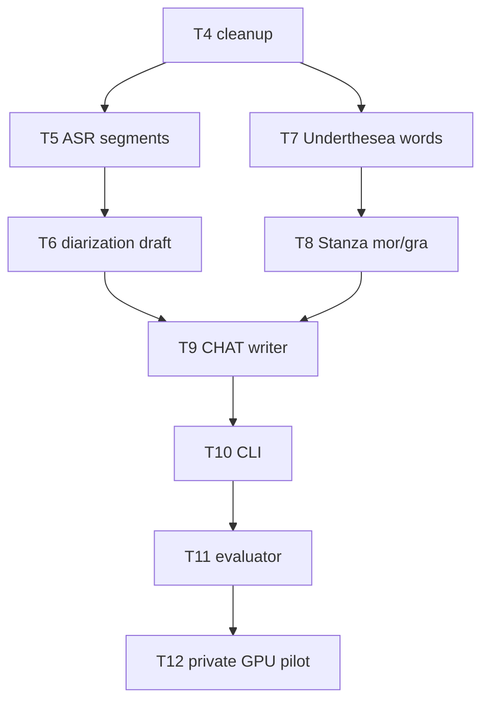

# Implementation plan: automatic transcription with `%mor`/`%gra`

**Specification:** [SPEC-2026-09-23.md](./SPEC-2026-09-23.md)
**Research:** [RESEARCH-2026-09-23.md](./RESEARCH-2026-09-23.md)
**Task detail:** [TASKS-2026-09-23.md](./TASKS-2026-09-23.md)
**Dispatch:** [tasks-2026-09-23.json](./tasks-2026-09-23.json)

## Outcome and guardrails

Build one automatic path from a master WAV to a Chatter-valid `.cha` file per session: PhoWhisper
ASR, pyannote speaker draft, Underthesea word grouping, Stanza `vi` (UD-VTB) morphosyntax, rendered
as `%wor`, `%mor` and `%gra` dependent tiers under the main tier — the shape DementiaBank Delaware
transcripts already have (460/462 carry `%wor`), produced automatically the way
`batchalign`/`talkbank-tools` produce it.

v4's annotation contract, clapperboard detection, and `tell-inspired-v1` preprocessing are dropped
(SPEC §1). Their code (T1–T3) is deleted in T4, not carried forward or reused. Native, explicitly
selected-channel audio stays the only ASR input; no mean downmix, no disk-written resampled copy
(SPEC §2).

## Dependency graph

Diagram verification: Mermaid flowchart syntax checked 2026-09-23, following the same convention as
v4's diagram. Render verification is **UNVERIFIED** because no Mermaid renderer is installed
locally (carried from v4).

## Ordered work and checkpoints

### Phase 1 — remove annotation-era code, add ASR + diarization

1. **T4** deletes `annotations.py`, `audio_profile.py`, `prepare.py`, `preprocess.py`, and
   `crop_task_clip` (`audio.py:78`); deletes `test_annotations.py` and
   `test_preprocess_contract.py`; trims `test_audio_prepare.py` to audio-only tests; fixes
   `__init__.py` exports. Keeps `read_wav`, `extract_channel`, `resample_to_16kHz`.
2. **T5** adds PhoWhisper-medium ASR (lazy import) producing timed segments and word-level
   `start_end` timestamps that stand directly as CHAT utterance boundaries (SPEC §2 step 4,
   RESEARCH §2).
3. **T6** adds pyannote diarization (lazy import) producing a per-utterance speaker draft; larger
   talk-time cluster becomes `*PAR` (SPEC §4).

**CP1:** offline fake-backed ASR and diarization tests pass; no real model download in unit tests;
`GPU_UNAVAILABLE`/`MODEL_UNAVAILABLE` paths are tested.

### Phase 2 — Vietnamese word grouping and morphosyntax

1. **T7** groups ASR tokens into `_`-joined Vietnamese words with Underthesea 9.5.0, never across
   an utterance boundary; NFC, tones, `d`/`đ` preserved (reused unchanged from v4 T8's contract).
2. **T8** runs Stanza `vi` (UD-VTB) pretokenized on those words, MWT explicitly disabled, and
   projects the output into `%mor`/`%gra` items per the render.py rules in RESEARCH §3
   and SPEC §3.

**CP2:** a Chatter fixture with `_`-joined words and both tiers validates before any real-model
work is trusted (SPEC open question 1). `CHAT_MORPHOSYNTAX_UNAVAILABLE` path is tested.

### Phase 3 — CHAT output and CLI

1. **T9** writes one `.cha` per session: headers, `*PAR`/`*INV` main tier with bullets, `%wor`,
   `%mor`, `%gra`, and the `@Comment` provenance lines (SPEC §3).
2. **T10** exposes `say-transcribe diagnose`, `run`, `evaluate`, and adds `say_transcribe*` to
   setuptools package discovery (`pyproject.toml` currently only includes `speech_features*`).

**CP3:** a synthetic session round-trips through `.cha` write → Chatter validation →
`src/speech_features/formats/chat.py` parse, preserving `%mor`/`%gra`.

### Phase 4 — evidence before promotion

1. **T11** measures CER/WER/SyER/DER, `%mor`/`%gra` tier agreement, and format pass rate on
   private development/held-out sessions, with a seeded 2,000-resample bootstrap (SPEC §6, carried
   from v4 §8).
2. **T12** is the real PhoWhisper GPU pilot, blocked until the host CUDA smoke test succeeds
   (same blocker as v4 T12; unresolved as of this plan).

**CP4:** aggregate metrics recorded privately; only aggregate numbers enter tracked docs.

## Code-reading map (pinned source)

Citations point at [RESEARCH-2026-09-23.md](./RESEARCH-2026-09-23.md), which pins
`batchalign@e88ab2ce4ab478c1f800ba9966d6c0d3ce6a7e64` and
`talkbank-tools@7e3f335d70e756b7801e421643f6cb9cd8bb1781`. Read the RESEARCH section before writing
the corresponding task; do not re-derive citations here.

| Planned feature | RESEARCH section | What to borrow / what to reject |
|---|---|---|
| ASR segments as utterance boundaries (T5) | §2 transcribe flow, §4 row 1 | Borrow the fallback-to-ASR-boundaries pattern batchalign itself uses for every language with no utseg model. Reject running `ba3` directly — PhoWhisper is not a batchalign engine (v4 D3, still true). |
| Diarization draft (T6) | §7 reusable code-reading rows (`pyannote.py`, `speaker.py`) | Borrow the stage boundary and output-validation shape. Keep role assignment (`*PAR`/`*INV`) human-reviewable, not auto-final. |
| Underthesea word grouping (T7) | §4 row 2 (syllable split), row 3 (`_` strip) | Reuse v4 T8's grouping contract verbatim. Do not adopt batchalign's syllable split or its `_`-stripping cleanup — both are wrong for a Vietnamese multi-syllable word joiner. |
| Stanza `vi` pretokenized morphosyntax (T8) | §3 morphotag flow, §4 rows 3-4, §6 Stanza vi package | Borrow `tokenizer_processor`'s DP realignment approach and the `render.py` rendering rules (root-head-0 invariant, `,`→`cm|cm`). Reject the MWT-for-`vi` request and the English-tuned `_CLEANUP_RE` — both assume `_` never appears as a legitimate word-internal character. |
| CHAT writer (T9) | §1 Delaware tier profile, §3 morphotag flow | Borrow the header/tier/bullet shape Delaware transcripts already use, `%wor` word spans included. No JSON sidecar (SPEC §1). |
| Evaluator (T11) | v4 SPEC §8 (carried into SPEC-2026-09-23.md §6) | Reuse v4's CER/WER/SyER/DER/bootstrap implementation approach; add `%mor`/`%gra` tier agreement, which v4 did not need. |

### Source-reading order

Read RESEARCH §1 (Delaware profile) and §2 (transcribe flow) before T5/T6. Read §3 (morphotag
flow) and §4 (gap table) before T7/T8 — the gap table is the list of places batchalign's own
patterns must NOT be copied verbatim for Vietnamese. Read §7 (reusable v4 code) before touching
`audio.py`.

## Verification policy

Every task has focused tests and Ruff checks in [TASKS-2026-09-23.md](./TASKS-2026-09-23.md).
Before T11, verify: `.cha` round-trips through `src/speech_features/formats/chat.py` preserving
`%wor`/`%mor`/`%gra`; Chatter validates a synthetic fixture with `_`-joined words; no absolute path or
utterance text in logs; native and diarization-draft speaker labels are marked `draft` until a
human relabels. Do not run real-model downloads in unit tests.
