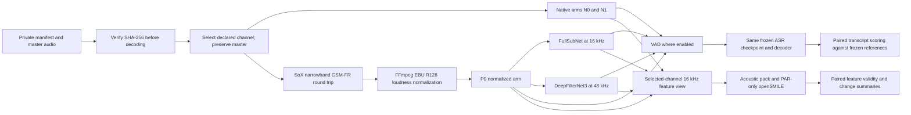

# Audio preprocessing A/B evaluation

## Objective

Define a reproducible, opt-in experiment that measures whether a narrowband audio-preprocessing profile improves Vietnamese speech transcription while keeping participant-speech acoustic features usable. Compare the native audio path with common-channel normalization, EBU R128 loudness normalization, two candidate denoisers, and voice activity detection (VAD).

This is a research profile. It must run alongside the native path, never replace or rewrite master recordings, and remain outside the default transcription workflow unless a later decision explicitly promotes it.

## Decisions

- Keep this as a separate study; do not amend the current v5 evaluation.
- Compare the existing acoustic feature pack and openSMILE eGeMAPS features.
- Evaluate both FullSubNet and DeepFilterNet3. Select a denoiser using development data and confirm it on locked held-out data.
- Make ASR performance the selection objective, subject to speech-coverage and acoustic-feature-validity gates.
- Curate and verify human reference transcripts and timing before scoring.
- Run openSMILE only on participant (`PAR`) speech intervals, using the same human intervals in every arm.

## Questions and hypotheses

1. Does the complete preprocessing profile lower Vietnamese utterance transcription error relative to the native path?
2. Does either denoiser improve ASR over the normalized, non-denoised arm?
3. Does preprocessing preserve enough reference speech and produce valid acoustic features for reliable downstream analysis?
4. How much do the preprocessing stages change acoustic feature values and missingness?

The study can establish effects on these recordings and this fixed ASR configuration. It cannot establish that denoising makes acoustic measurements closer to clean speech without clean acoustic references.

## Repository and implementation context

- Python project, Python >=3.10; command entry points are `say-transcribe` and `say-features`.
- Transcription code is under `src/say_transcribe/`; `audio.py` selects an explicit input channel and prepares an in-memory 16 kHz `float32` ASR view. `vad.py` contains the current Silero VAD integration, and `cli.py` owns the transcription and comparison commands.
- Feature extraction is under `src/speech_features/`. Reuse the existing acoustic extraction and openSMILE integration where possible. The study must select the declared channel before feature extraction; do not mean-downmix stereo.
- Follow `AGENTS.md`, the local Batchalign repository maps under `docs/repo-map/`, and the audio/channel, provenance, privacy, lazy-dependency, and opt-in-profile rules there.
- Keep PyTorch, denoiser, and openSMILE imports lazy. Unit tests must run offline and must not download model weights or require a GPU.

## Experiment design

### Participants, recordings, and references

Use the pilot recordings only after an approved manifest supplies a pseudonymous session and participant ID, master-audio SHA-256, declared `channel_index`, split, and verified human `.cha` reference. Verify the master hash before decoding or processing. Do not add source audio, `.cha` files, per-session transcripts, or model outputs to Git.

The current pilot inventory has five WAV recordings (`p001`–`p005`) and only two `.cha` files. Therefore, the full pilot is not ready to score until references are curated and checked. Provisional assignment is `p001`–`p003` for development and `p004`–`p005` for held-out evaluation, only if these are independent participants. Group by participant before splitting; if the proposed assignment is not participant-disjoint, revise it before running models. Do not tune on held-out data.

Check reference transcript completeness, participant turns, utterance boundaries, and usable timing. Freeze the references and scoring normalization before evaluation. If the available participant count is too small for useful inference, label results exploratory and expand the cohort before making confirmatory claims.

### Comparison arms

Every arm uses the same selected channel, the same ASR checkpoint and decoding settings, the same reference data, and the same VAD model/configuration where VAD is enabled.

| ID | Input to ASR | Purpose |
| --- | --- | --- |
| N0 | Native selected-channel audio; no VAD | Unprocessed baseline |
| N1 | Native selected-channel audio with VAD | Estimates the VAD contribution |
| P0 | GSM-FR/narrowband and R128-normalized audio with VAD; no denoiser | Common preprocessing baseline |
| PF | P0 plus FullSubNet, then VAD | FullSubNet candidate |
| PD | P0 plus DeepFilterNet3, then VAD | DeepFilterNet3 candidate |

Interpret N0 vs N1 as the VAD comparison, N1 vs P0 as the common/loudness normalization comparison, and P0 vs PF/PD as the denoising comparisons. N0 vs PF/PD estimates the complete profile, not an isolated stage effect.

### Preprocessing profile

Apply transformations to a private derived signal. Preserve the master file byte-for-byte and retain its native sample rate, bit depth, and sample boundaries. Select the manifest-declared channel explicitly before conversion; never average channels.

The profile order is:

1. Use SoX (Sound eXchange) to select the declared channel and prepare a mono WAV signal.
2. Apply a 200 Hz–3.4 kHz band-pass to emulate narrowband transmission.
3. Resample to the 8 kHz operating rate required by GSM Full Rate, encode at approximately 13 kb/s, then decode to 16-bit PCM. Treat GSM-FR as the stated 8:1 lossy compression stage; do not add a second independent compression stage.
4. Resample the decoded PCM to 16 kHz.
5. Apply FFmpeg `loudnorm` using two-pass EBU R128 normalization, target integrated loudness of −23 LUFS, true-peak ceiling of −1 dBTP, and LRA target of 7 LU. Record measured input/output loudness and whether the filter reached its target.
6. For PF, run FullSubNet at its 16 kHz input rate. For PD, resample to DeepFilterNet3's 48 kHz operating rate, denoise, and return to 16 kHz.
7. Run the pinned Silero VAD configuration on each VAD arm. Calibrate its threshold using development data only and freeze it before the held-out run.

The analysis receives in-memory arrays. Any format-conversion or model intermediates must be private, temporary, and removed after use. Do not save resampled ASR WAVs into the repository or substitute them for source media.

### Transcription evaluation

Use the same pinned PhoWhisper checkpoint, language/task settings, decoding parameters, and software versions in all arms. Store checkpoint identifiers and SHA-256 hashes in the private run manifest. Do not tune ASR or preprocessing against held-out transcripts.

Primary outcome is the per-session uncapped syllable error rate (`SyER`): Levenshtein edit distance over the reference and hypothesis syllable-token sequences divided by the number of reference syllables, with substitutions, deletions, and insertions counted and no cap at 1.0. Follow the repository evaluator's CHAT parsing and syllable segmentation convention. Aggregate sessions to participant-level paired summaries. Report CER and WER as secondary outcomes. Freeze scoring normalization before evaluation; preserve NFC, Vietnamese tone marks, and `đ`, and apply identical normalization in every arm.

The current `src/say_transcribe/evaluate.py` caps SyER, CER, and WER at 1.0. Do not use those capped values for the primary analysis: provide an unclamped scoring path for this study and cover insertion-heavy cases where the rate exceeds 1.0.

Report speech-duration coverage as the duration of verified participant-speech reference intervals retained by VAD divided by the total reference speech duration. Also report the fraction of reference participant utterances with usable retained audio, transcription, and timing. Do not hide insertion errors, missed turns, invalid timestamps, or empty outputs behind aggregate scores.

### Acoustic feature evaluation

For a fair rate comparison, feed each arm's explicitly selected-channel signal to feature extraction as an in-memory 16 kHz mono array; the native master remains at its original format on disk. Use the same verified human `PAR` intervals for every arm, independent of predicted VAD boundaries. Do not calculate participant features from interviewer turns.

Extract the repository's acoustic feature pack per session. Extract openSMILE eGeMAPS per eligible `PAR` utterance of at least 1 second. Compare paired feature changes by feature family and arm, and report finite-value coverage, missingness, extraction failures, and any out-of-range values. These comparisons measure how preprocessing changes features; without clean reference recordings, they are not acoustic-accuracy scores.

Confirm that the openSMILE research license permits the intended study before enabling that adapter. Record the openSMILE version and configuration with results.

### Selection and statistics

On development participants, select the denoiser with the lowest participant-macro mean `SyER` among PF and PD only if it meets both gates and is no worse than P0 on `SyER`. If neither denoiser passes the gates or improves on P0, select no denoiser:

- VAD retains at least 95% of verified participant-speech duration and at least 95% of reference participant utterances.
- At least 95% of eligible acoustic/openSMILE feature extractions are valid, with no systematic session-level failure.

Break a practical tie using fewer missed reference utterances, then lower runtime. If neither denoiser passes, select no denoiser. Freeze the selected arm and all settings before evaluating held-out participants. Report the locked held-out result even if it is worse; do not switch candidates based on it. If the selected candidate fails a held-out validity gate, report that no denoiser is supported by this study.

Report paired arm differences and 95% participant-cluster bootstrap intervals using 2,000 seeded resamples (seed 42). Resample participants, not utterances. Given the small pilot, report participant counts and treat intervals as descriptive if the number of independent participants is inadequate.

## Data flow



## Proposed interface and artifacts

Add an opt-in `say-transcribe preprocess-study MANIFEST.json --out PRIVATE_DIR [--device cpu|cuda]` command. The command should fail before decoding if any master SHA-256 check fails. Require explicit input channel, reference, split, and stable session ID per manifest row.

Write per-session predictions, derived media, timing, and feature vectors only to a private output directory. Write aggregate comparison metrics and a redacted run summary there as well. Any report committed to `docs/` may contain cohort-level aggregate metrics only; suppress cells that could identify an individual.

## Privacy, provenance, and error handling

Audio, `.cha` reference text, predicted transcripts, timestamps, feature vectors, participant/session mappings, absolute paths, and model access tokens are sensitive. Keep them in approved private storage and memory only. Never include them in tracked files, logs, exceptions, command examples, or reports.

Provenance and logs may include pseudonymous IDs, stable error codes, relative filenames when necessary, media metadata, public tool/model versions, and hashes. Do not log absolute filesystem paths, transcript text, credentials, or raw exception details. Use stable errors such as `SOURCE_HASH_MISMATCH`, `INVALID_AUDIO_CHANNEL`, `AUDIO_DECODE_FAILED`, `DENOISER_UNAVAILABLE`, and `FEATURE_EXTRACTION_FAILED`.

## Boundaries

### Always

- Run the profile as an explicit parallel study; never overwrite, rename, or silently substitute native media.
- Verify source SHA-256 before any decode or transformation.
- Use the declared channel and preserve native media on disk.
- Keep model dependencies lazy and tests offline.
- Use synthetic audio fixtures in tracked tests; keep real participant material out of Git.
- Freeze development decisions before held-out evaluation.

### Ask

- Before using an unapproved corpus, storing artifacts outside the approved private location, or publishing any participant-level result.
- Before changing the locked transcript normalization, participant split, model checkpoint, or primary metric after inspecting held-out results.

### Never

- Mean-downmix channels, alter master audio, or use gold transcript text as model input.
- Put private audio, transcripts, participant mappings, per-session outputs, tokens, or absolute paths in Git or logs.
- Download model weights during unit tests or silently fall back to another denoiser/model.
- Claim acoustic-feature accuracy from feature changes alone.

## Verification

### Synthetic/offline tests

- Channel selection returns only the declared channel, including when another channel is silent or much quieter.
- Source-hash mismatch fails before the decoder is called.
- The GSM-FR round trip emits mono 16-bit PCM at the expected 16 kHz output rate after resampling, with the configured band-pass.
- The study scorer uses syllable tokens, preserves NFC Vietnamese surface text, and returns uncapped SyER values above 1.0 for insertion-heavy synthetic hypotheses.
- Loudness normalization records EBU R128 measurements and handles clipping/short inputs without corrupting samples or timestamps.
- Denoiser adapters preserve duration and sample alignment; unavailable checkpoints fail with a stable redacted error and do not trigger implicit downloads.
- VAD output stays within signal bounds; coverage metrics use the frozen human participant intervals.
- Feature extraction uses matching human intervals per arm, excludes non-PAR speech and openSMILE utterances shorter than 1 second, and reports missing/invalid features.
- Logs and errors contain no raw exception text, absolute paths, transcript content, tokens, or participant identity.

### Repository commands

Run the focused suites and lint after implementation:

```sh
.venv/bin/python -m pytest tests/say_transcribe/ -q
.venv/bin/python -m pytest tests/speech_features/ -q
.venv/bin/python -m ruff check src/say_transcribe tests/say_transcribe
.venv/bin/python -m ruff check src/speech_features tests/speech_features
```

Run a real-corpus study manually in the approved private environment after gold-reference review, model/checkpoint pinning, and license review. Do not use private corpus files as unit-test fixtures.

## Success criteria

1. All five arms produce reproducible outputs from the same verified source and frozen ASR configuration.
2. Per-arm transcript metrics, participant speech coverage, timing validity, runtime, and acoustic-feature validity are reported with paired participant-level uncertainty.
3. The selected denoiser passes development gates and is evaluated once on the locked held-out split; if no candidate passes, the report says no denoiser is supported.
4. The native path remains unchanged, no private artifacts enter Git, and offline synthetic tests cover channel safety, hash ordering, alignment, lazy model behavior, and redaction.
5. Results distinguish observed ASR differences from acoustic-feature changes and state the limits of the small pilot.

## Open questions before implementation

- Confirm participant identities behind `p001`–`p005` and whether the proposed split is participant-disjoint.
- Curate or obtain verified `.cha` references for all recordings intended for scoring; only two are currently present.
- Confirm the pinned FullSubNet and DeepFilterNet3 checkpoints, licenses, hashes, runtime environment, and CPU/GPU availability. DeepFilterNet3 may require an isolated Python 3.11 environment for compatible packaged dependencies.
- Confirm openSMILE research-license eligibility and pin its version/configuration.
- Confirm that the proposed −23 LUFS / −1 dBTP / 7 LU loudnorm settings match the study's intended recording standard before freezing the profile.

## References

- User-provided preprocessing rationale: Favaro et al. (2023); Haulcy & Glass (2020); Arias-Vergara et al. (2019); Cox et al. (2009); Luz et al. (2020); Hao (2021); Li et al. (2023). Full bibliographic entries should be added when the source bibliography is available.
- SoX (Sound eXchange): https://sox.sourceforge.net/
- FFmpeg `loudnorm` filter: https://ffmpeg.org/ffmpeg-filters.html#loudnorm
- EBU R 128 loudness recommendation: https://www.ebu.ch/technologies/ebu-r128
- FullSubNet implementation and pretrained models: https://github.com/Audio-WestlakeU/FullSubNet
- DeepFilterNet implementation: https://github.com/Rikorose/DeepFilterNet
- openSMILE license and project information: https://github.com/audeering/opensmile
