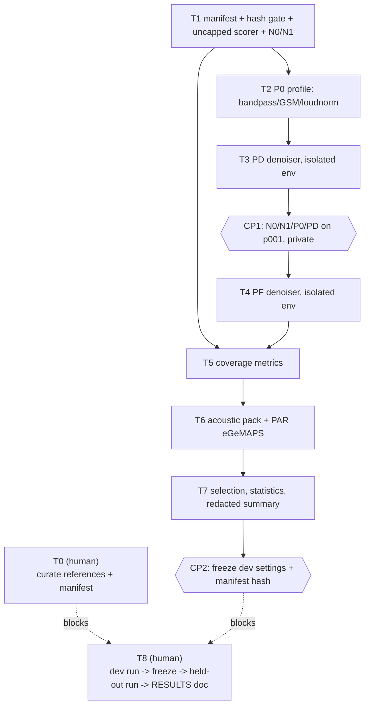

# Implementation plan: audio preprocessing A/B study

**Specification:** [SPEC-2026-09-25.md](./SPEC-2026-09-25.md)
**Research:** [RESEARCH-2026-09-25.md](./RESEARCH-2026-09-25.md)
**Task detail:** [TASKS-2026-09-25.md](./TASKS-2026-09-25.md)
**Dispatch:** [tasks-2026-09-25.json](./tasks-2026-09-25.json)

## Outcome and guardrails

Build an opt-in `say-transcribe preprocess-study` command that produces five arms (N0/N1/P0/PF/PD)
per manifest session, scores them against curated references, and reports coverage, feature
validity, and a locked denoiser selection. Nothing in this study touches the default `say-transcribe
run`/`compare` paths or `speech_features`' default packs; it calls their reusable pieces
(`extract_channel`, `resample_to_16kHz`, `extract_acoustic_features`, the Silero VAD loader) directly.

Every task branches from `main`, ships with offline synthetic tests, and stops there — no task
merges to `main` in this plan; T8 is a private manual run, not a code task.

## Blocking precondition

**T0 is a human task, not code.** Reference `.cha` files exist for all five pilot recordings but
none has verified PAR/INV timing (RESEARCH lead finding). T1–T7 can be built and unit-tested against
synthetic fixtures without T0, but **T8 (the real run) cannot start until T0 is done.**

## Dependency graph



Diagram verification: Mermaid flowchart syntax checked 2026-09-25, following the convention in
[`PLAN-2026-09-23.md`](../../../2026-09-23/vietnamese-chat-transcription/5/PLAN-2026-09-23.md).
Render verification is **UNVERIFIED** — no Mermaid renderer installed locally (same caveat carried
from that plan and from RESEARCH-2026-09-25.md).

## Ordered work and checkpoints

### Phase 1 — scaffolding, native arms, profile, first denoiser

1. **T1** adds the manifest schema/loader (fields per SPEC "Proposed interface"), the hash-first gate
   (`SOURCE_HASH_MISMATCH` before any decode), an uncapped SyER/CER/WER scoring path alongside the
   existing capped one, and wires N0/N1 to reuse the existing `compare` baseline/`vad_asr` outputs
   rather than reimplementing them.
2. **T2** builds the P0 profile: `extract_channel` → band-pass (`sosfiltfilt`) → 8 kHz →
   FFmpeg `libgsm` round trip, trimmed to input length → 16 kHz → FFmpeg two-pass `loudnorm`
   (`I=-23:TP=-1:LRA=50:linear=true`), recording `normalization_type`.
3. **T3** adds the DeepFilterNet3 adapter as an isolated-environment subprocess worker (pinned local
   checkpoint, no network access), going first because it is pip-installable once isolated
   (SPEC Decisions).

**CP1:** N0, N1, P0, and PD run end-to-end on one pilot session (p001) in the approved private
environment; outputs match SPEC's five-arm data-flow diagram for that session. Private, not
committed.

### Phase 2 — second denoiser, coverage, features, selection

4. **T4** adds the FullSubNet adapter, same isolated-worker pattern as T3, at its native 16 kHz rate.
5. **T5** computes speech-duration coverage and the 50%-overlap retained-utterance metric against the
   frozen human PAR intervals (SPEC "Transcription evaluation").
6. **T6** wires PAR-only acoustic-pack extraction (`extract_acoustic_features` on a pre-selected
   mono array, bypassing the stereo-downmix default reader) and per-utterance (≥1 s) eGeMAPS
   extraction, with a hard failure — not NaN rows — if `opensmile` is missing at run time.
7. **T7** implements the gates, the numeric tie-break, the participant-cluster bootstrap (resampling
   participants, seed 42, 2000 resamples), the "no denoiser passes" path, and the redacted aggregate
   summary writer.

**CP2:** all T1–T7 settings (checkpoint revisions, thresholds, profile parameters) are hashed into
one frozen dev-run manifest before any held-out session is touched.

### Phase 3 — the real run (human-gated, not a code task)

8. **T8**: with T0's curated references and CP2's frozen manifest, run the dev split, apply
   selection, freeze, run the held-out split once, and write a private RESULTS doc plus a redacted
   cohort-level aggregate under `docs/` if one is approved for commit.

## Numeric definitions carried from SPEC (repeated here so tests can cite them directly)

- Retained utterance: ≥50% of reference duration overlaps a VAD-selected window.
- Valid feature vector: every value finite, extraction raised no error.
- "No worse than P0": candidate's participant-macro mean SyER ≤ P0's.
- Practical tie: participant-macro mean SyER difference ≤ 1.0 percentage point absolute.
- Runtime: wall-clock seconds per audio-hour, device recorded in manifest.
- Held-out split (n=2): report paired differences and sign agreement, no bootstrap interval.

## Reuse map (do not reimplement)

| Need | Reuse | File |
| --- | --- | --- |
| Channel selection | `extract_channel` | `src/say_transcribe/audio.py:63` |
| 16 kHz resample | `resample_to_16kHz` | `src/say_transcribe/audio.py:76` |
| Hash check pattern | `compute_sha256` | `src/say_transcribe/asr.py:41` |
| VAD | `load_silero_vad`, `get_speech_windows` | `src/say_transcribe/vad.py` |
| PAR-scoped acoustic features | `extract_acoustic_features(..., target_speaker="PAR")` | `src/speech_features/features/acoustic/__init__.py:141` |
| eGeMAPS | `extract_egemaps_features` | `src/speech_features/features/standardized/opensmile_adapter.py:26` |
| CHAT/PAR intervals | `load_document`, `timing._merged_intervals` pattern | `src/speech_features/formats/chat.py`, `.../timing.py:130` |
| Redacted-error convention | `AsrError`/`AudioPreparationError`/`VADUnavailableError` (`[CODE] message`, `raise ... from None`) | `asr.py:12`, `audio.py:10`, `vad.py:15` |

## Out of scope, flagged not fixed

- `speech_features/audio.py:107`'s unconditional stereo mean-downmix — a pre-existing defect this
  study routes around (SPEC "Repository and implementation context") but does not patch.
- `docs/README.md` still describes v4/`tell-inspired-v1` as current; stale, not corrected here.

## Verification

- Each task's own offline pytest suite (see TASKS-2026-09-25.md per task) plus:
  ```sh
  .venv/bin/python -m pytest tests/say_transcribe/ -q
  .venv/bin/python -m pytest tests/speech_features/ -q
  .venv/bin/python -m ruff check src/say_transcribe tests/say_transcribe
  .venv/bin/python -m ruff check src/speech_features tests/speech_features
  ```
- `tests/speech_features/test_documentation.py -q` continues to pass unmodified (this plan does not
  touch `migration-0.2.md`).
- No task's tests require network access, a GPU, or private corpus files.
