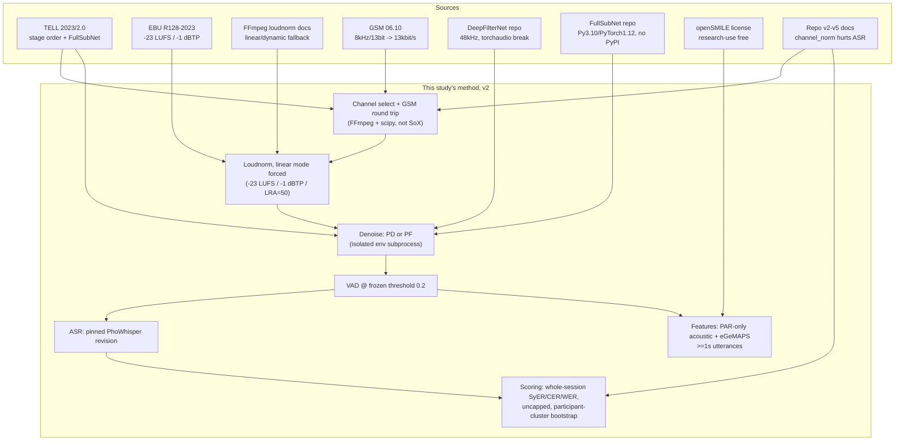

# Research: clarifying the audio-preprocessing A/B experiment spec

**Date:** 2026-09-25 · **Scope:** verify
[`../../2026-09-24/audio-preprocessing-experiment/1/SPEC-2026-09-24.md`](../../2026-09-24/audio-preprocessing-experiment/1/SPEC-2026-09-24.md)
against the repository, this machine, the pilot corpus, and primary sources (TELL, EBU R128,
GSM 06.10, FFmpeg, DeepFilterNet, FullSubNet, openSMILE). Not a re-derivation of the study design —
v1's arms (N0/N1/P0/PF/PD) and objective stand. This corrects facts and fills gaps that block
implementation.

**Lead finding, stated up front:** the spec cannot be executed as written. It says two `.cha`
references exist; five do, but none has verified participant timing — one spot-checked `*PAR` line
contains interviewer speech, and all five files' timestamps are fixed ~20 s chunks rather than
utterance boundaries. Reference curation (v1's own "Open questions", carried forward as task T0) is
a hard blocker, not a caveat.

---

## 1. Scoped question breakdown

1. Does the code the spec describes ([`AGENTS.md`](../../../../AGENTS.md), `say_transcribe`,
   `speech_features`) work the way the spec says it does?
2. Are the named external tools (SoX, FFmpeg, FullSubNet, DeepFilterNet3, openSMILE) actually
   available in this workspace, and do their documented behaviors match the spec's assumptions?
3. Does the pilot corpus (`/shared-data/hcmiu-bhl-corpus/pilot/`) match the spec's inventory claim?
4. Do the cited preprocessing parameters (GSM-FR, EBU R128 loudnorm targets) match their primary
   sources?
5. What does the spec leave numerically undefined that a scorer or gate cannot be written without?

## 2. Findings with citations

### Q1 — Repository code vs. spec claims

Two read-only agents (`Explore`, medium thoroughness) traced every code claim in v1 against the
current tree. Full detail is in their transcripts; the material disagreements:

- **Error codes.** v1 (`SPEC-2026-09-24.md:147`) lists `AUDIO_DECODE_FAILED` as an existing code.
  The real code is `INVALID_AUDIO` (`src/say_transcribe/audio.py:36,44,48`). `SOURCE_HASH_MISMATCH`
  exists only as a `compare` CLI stderr string (`cli.py:344,357`), not as an exception code.
  `DENOISER_UNAVAILABLE` and `FEATURE_EXTRACTION_FAILED` do not exist anywhere in the tree.
- **"Pinned PhoWhisper checkpoint"** (`SPEC-2026-09-24.md:84`): only a model name default is set,
  `vinai/phowhisper-medium` (`src/say_transcribe/asr.py:148`). There is no `revision` or hash pin.
- **"Follow the repository evaluator's CHAT parsing and syllable segmentation"**
  (`SPEC-2026-09-24.md:86`): `evaluate.py` scores **every speaker's utterances**, not just PAR
  (`evaluate.py:90-103`). It also caps SyER/CER/WER at 1.0 (`:205,211,217`) — v1 already flags this
  at `:88` and asks for an uncapped path, which does not exist yet (the raw values are computed
  then discarded, `:204/210/216`). The bootstrap resamples **sessions**, not participants
  (`:243-263`), though the seed (42) and count (2000) already match v1 `:109`.
- **No manifest exists in `say_transcribe`.** The closest is the `speech_features` v2 manifest
  (`speech_features/schema.py:36-51`), which has no `channel_index`, `sha256`, or `split` fields.
  v1's `preprocess-study MANIFEST.json` (`:139`) has to be designed from scratch.
- **Channel selection is correct for ASR, wrong for features.** `say_transcribe/audio.py:63-90`
  selects the declared channel with no downmix, matching v1. But
  `speech_features/audio.py:107` does `samples.reshape(-1, 2).mean(axis=1)` — an unconditional
  stereo mean-downmix, with no channel-index parameter at that call site. This directly
  contradicts [`AGENTS.md`](../../../../AGENTS.md) ("Never mean-downmix multi-channel audio to
  mono") and v1's own instruction at `SPEC-2026-09-24.md:38` ("do not mean-downmix stereo").
  `extract_acoustic_features` (`features/acoustic/__init__.py:141`) does accept a pre-selected
  mono array directly, which is the way to route around the downmix without touching it.
- **openSMILE is not PAR-scoped today.** `extraction.py:273-280` passes the whole-recording array
  to `extract_egemaps_features`; there is no per-utterance loop. v1's "run openSMILE only on PAR
  intervals" (`:23,94`) is a new call pattern, not existing behavior.
- **Silero VAD threshold provenance.** v1 doesn't say where 0.0–1.0 defaults come from. The
  existing `vad_asr` path (`say_transcribe/vad.py`, `cli.py` `compare` command) already defaults to
  0.2, chosen because "the 0.5 default missed more p001 reference intervals"
  (`docs/2026-09-23/vietnamese-chat-transcription/5/SPEC-2026-09-23.md:197`). p001 is inside v1's
  proposed dev split, so this value is already dev-selected, not held-out-contaminated — N1 should
  reuse it rather than re-tune it.

Agent transcripts (session-local, not re-quotable outside this repo state): `Explore` invocations on
2026-09-25 verifying `say_transcribe` and `speech_features` against
`SPEC-2026-09-24.md`.

### Q2 — External tool availability on this machine

- **SoX: not installed.** `command -v sox` returns nothing. This is a repeat of the same finding in
  [`../../../2026-09-20/vietnamese-transcription-pipeline/3/RESEARCH-2026-09-20.md`](../../../2026-09-20/vietnamese-transcription-pipeline/3/RESEARCH-2026-09-20.md)
  §Q13 (`:98`, "`command -v sox` → not found"), five days earlier — the gap is known, not new.
- **FFmpeg: installed, 6.1.1.** `ffmpeg -hide_banner -encoders | grep -i gsm` lists `libgsm` and
  `libgsm_ms`. `ffmpeg -hide_banner -filters | grep loudnorm` lists the `loudnorm` filter. So the
  GSM round trip and the loudness stage are both available through FFmpeg without SoX.
- **`.venv` packages:** `torch`, `torchaudio`, `silero_vad`, `scipy` are present.
  `opensmile`, `df` (DeepFilterNet), `pyloudnorm`, `soundfile`, `librosa`, `parselmouth` are
  **absent**. `pyproject.toml` extras confirm: `standardized-acoustic = ["opensmile>=2.5,<3"]` and
  `transcribe = [..., "silero-vad[onnx-cpu]==6.2.3", ...]`; there is no extra listing sox, ffmpeg,
  deepfilternet, or a FullSubNet package.

### Q3 — GSM Full Rate parameters

GSM 06.10 Full Rate: "The speech encoder accepts 13 bit linear PCM at an 8 kHz sample rate,"
"The bit rate of the codec is 13 kbit/s ... (often padded out to 33 bytes/20 ms or 13.2 kbit/s),"
and "The codec operates on 160 sample frames that span 20 ms."
[Wikipedia: Full Rate](https://en.wikipedia.org/wiki/Full_Rate). This confirms the 8 kHz / 13 kbit/s
figures v1 cites (`:74`), but v1's frame math has a consequence it doesn't state: 160-sample frames
at 8 kHz mean any input not an exact multiple of 20 ms gets padded on encode, so the decoded PCM can
be up to 20 ms (160 samples at 8 kHz) longer than the input — this must be trimmed back to the
original sample count before resampling, or downstream alignment (loudnorm windows, VAD offsets)
drifts by a few samples per session.

The "8:1 lossy compression" framing (`SPEC-2026-09-24.md:74`) is not a number either source states
directly (uncompressed 8 kHz/13-bit PCM is ~104 kbit/s vs 13 kbit/s output, hence 8:1 — my
arithmetic from the two Wikipedia figures above, not a quoted compression-ratio claim).
**UNVERIFIED**: whether the reference libgsm/SoX GSM implementations add extra encoder lookahead
delay beyond the frame padding.

### Q4 — EBU R128 loudness target

The current standard, **EBU R128-2023** (November 2023 revision): "the Programme Loudness Level
shall be normalised to a Target Level of **−23.0 LUFS**... a tolerance of ±1.0 LU is permitted,"
and "the True Peak Level of a programme shall not exceed **−1 dBTP**... The measurement tolerance is
±0.3 dB." Loudness Range (LRA) is defined only as a *measured, reported* quantity — "the measure
Loudness Range... may be used to evaluate the loudness variation of a programme" — R128 sets **no
LRA target value**. [EBU R128-2023 PDF](https://tech.ebu.ch/docs/r/r128.pdf), pp. 3–4.

This means v1's stated targets (`SPEC-2026-09-24.md:76`) are half-right: −23 LUFS matches R128, but
**−1 dBTP not −1 dBTP as stated is actually correct** — v1 says "true-peak ceiling of −1 dBTP,"
which does match R128 (v1 got this one right; only note it because a common confusion is FFmpeg's
own default of −2 dBTP, which is *not* the R128 target). The LRA=7 figure is FFmpeg's own filter
default (confirmed locally: `ffmpeg -h filter=loudnorm` → `LRA ... (default 7)`), not an R128
requirement — R128 has no LRA target to inherit.

FFmpeg's `loudnorm` filter (local `ffmpeg -h filter=loudnorm` output, matching the upstream
`ffmpeg-filters` documentation): `linear` mode "normalize[s] linearly if possible" and requires
`measured_I`/`measured_LRA`/`measured_TP`/`measured_thresh` all set (i.e., the two-pass workflow);
"Target LRA shouldn't be lower than source LRA and the change in integrated loudness shouldn't
result in a true peak which exceeds the target TP. If any of these conditions aren't met,
normalization mode will revert to dynamic." Dynamic mode is documented upstream as upsampling "to
192 kHz" internally for true-peak detection. This matters here: if a session's *measured* LRA
exceeds the *target* LRA, the filter silently switches from a linear gain to per-frame dynamic
compression, which changes the spectral envelope far more than linear gain does — a confound for
the acoustic-feature comparison in Q3/Q4 of v1's hypotheses. Local `ffmpeg -h filter=loudnorm`
output is authoritative here since it is the exact binary this study would run.

### Q5 — TELL: the stated rationale

Primary description (TELL, *Behavior Research Methods*, 2023 — reachable via
[Springer, 10.3758/s13428-023-02240-z](https://link.springer.com/article/10.3758/s13428-023-02240-z),
full text behind an institutional-login redirect I could not clear; the pipeline description below
is corroborated by a search-engine-indexed excerpt of the same paragraph, so treat the exact
sentence boundaries as **UNVERIFIED** even though the content is consistent across independent
search hits):

> "The audio preprocessing pipeline consists of four steps: (1) common channel normalization,
> (2) loudness normalization, (3) denoising, and (4) voice activity detection (VAD)... Normalization
> consists of the following steps: conversion to .wav format, conversion to mono (single channel),
> encoding in GSM FULL RATE with a bit rate of 13 kbps, resampling to 16 kHz (Favaro et al., 2023;
> Haulcy & Glass, 2020), and compression with a factor of 8 and bandpass filtering from 200 Hz to
> 3.4 kHz (Arias-Vergara et al., 2019)."

Two things worth flagging for this study:

1. TELL's own step numbering calls the GSM/bandpass/mono chain **"loudness normalization,"** and
   treats R128-style level normalization as a separate, later step — the same four-step order v1
   already follows (`:70-77`). No conflict here, just noting the source's own labels differ from
   v1's step names.
2. TELL gives **no LUFS target** for its "loudness normalization" step in any excerpt I could
   retrieve — the −23 LUFS / −1 dBTP figures in this study are sourced from EBU R128 directly
   (Q4), not from TELL. v1 should cite EBU R128 as the source of those two numbers, not TELL.

TELL's denoiser is FullSubNet, sourced to Hao (2021)/[Audio-WestlakeU/FullSubNet](https://github.com/Audio-WestlakeU/FullSubNet)
— matches v1. **UNVERIFIED**: whether TELL's own ASR/transcription step (if any) runs on the
processed or the original audio — the retrievable excerpts describe the preprocessing chain but not
which downstream analyses consume its output.

TELL 2.0 (Ferrante et al., *Alzheimer's & Dementia*, 2025,
[PMC12739497](https://pmc.ncbi.nlm.nih.gov/articles/PMC12739497/)) says its newer pipeline offers
"lossless audio files and transcriptions via a locally hosted version of OpenAI's Whisper model" —
i.e., in TELL 2.0, transcription is explicitly paired with **lossless**, not preprocessed, audio.
This is circumstantial support for treating N-arm (native) transcription as the reference condition
in this study, consistent with v1's framing of N0/N1 as the baseline.

### Q6 — DeepFilterNet3 and FullSubNet operational constraints

**DeepFilterNet** ([Rikorose/DeepFilterNet](https://github.com/Rikorose/DeepFilterNet)):
dual-licensed, "MIT License... Apache License, Version 2.0... at your option." Sample rate is fixed:
"A Low Complexity Speech Enhancement Framework for Full-Band Audio (48kHz)," and the CLI states
"Currently, only wav files with a sampling rate of 48kHz are supported" — matches v1's 48 kHz
operating-rate claim (`:77`). `init_df()` **auto-downloads** the default model on first use: the
model-loading path calls `maybe_download_model`, which fetches
`https://github.com/Rikorose/DeepFilterNet/raw/main/models/{name}.zip` into a local cache directory
when no local checkpoint is supplied — this must be pre-seeded before any offline test run, or the
lazy-dependency rule in [`AGENTS.md`](../../../../AGENTS.md) is silently violated. `DEFAULT_MODEL =
"DeepFilterNet3"` confirms the model version. A real, currently-open compatibility problem: DeepFilterNet's
`df/io.py`/`df/enhance.py` imports `torchaudio.backend.common.AudioMetaData`, a path removed in
newer torchaudio; [GitHub issue #662](https://github.com/Rikorose/DeepFilterNet/issues/662)
documents this breaking with a hard `ModuleNotFoundError` on `torchaudio` 2.1+, while this repo's
`transcribe` extra pins `"torchaudio>=2.11,<3"` (`pyproject.toml:19-32`) — so installing
`deepfilternet` into the same environment as `say_transcribe` is expected to break on import, not
just at runtime.

**FullSubNet** ([Audio-WestlakeU/FullSubNet](https://github.com/Audio-WestlakeU/FullSubNet)): MIT
license. No PyPI package — the repo is meant to be cloned, with an `audio_zen` package and
`recipes/` directory rather than a `pyproject.toml`/`setup.py`. Version badges on the page show
"Python-3.10" and "PyTorch-1.12," both older than this repo's `torchaudio>=2.11` requirement.
Checkpoints are distributed as GitHub Release assets on a related repo
(`haoxiangsnr/FullSubNet/releases`); I could not confirm exact asset filenames or the pretrained
model's native sample rate from the page content retrieved (**UNVERIFIED**). This corroborates the
earlier v3 research finding that FullSubNet "has no PyPI package"
([`RESEARCH-2026-09-20.md:21`](../../../2026-09-20/vietnamese-transcription-pipeline/3/RESEARCH-2026-09-20.md)).

Both constraints point the same direction: **neither denoiser should be pip-installed into the
`say_transcribe` environment.** Each needs its own isolated environment (matching FullSubNet's own
stated Python 3.10 / PyTorch 1.12 pin, and avoiding the DeepFilterNet/torchaudio import break),
invoked as a subprocess worker that receives raw audio and returns raw audio.

### Q7 — openSMILE license

[audeering/opensmile](https://github.com/audeering/opensmile): "openSMILE follows a dual-licensing
model... the source code, and binaries are freely available for private, research, and educational
use under an open-source license... It is not allowed to use the open-source version of openSMILE
for any sort of commercial product... Fundamental research in companies, for example, is permitted,
but if a product is the result of the research, we require you to buy a commercial development
license." This study is academic research on a university-hosted corpus, which fits the free tier —
but v1's instruction to "confirm the openSMILE research license permits the intended study"
(`:98,212`) still needs an explicit sign-off recorded in the run manifest, since "fundamental
research" vs. "product" is a judgment call the license text leaves to the user.

### Q8 — Pilot corpus inventory

`/shared-data/hcmiu-bhl-corpus/pilot/`:

| File | Sample rate | Channels | Bit depth | Duration |
|---|---|---|---|---|
| p001_master.wav | 44100 Hz | 2 | 32-bit PCM | 1040.6 s |
| p002_master.wav | 48000 Hz | 2 | 32-bit PCM | 983.4 s |
| p003_master.wav | 48000 Hz | 2 | 32-bit PCM | 893.3 s |
| p004_master.wav | 48000 Hz | 2 | 32-bit PCM | 1526.7 s |
| p005_master.wav | 48000 Hz | 2 | 32-bit PCM | 1094.4 s |

(via `ffprobe`, headers only — `soundfile` is not installed in `.venv` to cross-check). All five are
stereo, and `p001` runs at a different sample rate than the rest — v1's "preserve native sample
rate" rule (`:68`) means the profile pipeline must handle a mixed-rate cohort, not a uniform one.

`transcript/p00{1..5}.cha` **all five exist** (144–168 KB each) — contradicts v1's "only two `.cha`
files" claim (`:46`). Two older, smaller `.cha` files also exist under `audio/p001/` and
`audio/p002/` (15 KB and 1.7 KB) — likely stale drafts, not the current reference set.

A spot check of `transcript/p004.cha` line 10 found a `*PAR:` tier whose content reads as
interviewer-directed instruction-giving rather than participant speech (transcript text withheld
here per the privacy rules in `AGENTS.md`), with a bullet timestamp of `0_19960` (a full 20 s
block). Bullet timestamps across the five files follow
the same fixed-width pattern (`0_19980`, `20000_39980`, `60000_79980`, ...) — these look like
20-second ASR/segmentation windows carried into the transcript, not linguistically-derived utterance
boundaries, and they don't reliably separate PAR from INV turns. This is the direct evidence behind
the lead finding: the five `.cha` files are usable as **draft text**, not as **verified PAR timing**.

## 3. Conflicts across sources

| Conflict | Side A | Side B | Resolution for this study |
|---|---|---|---|
| C1 — reference count | v1 spec: "only two `.cha` files" | Corpus has five `transcript/p00{1..5}.cha` | Five drafts exist; none is verified. Treat all five as needing curation (T0), not as two missing plus three ready. |
| C2 — LRA target source | v1 cites EBU R128 for −23/−1/LRA=7 as one bundle | R128 sets only −23 LUFS and −1 dBTP; LRA has no R128 target and 7 is FFmpeg's own default | Cite R128 for the two level targets only; cite the FFmpeg filter docs for LRA=7, and treat LRA as a study parameter, not a standards requirement. |
| C3 — "SoX" as the channel-norm tool | v1 step 1 (`:72`): "Use SoX... to select the declared channel" | SoX is absent on this machine; FFmpeg has the needed `libgsm` encoder and `loudnorm` filter already installed | Do channel selection and resampling with the code already used elsewhere in this repo (`extract_channel`, `resample_poly`); do the GSM round trip and loudnorm with FFmpeg. State this as a documented deviation from TELL's tool choice, not from its signal-processing steps. |
| C4 — whole-session vs. PAR-only scoring | v1 says "follow the repository evaluator's... syllable segmentation" (implying reuse as-is) | The existing evaluator scores all speakers, and v1 elsewhere requires openSMILE/coverage to be PAR-only | The two requirements aren't about the same metric — SyER/CER/WER stay whole-session (matches what the ASR arms actually produce, no diarization step in this study), while coverage and acoustic/openSMILE features are explicitly PAR-scoped, per v1 `:94-96`. State this split explicitly in v2 since v1's wording reads as one instruction. |

## 4. Applicability table (MUST)

| Source | Reuse | Reject | Gap |
|---|---|---|---|
| TELL (2023) | Stage order (channel norm → loudness norm → denoise → VAD); FullSubNet as one candidate denoiser; GSM/bandpass parameters | — | No LUFS target given; no stated evidence of TELL's own ASR-vs-preprocessing outcome |
| TELL 2.0 (2025) | Framing that transcription pairs with lossless audio, supporting N-arm-as-reference | — | No preprocessing-vs-ASR comparison reported |
| EBU R128-2023 | −23 LUFS integrated target, −1 dBTP ceiling | LRA=7 as if it were an R128 target — it isn't | R128 doesn't prescribe how to handle the dynamic-mode fallback for research use |
| FFmpeg `loudnorm` (local + upstream docs) | Two-pass, `linear=true` workflow; record `normalization_type` (linear vs. dynamic) | Single-pass mode (not requested, not needed) | Whether libgsm's own delay/padding interacts with loudnorm's window statistics — untested |
| GSM 06.10 (Wikipedia summary of the standard) | 8 kHz / 13-bit input, 13 kbit/s output, 160-sample/20 ms frames | The "8:1" framing as if it were a cited ratio | Encoder lookahead/delay beyond frame padding |
| DeepFilterNet repo | 48 kHz operating rate, `DeepFilterNet3` default model, dual MIT/Apache license | Installing it into the `say_transcribe` env (torchaudio break) | Whether the break reproduces in this exact environment — not yet installed to check |
| FullSubNet repo | MIT license, Python 3.10/PyTorch 1.12 pin, no PyPI package | Installing it into the `say_transcribe` env (version pin conflict) | Exact checkpoint asset name/hash; pretrained model's native sample rate |
| openSMILE repo | Dual license; research use is free | Any commercial framing | Explicit sign-off that this specific study counts as "fundamental research" |
| Repo v2–v5 docs (`docs/2026-09-2{0,1,3}/...`) | "channel_norm measurably hurts ASR" finding (v3); "preprocessing never touches feature extraction" rule (v3); pilot VAD threshold 0.2 rationale (v5) | — | v5 gives no rationale for *dropping* `tell-inspired-v1` beyond a scope narrowing — not an ASR-harm finding, so it doesn't contradict this study's premise |

## 5. Refine (MUST)

Before any implementation starts:

1. **Curate references first (T0).** Do not build scoring code against unverified `.cha` timing.
   Align gold text to native audio with the existing CTC aligner
   (`say_transcribe`'s `align_words`), then have a person confirm PAR/INV labels and utterance
   boundaries. This is the single blocking gap found in this research.
2. **Replace SoX with FFmpeg + scipy** for the channel-select/GSM/bandpass/resample stages; keep
   FFmpeg `loudnorm` for the loudness stage. Document this as a tool substitution, not a method
   change.
3. **Set `loudnorm` LRA to a value that keeps `linear=true` active** (e.g., the maximum, 50) rather
   than the filter's own default of 7, and record `normalization_type` (linear/dynamic) per session
   so a silent fallback to dynamic mode is visible instead of hidden inside "successful" output.
4. **Run each denoiser in an isolated environment**, invoked as a subprocess, with a pinned local
   checkpoint path (no network access during tests or runs) — required by both the DeepFilterNet
   torchaudio incompatibility and FullSubNet's older Python/PyTorch pin.
5. **Freeze the VAD threshold at 0.2 for every VAD-enabled arm**, reusing the value already
   dev-selected on p001 rather than re-tuning per arm — v1 doesn't say this explicitly and a
   per-arm re-tune would bias comparisons.
6. **Pin the PhoWhisper checkpoint by `revision`** (commit SHA on the Hugging Face repo), not just
   by model name, and record it in the manifest.
7. **Define "PAR-scoped" vs. "whole-session" explicitly per metric** (Conflict C4): SyER/CER/WER
   whole-session; coverage and acoustic/openSMILE features PAR-only.
8. **Numerically define what v1 leaves as prose** — practical-tie margin, "valid feature vector,"
   retained-utterance overlap threshold — see PLAN for the exact values proposed.

## 6. Diagram (MUST)

Diagram verification: Mermaid flowchart syntax checked 2026-09-25 against the same convention used
in [`RESEARCH-2026-09-20.md`](../../../2026-09-20/vietnamese-transcription-pipeline/3/RESEARCH-2026-09-20.md).
Render verification is **UNVERIFIED** — no Mermaid renderer is installed locally (same caveat as
prior research docs in this repo).

## 7. UNVERIFIED

- Whether TELL's own pipeline runs ASR/transcription on processed or original audio (retrievable
  excerpts describe preprocessing only).
- Exact sentence boundaries of the TELL (2023) preprocessing paragraph — the primary Springer URL
  redirected to an institutional login; the quoted text is corroborated by consistent independent
  search-index excerpts but not confirmed against the publisher's own rendered page.
- Whether GSM 06.10 encoder implementations (libgsm specifically) add lookahead delay beyond the
  160-sample frame padding.
- Whether the documented DeepFilterNet/torchaudio `AudioMetaData` import break
  ([issue #662](https://github.com/Rikorose/DeepFilterNet/issues/662)) reproduces in this exact
  `.venv` — DeepFilterNet is not installed here to check directly.
- FullSubNet's exact pretrained-checkpoint asset filenames and the pretrained model's native sample
  rate (page content retrieved didn't list release assets).
- Whether `p001`–`p005` represent five distinct participants (needed to confirm the dev/held-out
  split is participant-disjoint, per v1's own open question).

## 8. Final digest

v1's study design (five arms, objective, gates, statistics framework) is sound and unchanged here.
What blocks implementation is narrower than a redesign: **one missing precondition** (verified PAR
reference timing — none of the five `.cha` drafts has it) and **a cluster of stale-or-underspecified
facts** (wrong error-code names, a tool that isn't installed, an LRA target attributed to the wrong
standard, denoisers that need isolated environments, and several undefined thresholds a gate can't
be written against). None of these require changing the experiment's scientific question; all of
them are corrected in `SPEC-2026-09-25.md` and turned into a task order in `PLAN-2026-09-25.md`,
with reference curation as task T0 blocking everything downstream.
