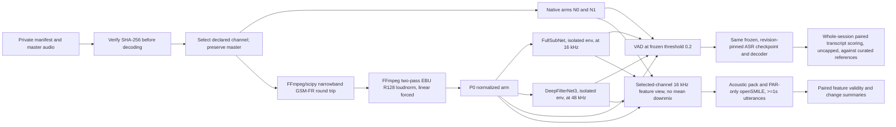

# Audio preprocessing A/B evaluation

**Research:** [RESEARCH-2026-09-25.md](./RESEARCH-2026-09-25.md)

This revises v1 after checking it against the repository, this machine, the pilot corpus, and
primary sources (see RESEARCH). The experiment design — five arms, ASR as the selection objective,
opt-in and parallel to the native path — is unchanged. What changed: reference status, tool choice
for channel/GSM stages, loudness-normalization sourcing, denoiser deployment, and several thresholds
v1 left as prose. Each change below cites the RESEARCH finding it comes from.

## Objective

Define a reproducible, opt-in experiment that measures whether a narrowband audio-preprocessing
profile improves Vietnamese speech transcription while keeping participant-speech acoustic features
usable. Compare the native audio path with common-channel normalization, EBU R128 loudness
normalization, two candidate denoisers, and voice activity detection (VAD).

This is a research profile. It must run alongside the native path, never replace or rewrite master
recordings, and remain outside the default transcription workflow unless a later decision explicitly
promotes it.

## Decisions

- Keep this as a separate study; do not amend the current v5 evaluation.
- Compare the existing acoustic feature pack and openSMILE eGeMAPS features.
- Evaluate both FullSubNet and DeepFilterNet3, in that build order (DeepFilterNet3 first — it is
  pip-installable; FullSubNet needs a cloned checkout). Select a denoiser using development data and
  confirm it on locked held-out data. (RESEARCH Q6)
- Make ASR performance the selection objective, subject to speech-coverage and acoustic-feature-
  validity gates.
- Curate and verify human reference transcripts and timing before scoring — this is now a named,
  blocking task (T0), not a caveat. (RESEARCH §8, lead finding)
- Run openSMILE only on participant (`PAR`) speech intervals of at least 1 second, using the same
  human intervals in every arm. Whole-session SyER/CER/WER is scored on all speakers, matching what
  the ASR arms actually produce (no diarization step in this study). These are two different scoping
  rules for two different metrics — v1 stated them as if they were one rule. (RESEARCH C4)

## Questions and hypotheses

1. Does the complete preprocessing profile lower Vietnamese utterance transcription error relative
   to the native path?
2. Does either denoiser improve ASR over the normalized, non-denoised arm?
3. Does preprocessing preserve enough reference speech and produce valid acoustic features for
   reliable downstream analysis?
4. How much do the preprocessing stages change acoustic feature values and missingness?

The study can establish effects on these recordings and this fixed ASR configuration. It cannot
establish that denoising makes acoustic measurements closer to clean speech without clean acoustic
references. With five pilot participants, the study is **exploratory**: report participant counts,
and treat confidence intervals as descriptive rather than confirmatory (see Selection and
statistics).

## Repository and implementation context

- Python project, Python >=3.10 (`pyproject.toml:10`); command entry points are `say-transcribe` and
  `say-features` (`pyproject.toml:15-17`).
- Transcription code is under `src/say_transcribe/`; `audio.py` selects an explicit input channel
  with no downmix and prepares an in-memory 16 kHz `float32` ASR view (`audio.py:63-90`). `vad.py`
  contains the current Silero VAD integration (lazy-loaded, ONNX, pinned at `silero-vad[onnx-
  cpu]==6.2.3`), and `cli.py` owns the transcription and comparison commands. There is **no
  manifest format** in `say_transcribe` yet — it must be designed as part of this study
  (see Proposed interface). (RESEARCH Q1)
- Feature extraction is under `src/speech_features/`. Reuse the existing acoustic extraction and
  openSMILE integration where possible. **`speech_features/audio.py:107` unconditionally
  mean-downmixes stereo** (`samples.reshape(-1, 2).mean(axis=1)`), which this study must not
  trigger — call `extract_acoustic_features(audio, sample_rate, ...)`
  (`features/acoustic/__init__.py:141`) with a pre-selected mono array from the study's own channel-
  selection step instead of routing a stereo file path through the default reader. Fixing the
  downmix itself is out of scope for this study; it is a separate, reportable defect. (RESEARCH Q1,
  AGENTS.md)
- Follow `AGENTS.md`, the local Batchalign repository maps under `docs/repo-map/`, and the
  audio/channel, provenance, privacy, lazy-dependency, and opt-in-profile rules there.
- Keep PyTorch, denoiser, and openSMILE imports lazy. Unit tests must run offline and must not
  download model weights or require a GPU. `opensmile` and any denoiser package are **not currently
  installed** in `.venv`; treat their absence as the expected offline-test state, not an error to
  fix here. (RESEARCH Q2)

## Experiment design

### Participants, recordings, and references

Use the pilot recordings only after an approved manifest supplies a pseudonymous session and
participant ID, master-audio SHA-256, declared `channel_index`, split, and verified human `.cha`
reference. Verify the master hash before decoding or processing. Do not add source audio, `.cha`
files, per-session transcripts, or model outputs to Git.

The current pilot inventory has **five** WAV recordings (`p001`–`p005`) and **five** draft `.cha`
files (`transcript/p00{1..5}.cha`) — v1 said only two `.cha` files existed; that was wrong
(RESEARCH C1). What blocks scoring is not file count but **verified timing**: a spot check of
`p004.cha` found a `*PAR` line containing interviewer instruction-giving speech, and all five files'
bullet timestamps follow a fixed ~20-second pattern (`0_19980`, `20000_39980`, ...) that looks like
carried-over ASR windowing, not utterance-level boundaries. **None of the five references is usable
for scoring as-is.** Curating them — aligning gold text to native audio with the existing CTC
aligner (`align_words`) and having a person confirm PAR/INV labels and boundaries — is task T0 in
the plan and blocks every task after it.

Provisional split assignment is `p001`–`p003` for development and `p004`–`p005` for held-out
evaluation, only if these are independent participants — **unconfirmed** (RESEARCH §7 UNVERIFIED).
Group by participant before splitting; if the proposed assignment is not participant-disjoint,
revise it before running models. Do not tune on held-out data.

Recording headers (RESEARCH Q8, via `ffprobe`): all five WAVs are stereo 32-bit PCM; `p001` is
44.1 kHz, the other four are 48 kHz. The preprocessing profile must tolerate this mixed native rate
— nothing in the profile may assume a uniform input sample rate.

Check reference transcript completeness, participant turns, utterance boundaries, and usable timing.
Freeze the references and scoring normalization before evaluation. If the available participant
count is too small for useful inference, label results exploratory and expand the cohort before
making confirmatory claims.

### Comparison arms

Every arm uses the same selected channel, the same ASR checkpoint and decoding settings, the same
reference data, and the same VAD model/configuration where VAD is enabled.

| ID | Input to ASR | Purpose |
| --- | --- | --- |
| N0 | Native selected-channel audio; no VAD (existing 20 s-chunked baseline path) | Unprocessed baseline |
| N1 | Native selected-channel audio with VAD, threshold 0.2 (existing `vad_asr` path) | Estimates the VAD contribution |
| P0 | GSM-FR/narrowband and R128-normalized audio with VAD; no denoiser | Common preprocessing baseline |
| PF | P0 plus FullSubNet, then VAD | FullSubNet candidate |
| PD | P0 plus DeepFilterNet3, then VAD | DeepFilterNet3 candidate |

N0 and N1 are the *existing* `say-transcribe compare` baseline and `vad_asr` paths
(`cli.py:401-405`) — this study reuses their output rather than re-implementing them. The VAD
threshold for N1 and every VAD-enabled P-arm is **frozen at 0.2**, the value already dev-selected on
p001 in the v5 pilot (`docs/2026-09-23/vietnamese-chat-transcription/5/SPEC-2026-09-23.md:197`); do
not re-tune per arm (RESEARCH Q1, refine #5).

Interpret N0 vs N1 as the VAD comparison, N1 vs P0 as the common/loudness normalization comparison,
and P0 vs PF/PD as the denoising comparisons. N0 vs PF/PD estimates the complete profile, not an
isolated stage effect.

### Preprocessing profile

Apply transformations to a private derived signal. Preserve the master file byte-for-byte and retain
its native sample rate, bit depth, and sample boundaries. Select the manifest-declared channel
explicitly before conversion; never average channels.

**Tooling change from v1: SoX is not installed on this machine and is not being added as a new
dependency for this study.** FFmpeg (already present, 6.1.1, with the `libgsm` encoder and
`loudnorm` filter) and scipy (already a dependency, `resample_poly` already used in
`say_transcribe/audio.py`) cover every stage below. This is a tool substitution, not a change to
TELL's signal-processing steps (RESEARCH Q2, C3, refine #2).

The profile order is:

1. Select the declared channel and produce a mono signal, reusing `extract_channel`
   (`say_transcribe/audio.py:63-73`) — no new channel-selection code.
2. Apply a 200 Hz–3.4 kHz band-pass (zero-phase, e.g. `scipy.signal.sosfiltfilt`) to emulate
   narrowband transmission.
3. Resample to 8 kHz (`resample_poly`), encode with FFmpeg's `libgsm` at 13 kbit/s, decode back to
   16-bit PCM. GSM-FR frames are 160 samples / 20 ms (RESEARCH Q3); trim any decode-side padding back
   to the exact input sample count before the next stage, so later stages never see drift from frame
   rounding.
4. Resample the decoded PCM to 16 kHz (`resample_poly`).
5. Apply FFmpeg `loudnorm`, two-pass, `linear=true`, target integrated loudness **I=-23** (EBU
   R128-2023's Target Level) and true-peak ceiling **TP=-1** (EBU R128-2023's maximum). Set
   **LRA=50** (the filter's own maximum), not the filter's default of 7 — R128 itself sets no LRA
   target, and the default of 7 risks tripping the filter's dynamic-mode fallback and confounding the
   acoustic-feature comparison (RESEARCH Q4, refine #3). Record measured input/output loudness and
   `normalization_type` (`linear` or `dynamic`) per session; a session that falls back to dynamic
   mode gets flagged, not silently accepted.
6. For PF, run FullSubNet at its 16 kHz input rate. For PD, resample to DeepFilterNet3's 48 kHz
   operating rate, denoise, and return to 16 kHz. **Run each denoiser as a subprocess call into its
   own isolated Python environment** (own venv, own pinned Python/PyTorch versions, local checkpoint
   path only) — DeepFilterNet's `torchaudio.backend.common.AudioMetaData` import breaks on
   `torchaudio>=2.11` (this repo's pin) per [issue #662](https://github.com/Rikorose/DeepFilterNet/issues/662),
   and FullSubNet is pinned to Python 3.10/PyTorch 1.12 with no PyPI package (RESEARCH Q6). Neither
   denoiser is installed into the `say_transcribe` `.venv`.
7. Run the pinned Silero VAD configuration (threshold 0.2, frozen — see Comparison arms) on each VAD
   arm.

The analysis receives in-memory arrays. Any format-conversion or model intermediates must be
private, temporary, and removed after use. Do not save resampled ASR WAVs into the repository or
substitute them for source media.

### Transcription evaluation

Use the same pinned PhoWhisper checkpoint, language/task settings, decoding parameters, and software
versions in all arms. **Pin the checkpoint by Hugging Face `revision` (commit SHA), not model name
alone** — the current default (`vinai/phowhisper-medium`, `asr.py:148`) has no revision pin today
(RESEARCH Q1, refine #6). Store the checkpoint identifier, revision, and SHA-256 in the private run
manifest. Do not tune ASR or preprocessing against held-out transcripts.

Primary outcome is the per-session uncapped syllable error rate (`SyER`): Levenshtein edit distance
over the reference and hypothesis syllable-token sequences divided by the number of reference
syllables, with substitutions, deletions, and insertions counted and no cap at 1.0. **Score is
whole-session, all speakers** — this matches what the ASR arms actually produce (there is no
diarization step distinguishing PAR/INV in this study's transcription path) and matches the existing
evaluator's current behavior (`evaluate.py:90-103` scores every speaker). PAR-only scoring is used
for coverage and features only, not for SyER/CER/WER (RESEARCH C4). Follow the repository
evaluator's syllable segmentation convention (NFC normalization, `_`-delimited syllables,
`evaluate.py:96-103`). Aggregate sessions to **participant-level** paired summaries: per-participant
SyER is the pooled edit distance over pooled reference syllables across that participant's session(s),
then report the macro mean (unweighted average) across participants. Report CER and WER as secondary
outcomes. Freeze scoring normalization before evaluation; preserve NFC, Vietnamese tone marks, and
`đ`, and apply identical normalization in every arm.

The current `src/say_transcribe/evaluate.py` caps SyER, CER, and WER at 1.0
(`:205,211,217` — the raw values are computed and then discarded). Do not use those capped values for
the primary analysis: provide an unclamped scoring path for this study and cover insertion-heavy
cases where the rate exceeds 1.0.

Report speech-duration coverage as the duration of verified participant-speech reference intervals
retained by VAD divided by the total reference speech duration. An utterance counts as **retained**
when at least 50% of its reference duration overlaps a VAD-selected window (numeric threshold added
here; v1 left this undefined). Also report the fraction of reference participant utterances with
usable retained audio, transcription, and timing. Do not hide insertion errors, missed turns, invalid
timestamps, or empty outputs behind aggregate scores.

### Acoustic feature evaluation

For a fair rate comparison, feed each arm's explicitly selected-channel signal to feature extraction
as an in-memory 16 kHz mono array — call `extract_acoustic_features(audio, 16000, ...)` directly with
a pre-selected array, bypassing `speech_features/audio.py`'s stereo mean-downmix path entirely
(RESEARCH Q1). The native master remains at its original format on disk. Use the same verified human
`PAR` intervals for every arm, independent of predicted VAD boundaries. Do not calculate participant
features from interviewer turns.

Extract the repository's acoustic feature pack per session, per verified `PAR` interval. Extract
openSMILE eGeMAPS **per eligible `PAR` utterance of at least 1 second** — this requires a new
per-utterance call pattern; the existing `standardized_acoustic` pack currently runs on the whole
recording (`extraction.py:273-280`), which this study does not reuse as-is (RESEARCH Q1). Compare
paired feature changes by feature family and arm, and report finite-value coverage, missingness,
extraction failures, and any out-of-range values. A feature vector is **valid** when every value is
finite and extraction raised no error (numeric definition added here). If `opensmile` is not
installed when a study run starts, stop the run rather than writing all-NaN rows for that pack
(`opensmile_adapter.py`'s existing behavior is to emit `MISSING_OPTIONAL_DEPENDENCY` NaN rows for
general use; this study's run should fail loudly instead, since silent NaN would be indistinguishable
from a real missingness finding). These comparisons measure how preprocessing changes features;
without clean reference recordings, they are not acoustic-accuracy scores.

Pre-register the eGeMAPS feature families most likely distorted by the 200 Hz–3.4 kHz band-limit
(alpha ratio, Hammarberg index, and spectral energy/slope above 3.4 kHz) so a large shift there is
interpreted as an expected artifact of the band-pass stage, not a denoiser effect.

Confirm that the openSMILE research license permits the intended study before enabling that adapter.
openSMILE is dual-licensed: free for "private, research, and educational use," but "not allowed...
for any sort of commercial product" (RESEARCH Q7) — record an explicit sign-off in the manifest that
this study qualifies, since the license text leaves "fundamental research" vs. "product" to the
user's judgment. Record the openSMILE version and configuration with results.

### Selection and statistics

On development participants, select the denoiser with the lowest participant-macro mean `SyER`
among PF and PD only if it meets both gates and is **no worse than P0 on `SyER`** — defined as: the
candidate's participant-macro mean SyER is ≤ P0's participant-macro mean SyER (numeric definition
added here). If neither denoiser passes the gates or improves on P0, select no denoiser:

- VAD retains at least 95% of verified participant-speech duration and at least 95% of reference
  participant utterances.
- At least 95% of eligible acoustic/openSMILE feature extractions are valid, with no systematic
  session-level failure.

Break a practical tie — defined as a participant-macro mean SyER difference of **1.0 percentage
point absolute or less** (numeric definition added here) — using fewer missed reference utterances,
then lower runtime, defined as **wall-clock seconds per audio-hour** on the device recorded in the
manifest (numeric definition added here). If neither denoiser passes, select no denoiser. Freeze the
selected arm and all settings before evaluating held-out participants. Report the locked held-out
result even if it is worse; do not switch candidates based on it. If the selected candidate fails a
held-out validity gate, report that no denoiser is supported by this study.

Report paired arm differences and 95% participant-cluster bootstrap intervals using 2,000 seeded
resamples (seed 42), **resampling participants, not utterances or sessions** — the existing evaluator
bootstrap resamples sessions (`evaluate.py:243-263`), which this study's manifest-driven scorer must
override. Given the small pilot (5 participants: 3 dev, 2 held-out), report participant counts and
treat all intervals as descriptive, not confirmatory. With only 2 held-out participants, a
participant-cluster bootstrap has just 3 distinct resamples — report paired differences and sign
agreement on the held-out split instead of a bootstrap interval there.

## Data flow



## Proposed interface and artifacts

Add an opt-in `say-transcribe preprocess-study MANIFEST.json --out PRIVATE_DIR [--device cpu|cuda]`
command. `say_transcribe` has no manifest format today (RESEARCH Q1); required manifest row fields
for this study: `session_id`, `participant_id`, `audio_path` (private, not in the manifest schema
docs), `channel_index`, `sha256`, `split` (`dev`/`held_out`), `reference_path` (verified `.cha`), and
`asr_revision` (Hugging Face revision SHA). The command should fail before decoding if any master
SHA-256 check fails. Require explicit input channel, reference, split, and stable session ID per
manifest row.

Write per-session predictions, derived media, timing, and feature vectors only to a private output
directory. Write aggregate comparison metrics and a redacted run summary there as well. Any report
committed to `docs/` may contain cohort-level aggregate metrics only; suppress cells that could
identify an individual.

## Privacy, provenance, and error handling

Audio, `.cha` reference text, predicted transcripts, timestamps, feature vectors, participant/session
mappings, absolute paths, and model access tokens are sensitive. Keep them in approved private
storage and memory only. Never include them in tracked files, logs, exceptions, command examples, or
reports.

Provenance and logs may include pseudonymous IDs, stable error codes, relative filenames when
necessary, media metadata, public tool/model versions, and hashes. Do not log absolute filesystem
paths, transcript text, credentials, or raw exception details. Stable error codes for this study,
checked against what already exists (RESEARCH Q1):

| Code | Status | Meaning |
| --- | --- | --- |
| `SOURCE_HASH_MISMATCH` | New (was only a stderr string in `compare`) | Master audio SHA-256 does not match the manifest |
| `INVALID_AUDIO_CHANNEL` | Existing (`audio.py:68`) | Reused as-is |
| `INVALID_AUDIO` | Existing (`audio.py:36`) | Reused in place of v1's non-existent `AUDIO_DECODE_FAILED` |
| `CODEC_UNAVAILABLE` | New | FFmpeg GSM/loudnorm stage failed or the binary/filter is missing |
| `LOUDNORM_FAILED` | New | `loudnorm` pass-2 could not converge or measured stats are unusable |
| `DENOISER_UNAVAILABLE` | New | Denoiser checkpoint/environment missing; never falls back to another model |
| `FEATURE_EXTRACTION_FAILED` | New | Acoustic or eGeMAPS extraction raised for a valid input |

## Boundaries

### Always

- Run the profile as an explicit parallel study; never overwrite, rename, or silently substitute
  native media.
- Verify source SHA-256 before any decode or transformation.
- Use the declared channel and preserve native media on disk.
- Keep model dependencies lazy and tests offline.
- Use synthetic audio fixtures in tracked tests; keep real participant material out of Git.
- Freeze development decisions before held-out evaluation.

### Ask

- Before using an unapproved corpus, storing artifacts outside the approved private location, or
  publishing any participant-level result.
- Before changing the locked transcript normalization, participant split, model checkpoint, or
  primary metric after inspecting held-out results.

### Never

- Mean-downmix channels, alter master audio, or use gold transcript text as model input.
- Put private audio, transcripts, participant mappings, per-session outputs, tokens, or absolute
  paths in Git or logs.
- Download model weights during unit tests or silently fall back to another denoiser/model.
- Claim acoustic-feature accuracy from feature changes alone.

## Verification

### Synthetic/offline tests

- Channel selection returns only the declared channel, including when another channel is silent or
  much quieter.
- Source-hash mismatch fails before the decoder is called.
- The GSM-FR round trip (FFmpeg `libgsm`, not SoX) emits mono 16-bit PCM at the expected 16 kHz
  output rate after resampling, with the configured band-pass, and any decode-side frame padding
  trimmed back to the input sample count.
- The study scorer uses syllable tokens, preserves NFC Vietnamese surface text, and returns uncapped
  SyER values above 1.0 for insertion-heavy synthetic hypotheses.
- Loudness normalization records EBU R128 measurements, `normalization_type`, and handles
  clipping/short inputs without corrupting samples or timestamps; a synthetic case with source LRA
  above the LRA=50 target confirms the linear/dynamic fallback is detected and flagged, not silently
  accepted.
- Denoiser adapters (invoked via the isolated-environment subprocess worker) preserve duration and
  sample alignment; unavailable checkpoints/environments fail with `DENOISER_UNAVAILABLE` and do not
  trigger implicit downloads.
- VAD output stays within signal bounds; coverage metrics use the frozen human participant intervals
  and the 50%-overlap retained-utterance definition.
- Feature extraction uses matching human intervals per arm, excludes non-PAR speech and openSMILE
  utterances shorter than 1 second, calls `extract_acoustic_features` directly on a pre-selected
  mono array (never through the stereo-downmixing default reader), and reports missing/invalid
  features.
- Logs and errors contain no raw exception text, absolute paths, transcript content, tokens, or
  participant identity.

### Repository commands

Run the focused suites and lint after implementation:

```sh
.venv/bin/python -m pytest tests/say_transcribe/ -q
.venv/bin/python -m pytest tests/speech_features/ -q
.venv/bin/python -m ruff check src/say_transcribe tests/say_transcribe
.venv/bin/python -m ruff check src/speech_features tests/speech_features
```

Run a real-corpus study manually in the approved private environment after gold-reference review
(task T0), model/checkpoint pinning, and license review. Do not use private corpus files as
unit-test fixtures.

## Success criteria

1. All five arms produce reproducible outputs from the same verified source and frozen ASR
   configuration.
2. Per-arm transcript metrics, participant speech coverage, timing validity, runtime, and
   acoustic-feature validity are reported with paired participant-level uncertainty.
3. The selected denoiser passes development gates and is evaluated once on the locked held-out
   split; if no candidate passes, the report says no denoiser is supported.
4. The native path remains unchanged, no private artifacts enter Git, and offline synthetic tests
   cover channel safety, hash ordering, alignment, lazy model behavior, and redaction.
5. Results distinguish observed ASR differences from acoustic-feature changes and state the limits
   of the small, exploratory pilot.

## Open questions before implementation

- Curate verified `.cha` references (PAR/INV labels, real utterance boundaries) for all five
  recordings — this is now task T0, not an open question to resolve informally.
- Confirm participant identities behind `p001`–`p005` and whether the proposed split is
  participant-disjoint.
- Confirm the pinned FullSubNet and DeepFilterNet3 checkpoints, licenses, hashes, and isolated
  runtime environments (Python 3.10/PyTorch 1.12 for FullSubNet; a torchaudio version that predates
  the `AudioMetaData` relocation, or a patched import, for DeepFilterNet3).
- Record explicit sign-off that this study qualifies as "fundamental research" under openSMILE's
  license.
- Confirm the −23 LUFS / −1 dBTP loudnorm targets (sourced to EBU R128-2023, not TELL — see
  RESEARCH Q4/Q5) match the study's intended recording standard before freezing the profile.

## References

- User-provided preprocessing rationale: Favaro et al. (2023); Haulcy & Glass (2020);
  Arias-Vergara et al. (2019); Cox et al. (2009); Luz et al. (2020); Hao (2021); Li et al. (2023).
  Full bibliographic entries should be added when the source bibliography is available.
- TELL: "Toolkit to Examine Lifelike Language," *Behavior Research Methods* (2023):
  https://link.springer.com/article/10.3758/s13428-023-02240-z
- TELL 2.0: Ferrante et al., *Alzheimer's & Dementia* (2025):
  https://pmc.ncbi.nlm.nih.gov/articles/PMC12739497/
- EBU R128-2023, "Loudness normalisation and permitted maximum level of audio signals":
  https://tech.ebu.ch/docs/r/r128.pdf
- FFmpeg `loudnorm` filter: https://ffmpeg.org/ffmpeg-filters.html#loudnorm (local
  `ffmpeg -h filter=loudnorm` used as the authoritative source for this study's exact binary)
- GSM Full Rate (06.10): https://en.wikipedia.org/wiki/Full_Rate
- FullSubNet implementation and pretrained models: https://github.com/Audio-WestlakeU/FullSubNet
- DeepFilterNet implementation: https://github.com/Rikorose/DeepFilterNet
- DeepFilterNet/torchaudio import break: https://github.com/Rikorose/DeepFilterNet/issues/662
- openSMILE license and project information: https://github.com/audeering/opensmile
