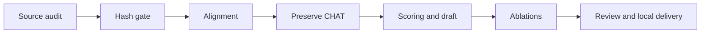

# Approved implementation amendment

User authorization: “Implement the plan.” Existing T1–T7 remain done. Work continues on the isolated run branch, preserving the four preexisting deleted task JSON mirrors.

| Task | Acceptance | State |
|---|---|---|
| T8 source audit | Pin both Batchalign3 repositories, Batchalign2, Chatter and Sherpa; distinguish defects from deliberate divergences | in progress |
| T9 hash gate | Approved digest required before decoding in run/transcribe; callers updated; redacted errors | in progress |
| T10 alignment | Ordered POS-specific morphology, correction/retrace projection, lexically corroborated positive %wor timings | queued |
| T11 tag preservation | Only morphology tiers change; original headers, main tiers, %wor, task boundaries and MED roster preserved | queued |
| T12 evaluation/draft | Spoken-domain scoring; separate provisional audio-grounded p002 draft and uncertainty queue | queued |
| T13 ablations | Main, compatibility and individual/combined Sherpa arms on approved p001/p002 channel 0 | queued |
| T14 local delivery | Fresh review, offline suite, Ruff, zero-skipped Chatter, commits and authorized local integration; user pushes | queued |

## Binding constraints

Hash-before-decode, explicit channel selection, native PCM, redacted provenance, Vietnamese surface integrity, lazy models and offline synthetic tests override weaker upstream behavior. No new models, downmix or spoken-content deletion. Preserve hypotheses flagged as suspicious repetition.

T9 produces the file contract consumed by experiment callers. T10 produces canonical members consumed by T11. T12 defines scoring consumed by T13. T1–T7 historical evidence is retained; corrective tests begin failing before production changes.

p001 is the primary accuracy reference; p002 scores are provisional. Spoken-domain scoring retains physically spoken fillers/retraces and removes CHAT annotation syntax. Delaware supplies formatting conventions only. Original corpus files remain unchanged. Private output goes to the approved external generated directory after tool write permission, with hashes checked before processing and publication.

Compare the same models/revisions/channels/references across main, compatibility, quiet-VAD, empty-retry, silence-cut and combined arms. Record uncapped CER/SyER/WER, coverage, invalid/missing timing, repetition flags, runtime and GPU memory. Promote only accuracy improvement with no p001 content, coverage or timing regression. Defer new model selection and word deletion.

Local delivery is authorized; remote PR/CI gates are waived for local integration, never recorded as passing without evidence. Auto merge opt-in remains false. Every workflow transition uses the runtime.

## Execution ledger

- Initial five-axis review recorded real findings; runtime checkpoint routed review → build at iteration 16.
- Ruling: use the existing feature branch rather than a second worktree; it already isolates main. Preserve unrelated deleted files.
- The proposed task-table update was rejected by the hook as direct run-state mutation, although it targeted task_lists. No database write occurred. Keep this amendment as the approved human-readable task record until a supported runtime task-writing interface is available.
