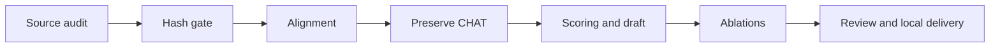

# Approved implementation amendment

User authorization: “Implement the plan.” Existing T1–T7 remain done. Work continues on the isolated run branch, preserving the four preexisting deleted task JSON mirrors.

| Task | Acceptance | State |
|---|---|---|
| T8 source audit | Pin both Batchalign3 repositories, Batchalign2, Chatter and Sherpa; distinguish defects from deliberate divergences | done |
| T9 hash gate | Approved digest required before decoding in run/transcribe; callers updated; redacted errors | done |
| T10 alignment | Ordered POS-specific morphology, correction/retrace projection, lexically corroborated positive %wor timings | done |
| T11 tag preservation | Only morphology tiers change; original headers, main tiers, %wor, task boundaries and MED roster preserved | done |
| T12 evaluation/draft | Spoken-domain scoring; separate provisional audio-grounded p002 draft and uncertainty queue | done |
| T13 ablations | Main, compatibility and individual/combined Sherpa arms on approved p001/p002 channel 0 | in progress |
| T14 local delivery | Fresh review, offline suite, Ruff, zero-skipped Chatter, commits and authorized local integration; user pushes | queued |

## Binding constraints

Hash-before-decode, explicit channel selection, native PCM, redacted provenance, Vietnamese surface integrity, lazy models and offline synthetic tests override weaker upstream behavior. No new models, downmix or spoken-content deletion. Preserve hypotheses flagged as suspicious repetition.

T9 produces the file contract consumed by experiment callers. T10 produces canonical members consumed by T11. T12 defines scoring consumed by T13. T1–T7 historical evidence is retained; corrective tests begin failing before production changes.

p001 is the primary accuracy reference; p002 scores are provisional. Spoken-domain scoring retains physically spoken fillers/retraces and removes CHAT annotation syntax. Delaware supplies formatting conventions only. Original corpus files remain unchanged. Private output goes to the approved external generated directory after tool write permission, with hashes checked before processing and publication.

Compare the same models/revisions/channels/references across main, compatibility, quiet-VAD, empty-retry, silence-cut and combined arms. Record uncapped CER/SyER/WER, coverage, invalid/missing timing, repetition flags, runtime and GPU memory. Promote only accuracy improvement with no p001 content, coverage or timing regression. Defer new model selection and word deletion.

Local delivery is authorized; remote PR/CI gates are waived for local integration, never recorded as passing without evidence. Auto merge opt-in remains false. Every workflow transition uses the runtime.

## Execution ledger

- Initial five-axis review recorded real findings; runtime checkpoint routed review → build at iteration 16.
- T9 commits a993c08, 27e0cd8, 551c4ff and 77d55bf. Initial RED: three new tests failed on missing API/flag. Focused GREEN: 74 hash/compare/study cases, Ruff passed. Independent review caught publication checks preceding morphology/features; two mutation tests now reject writes after those mutations. Scoped re-review approved spec and quality, with nine hash-gate tests independently passing. No passing full-suite claim is made yet.
- T10 initial commit c575d45: 90 focused tests and owned-file Ruff passed; broader transcription/CHAT suite exited zero. Independent review requested ordered-tier rejection and timed-replacement regression coverage. A new timed test then exposed identical replacement words retaining physical timing; correction is in progress. Untrusted wor is quarantined per utterance outside AnnotationLayer and restored only by serialization, so tag cannot consume its bullets.
- T10 follow-up 90d7a94: the timed regression first failed (92 passed, one failed), then all 93 focused cases and Ruff passed after clearing morphology-view timings. Independent scoped re-review approved. A child git approval waited approximately 620 seconds and was aborted during recovery; parent committed the verified fix centrally. Future workers prepare changes and parent owns staging/committing.
- Ruling: morphology projection carries no timing evidence; clear projected spans while preserving the original immutable words and record timing. This prevents identical-surface replacements from inheriting uncorroborated timing without adding mutable projection bookkeeping.
- Main baseline exported from commit 8a3a469ec7037fb5639b7c03e486af676995e618 into a separate temporary source tree; no private media copied or resampled audio written. Both pilot manifest rows select channel 0 and their approved hashes passed the new predecode gate. Cached model revisions: PhoWhisper-large b9136a44b5f2ca664bd0b8f74baecf1715f6eeeb; Qwen3-ASR bcd2b5b7f32b480ab5790554cfa8347f246a14f3.
- T8 independent source review passed after distinguishing Sherpa public threshold 0.2 from internal default 0.5. Exact pinned supporting-file links added. Chatter archive SHA-256 45d6695070b8b00fd65f09cb430959515139a357581f8cd44686ebfafc2fce31 matches its checksum; extracted bytes match archive and version is 0.28.0. Historical 11-test assertion will be replaced by fresh final validation evidence.
- Ruling: use the existing feature branch rather than a second worktree; it already isolates main. Preserve unrelated deleted files.
- The proposed task-table update was rejected by the hook as direct run-state mutation, although it targeted task_lists. No database write occurred. Keep this amendment as the approved human-readable task record until a supported runtime task-writing interface is available.
- T11: `cmd_tag` now rewrites only `%mor`/`%gra` byte ranges instead of regenerating a reviewed transcript, so headers, `@G` task boundaries, the MED roster, `%wor`, `%com` and every main tier survive verbatim. Five new cases in `tests/say_transcribe/test_tag_preservation.py` prove it; `without_morphology(result) == without_morphology(original)` compares the output against the input with only morphology blocks removed, and the untimed-input case proves a phase-1 draft can be tagged at all.
- T11 decode contract: an untimed draft is a legitimate phase-2 input, but every timing-dependent caller must keep rejecting one. `decode_chat` therefore gained `require_timing: bool = True`; only `cmd_tag` passes `False`. The two preexisting tests that pinned the strict contract (`test_chat_writer.py::test_untimed_utterance_preserves_text_without_fabricated_bullet`, `test_study_coverage.py::test_participant_utterance_without_a_bullet_fails_loudly`) were left untouched and pass unchanged, so the guard lives at one shared boundary rather than at each caller.
- T11 verification: full suite 1147 passed with zero skipped once a verified Chatter binary was restored; Ruff clean over `src` and `tests`. Chatter 0.28.0 was reinstalled under the already-ignored `.agent-state/tools/chatter-0.28.0/` after the archive's published SHA-256 matched (45d6695…) and `chatter --version` reported 0.28.0. `/tmp` is not usable for this: each tool call gets a fresh `/tmp`, and the sandbox denies writes outside the workspace, so the tool belongs inside `.agent-state/`.
- T12 scoring: `extract_session_items` now projects the main tier to the spoken domain with the shared `tier_roles` classifier — words, physically spoken fillers (`&-ờ` → `ờ`) and retraced words (`<tôi`/`đi>` → `tôi`/`đi`) are scored; `xxx`, nonword fragments, annotations and pauses are not. Replacement annotations are not merged into the reference on purpose, because the spoken surface is what an ASR hypothesis is compared against; they are reported instead.
- T12 uncertainty queue: the same pass returns redacted `{"utterance_index", "code"}` entries for `UNTRANSCRIBED_SPAN`, `REPLACEMENT_ANNOTATION`, `NONWORD_FRAGMENT` and `ZERO_DURATION_UTTERANCE`, deduplicated per utterance so one long span does not flood the queue, and `run_evaluation` aggregates them by code into its report. Six new cases in `tests/say_transcribe/test_evaluate.py` failed before the change and pass after; full suite 1153 passed, zero skipped, Ruff clean.
- T13 arm ruling: `get_speech_windows` gained `boost`, `retry` and `snap` keyword flags, each defaulting to the shipped behavior, so no existing caller changes. Raised with the user (option A: three ported behaviors as flags) and adopted with one correction — `main` is the shipped default and `combined` is the only arm with all three behaviors on, so the two are distinct. Had `snap` defaulted to `True` instead, `combined == main` would have held but the shipped `compare`/`preprocess-study` behavior would have silently changed and the historical study numbers would no longer be comparable. The lost self-check is replaced by a drift-guard test asserting `main`'s flags equal the live defaults of `get_speech_windows`.
- T13 layering: the silence snap now lives in `vad.py` (`_quietest_cut` plus `_SNAP_SEARCH_SAMPLES`/`_SNAP_FRAME_SAMPLES`/`_SNAP_HOP_SAMPLES`, moved from `asr.py`) because `asr.py` imports `vad.py` and the reverse would invert the dependency; `asr.py::_window_bounds` imports them back and its behavior is unchanged. The VAD cut loop is the only mid-word cut on the VAD path, so it is the only site where a silence-snap arm can differ. `study.py` exposes `read_reference` (was `_read_reference`) and `session_record(..., order=...)` so the ablation reuses the one scoring path instead of duplicating it.
- T13 arms: `src/say_transcribe/ablation.py` runs the six arms over a manifest with `study.verify_source` before and after each row (hash-before-decode kept), writes one private `records/<session>.json` per row through the existing `write_session_record` and a redacted `ablation.json`/`ABLATION.md` carrying no transcript text and no absolute paths. Recorded per arm: uncapped SyER/CER/WER, coverage, invalid/missing word timing, repetition flags, produced content and runtime; `device` plus `gpu_memory_bytes` are recorded with the run (the pinned revision is mandatory on the CLI, so an unattributable arm result cannot be produced). Promotion is refused unless the arm is strictly more accurate than `main` on p001 with no content, coverage or timing regression.
- T13 verification: 12 new cases in `tests/say_transcribe/test_ablation.py` and 4 in `tests/say_transcribe/test_vad.py` began RED (`ImportError: cannot import name 'ablation'`; `TypeError: get_speech_windows() got an unexpected keyword argument 'snap'`) and pass after implementation; full suite 1169 passed, zero skipped with a verified Chatter binary, Ruff clean over `src` and `tests`. `ruff format` was deliberately not applied: it rewraps pre-existing long lines across untouched code, so the change stays a minimal diff.
- T12 draft RED evidence: the first audio-grounded p002 draft (`.agent-state/…/experiment/rejected/p002.glued-punctuation.cha`) was rejected by `chatter validate` 0.28.0 with four E316 and two E342 findings. A probe that stripped exactly two glued sentence periods from the file removed every one of those findings, leaving only the file-name `@Media` mismatch, so the six findings had one cause rather than six.
- T12 draft fix: `_normalize_segment` is the single boundary both `transcribe()` and `result_from_windows()` already funnel through, so Whisper's glued sentence punctuation is stripped there, with `_ASR_EDGE_PUNCTUATION = ".,!?…"` — the same set the repetition guard already strips. One guard now covers the written main tier, the scorer's `segment.text` (`study.py:540`) and the word list at once. CHAT markup characters are deliberately excluded so `&-ờ` and `[/]` can never be reshaped. The glued period also counted as a phantom substitution, because `items_from_texts` only drops punctuation-only tokens; T12's real p002 numbers therefore change with this fix and no previously recorded number is invalidated, since no real p002 score had been produced yet.
- T12 draft fix verification: four new cases in `tests/say_transcribe/test_asr.py` and one end-to-end case in `tests/say_transcribe/test_chatter_validate.py` began RED (the three behaviour cases plus `assert 1 == 0` on `chatter validate`); two preexisting expectations that pinned the old raw text (`test_asr.py::test_short_valid_vietnamese_repeats_are_kept`, `test_pilot_variants.py::test_alignment_splits_after_asr_and_keeps_unalignable_text_untimed`) were updated, and their purposes — keeping valid Vietnamese repeats, keeping unalignable text untimed — are untouched. Full suite 1174 passed, zero skipped, Ruff clean.
- T12 draft delivered: regenerated with the fix, `chatter validate` 0.28.0 reports `Valid: 1 / Invalid: 0`, SHA-256 `03c15ff32587a71ab1896c1e235b3db781f9c1303d575cabd39edfd3172719a7`, 56 main-tier utterances (55 `*PAR`, 1 `*INV`), `%wor` present on every utterance, and the two `ASR_REPETITION_SUSPECTED` utterances are preserved rather than deleted, as the constraints require. The draft stays provisional on two recorded grounds: the WavLM diarizer collapsed a two-speaker interview into one speaker, and the ASR surface is visibly garbled in places (`siêu_nữ`, `nhàm`, `thu_xếp`). It is not published into the repository, because audio-grounded output belongs in the private generated directory.
- T12 uncertainty queue published beside the draft as `t12-uncertainty-queue.json`: p001 holds 21 entries (16 `NONWORD_FRAGMENT`, 3 `UNTRANSCRIBED_SPAN`, 2 `REPLACEMENT_ANNOTATION`) and p002 holds 7 (all `NONWORD_FRAGMENT`), each with its reference SHA-256, the manifest audio SHA-256 and a bare reference filename — no transcript text and no absolute path. The queue is the reviewer worklist for reference quality, which is exactly why p002's scores are provisional.
- T12 provisional p002 score (draft against the unreviewed p002 reference): uncapped SyER 0.3890 (752 edits / 1933 reference syllables), CER 0.3271 (1978 / 6047), WER 0.5391 (1042 / 1933), format pass rate 1.0. The clamped `run_evaluation` report is identical, so no rate was truncated by its `min(1.0, …)`. Its `der`, `pos`, `uas` and `las` fields are structurally absent evidence — the draft carries no speaker structure and was transcribed with `--no-morphosyntax` — and are not read as results.
- T13 attribution fix: `_session_summary` copied `asr_revision` out of the manifest row, so a run pinned to a different revision would have reported a revision it never used. The record now carries the run's pinned revision next to the `asr_model` the run already attributed. The new assertion began RED (`assert 'vinai/phowhisper-large' == 'bbbbbbbb…'`), then full suite 1174 passed with zero skipped and Ruff clean.
- T13 run configuration ruling: `phowhisper-medium` at revision `55a7e3eb6c906de891f8f06a107754427dd3be79`, which is the revision the historical pilot study is recorded under at `output/CODE-REVIEW-AND-RUN-REPORT-2026-09-25.md:305`, so the arm numbers sit directly beside recorded baseline numbers while still satisfying the requirement that every arm share one pinned model revision.
- T13 execution environment recorded with the numbers, which is what the historical C-3 finding asked for: this host has **no usable NVIDIA driver** (`nvidia-smi` cannot communicate with it), so every arm ran on `--device cpu`, while the 2026-09-25 study this revision comes from ran on an RTX 5070 12 GB with `--device cuda` at 516-519 s per audio-hour. `runtime_s` is therefore an order of magnitude larger here and is comparable only *between arms of this run*, never against that study's runtime column. A measured probe of the pinned revision puts one 20 s window at 14.4 s wall at 24 threads (real-time factor 0.72) and 16.5 s at 4 threads (0.82), so CPU threading is not a lever: the decoder is sequential and the fixed per-window cost dominates the cost of audio seconds.
- A probe file written under `/tmp` does not survive between shell calls — every call gets a fresh `--tmpfs /tmp` — so throwaway scripts must live in the workspace or be piped to the interpreter on stdin.
- T13 structural finding, measured directly from `arm_windows` over both approved masters: on **p001 all six arms select identical windows** — 134 windows covering 400.6 s of 1040.6 s (38.5 %) — and on **p002 four of the six do**, with `silence-cut` and `combined` sharing one different set (5 boundaries moved, same 111 windows covering 437.0 s of 983.4 s). The behaviors are inert for a measurable reason, not an untested one: p001 peaks at 0.1067 and p002 at 0.4935, both above `vad.py`'s `_BOOST_PEAK = 0.071`, so the quiet-audio boost never fires; the first Silero pass already returns 226 bounded spans on p001 and 263 on p002, so the empty-retry pass never fires; and after the 0.7 s merge rule plus 30 ms padding p001's longest span is 19.5 s with none over the 20 s `_MAX_WINDOW_SAMPLES` cap, so the silence snap is structurally unreachable there. Only p002 has spans long enough to hit the cap (longest 43.6 s, two over 20 s), which is why p002 is the one session where the snap arm can change the ASR input at all.
- T13 arms therefore reduce from twelve decodes to **three distinct decodes** (p001 once, p002 twice), and the runner now detects that instead of recomputing it. Each arm's windows are computed once, keyed by the window tuple, and a later arm whose windows are identical reuses the earlier arm's decode, recording `reused_from` on the arm and in its rendered line, so the report stays honest about which runtimes are separate measurements. `run_arm` gained an optional `windows` keyword so the caller that already selected them does not select them twice. The new assertion that the stub backend is called once rather than six times began RED with `assert 6 == 1 where 6 = len([32480, 32480, 32480, 32480, 32480, 32480])`, then 12 ablation cases and 19 VAD cases passed with Ruff clean.
- T13 per-window cost measured on four consecutive real p001 windows with the pinned revision: 142.1 s (18.5 s window, 150 chars), 71.4 s (16.2 s, 156), 64.7 s (14.9 s, 157) and 106.6 s (2.9 s, 56) — median 106.6 s, mean 96.2 s. The cost tracks how much text a window yields, because word-timestamp extraction is sequential and per-token; VAD itself measured real-time factor 0.02. A single p001 pass is therefore hours on this CPU host, which is why the superseded six-arm run was stopped rather than left to finish five provably redundant decodes.
- T13 run restarted with reuse detection as the authoritative run; the superseded run's partial work is discarded because the runner writes no partial record, and its first arm would have had to be recomputed by the new run in any case.
