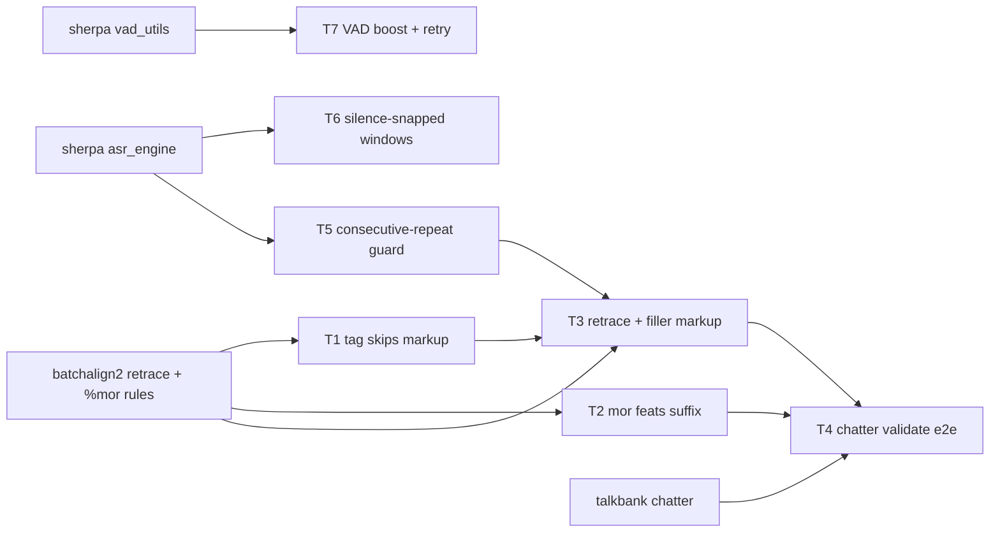

# Research: batchalign2 gaps and sherpa-vietnamese-asr techniques for say_transcribe

## Sources

1. [TalkBank/batchalign2](https://github.com/TalkBank/batchalign2) — Python baseline (`retrace.py`, `whisper_fa.py` read; `disfluencies.py` only a thin wrapper).
2. [TalkBank/batchalign](https://github.com/TalkBank/batchalign) — current Batchalign3 (Rust plus Python); named in AGENTS.md as a baseline.
3. [FranklinChen/talkbank-tools](https://github.com/FranklinChen/talkbank-tools) — also Batchalign3 now; its README says CHAT parsing, validation and serialization moved to a separate `chatter` repo.
4. [welcomyou/sherpa-vietnamese-asr](https://github.com/welcomyou/sherpa-vietnamese-asr) — Vietnamese CPU-first ASR app; README, `core/config.py`, `core/asr_engine.py`, `core/vad_utils.py`, `core/audio_preprocessing.py`, `core/punctuation_restorer_improved.py` read.
5. [sherpa `core/vad_utils.py`](https://github.com/welcomyou/sherpa-vietnamese-asr/blob/HEAD/core/vad_utils.py) — VAD defaults, quiet-audio boost to -23 dBFS peak, retry at threshold 0.3 and min speech 150 ms.
6. [sherpa `core/asr_engine.py`](https://github.com/welcomyou/sherpa-vietnamese-asr/blob/HEAD/core/asr_engine.py) — silence-snapped chunk cuts (±2 s, RMS < 0.01 for 0.3 s), overlap merge, disabled n-gram repeat removal.

## Facts

- **Both baseline URLs are Batchalign3 now.** The Python reference for retracing and forced alignment is batchalign2. Local clones do not exist; the repo only holds text maps under `docs/2026-09-21/repo-map/1/`.
- **batchalign2 leaves markup out of %mor.** Retraced material, fillers, `xxx` and annotations do not appear in `%mor`; `say_transcribe tag` currently sends every token, including `[/]`, `&-ờ`, `xxx`, `[: x]`, to Stanza (`cli.py::_reviewed_records`), and `chat.py::_item_kind` splits on whitespace so `<a`, `b>` and `[:` come out as words.
- **batchalign2 marks retraces by n-gram matching** (`NgramRetraceEngine`) and fillers as `&-`-prefixed tokens; this repo only reads those markers (`speech_features/formats/chat.py`) and never writes them.
- **`MorItem.format_mor` emits raw UD feats** after `-`; `Key=Val|Key=Val` adds extra `|` characters that break the `pos|lemma` shape of `%mor`.
- **sherpa VAD.** Defaults threshold 0.2, min silence 100 ms, min speech 250 ms; a copy of quiet audio is boosted to a -23 dBFS peak (0.071) for VAD only; if no speech is found it retries with threshold 0.3 and min speech 150 ms.
- **sherpa chunking.** About 30 s chunks; each cut moves to the middle of the nearest silent region within ±2 s (RMS < 0.01, at least 0.3 s), falling back to the plain cut.
- **sherpa repetition handling.** `remove_repeated_ngrams` exists but is deliberately disabled because it deleted valid Vietnamese repeats such as "một một bảy".
- **Repo pilot gates.** VAD coverage 87.6% vs target 95%; 54 of 386 spans had zero or negative duration; one "hai" x55 loop still got past `_is_suspected_repetition` (`output/PILOT-COMPARISON-REPORT-2026-09-24.md`, `REVIEW-2026-09-24.md`).
- **Not portable.** Mono downmix (AGENTS.md forbids it), filler deletion (CHAT keeps fillers), NaturalTurn backchannel absorption (would drop INV backchannels), ROVER, Zipformer and the GECToR punctuation model (new model stack).

## Applicability

| Source | Technique | Verdict |
| --- | --- | --- |
| batchalign2 | leave retraces, fillers, `xxx`, annotations out of %mor | reuse (T1) |
| batchalign2 | feats as CHAT suffixes | reuse (T2) |
| batchalign2 | n-gram retrace and filler marking | reuse, Vietnamese filler list added (T3) |
| talkbank `chatter` | validate generated CHAT | reuse as an e2e check (T4) |
| sherpa | consecutive-repeat awareness, no n-gram deletion | reuse as a consecutive-run guard (T5) |
| sherpa | silence-snapped chunk cuts | reuse, capped at 20 s (T6) |
| sherpa | quiet-audio VAD boost and retry | reuse (T7) |
| sherpa | mono downmix, filler removal, backchannel absorption | reject |
| sherpa | ROVER, Zipformer, GECToR punctuation, overlap separation | gap: new model stack, out of scope |
| batchalign2 | `align` command re-timing an edited .cha, number expansion | gap: separate work |

## Refine

- Keep the two-phase workflow: markup is added in the main tier of `run` drafts; `tag` consumes the reviewed file and never edits it.
- Mark, never delete: every content word stays in `%wor` with its timing.
- Cap snapped windows at 20 s; the GPU attention-cache ceiling in `asr.py` still holds.
- Boost audio for VAD detection only; ASR input and the native audio on disk are untouched.
- Reproduce the "hai" x55 leak with a test before changing the guard, because the likely cause is where the check runs, not its threshold.

## UNVERIFIED

- The exact filler output form of batchalign2 (`&-um` style) was not seen in code; it comes from prior knowledge of batchalign2. T3 checks it against the `chatter` grammar via T4 before relying on it.
- The batchalign2 feats-to-suffix mapping in `ud.py` was not read; T2 reads it before porting.
- Sherpa reports no WER or CER numbers, so no accuracy gain is claimed from its techniques; the gain is measured locally against the 2026-09-24 pilot gates.

## Unresolved questions

None that block the build. The UNVERIFIED items above are each resolved inside the task that depends on them.

## Final digest

Fix the two `tag` correctness bugs first, then add retrace and filler markup, validate with `chatter`, and port three small sherpa techniques (VAD boost with retry, silence-snapped windows, consecutive-repeat guard). Everything is a small, testable change inside `say_transcribe`; larger model swaps from sherpa are rejected or deferred.
