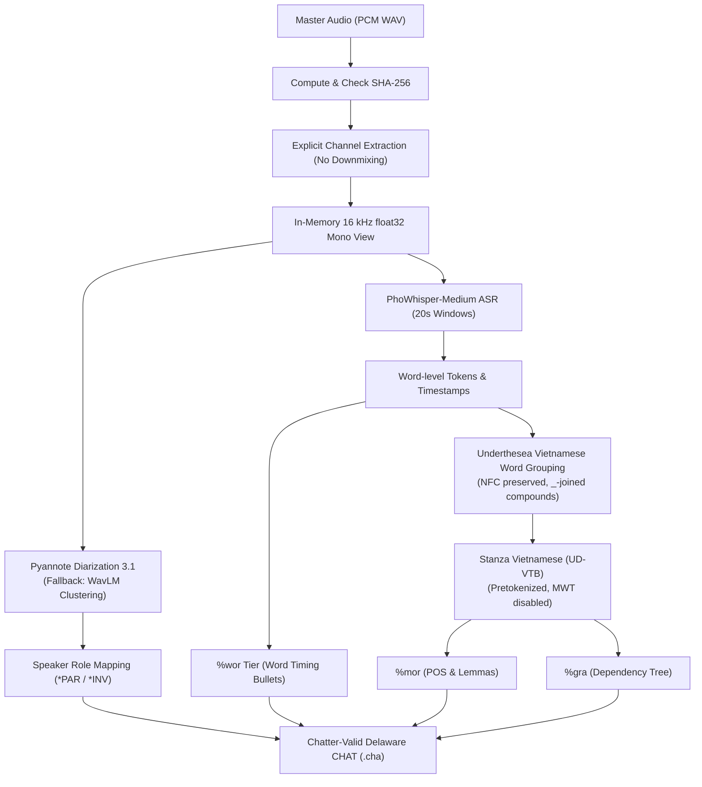

# SAY Automated Transcription (`src/say_transcribe/`)

The **`say_transcribe`** package provides an automated, clinical-grade Vietnamese transcription and tier serialization pipeline adhering to the TalkBank Batchalign and DementiaBank Delaware CHAT formats.

It generates standard Chatter-valid `.cha` transcripts with:
- **Main speaker tiers** (`*PAR:`, `*INV:`) with millisecond timestamp bullets (`•start_ms_end_ms•`).
- **Word alignment tier** (`%wor:`) with word-level start/end timestamps.
- **Morphological tier** (`%mor:`) with Universal Dependencies (UD) part-of-speech tags and preserved Vietnamese compound lemmas.
- **Grammatical dependency tier** (`%gra:`) with head indices and syntactic dependency relations.

---

## 1. Architecture & Models



### Models Used

| Stage | Model / Library | Checkpoint / Authority | Role |
|---|---|---|---|
| **ASR & Word Timing** | **PhoWhisper-medium** | [`vinai/phowhisper-medium`](https://huggingface.co/vinai/phowhisper-medium) | 20s-windowed inference, repetition loop heuristic guard, word timestamps |
| **Speaker Diarization** | **Pyannote Audio 3.1** | [`pyannote/speaker-diarization-3.1`](https://huggingface.co/pyannote/speaker-diarization-3.1) | Multi-speaker diarization for participant vs investigator clustering |
| **Diarization Fallback** | **WavLM Embedding Cluster** | [`microsoft/wavlm-base-plus-sv`](https://huggingface.co/microsoft/wavlm-base-plus-sv) | Ungated fallback clustering when Pyannote token/access is unavailable |
| **Word Segmentation** | **Underthesea** | `underthesea>=6.8.0` | Vietnamese compound word grouping (`_`-joined), preserves tones, NFC, $d/đ$ |
| **Morphosyntax & Syntax** | **Stanza Vietnamese** | `stanza` (`UD-VTB` treebank) | Pretokenized UPOS tagging (`%mor`) and dependency parsing (`%gra`) |
| **VAD (Research Spike)** | **Silero VAD** | `silero-vad[onnx-cpu]==6.2.3` | Speech activity detection for ASR windowing (`say-transcribe compare`) |
| **CTC Alignment (Spike)** | **Wav2Vec2 Vietnamese CTC** | [`nguyenvulebinh/wav2vec2-base-vi-vlsp2020`](https://huggingface.co/nguyenvulebinh/wav2vec2-base-vi-vlsp2020) | High-resolution forced alignment (`say-transcribe compare`) |

---

## 2. Source Code Modules

| Module | Description | Key Functions & Classes |
|---|---|---|
| [`audio.py`](file:///home/ducvu/Heigat-home/project/speech-analysis-for-you/src/say_transcribe/audio.py) | Audio I/O, strict channel selection, and in-memory resampling | `read_wav()`, `extract_channel()`, `resample_to_16kHz()` |
| [`asr.py`](file:///home/ducvu/Heigat-home/project/speech-analysis-for-you/src/say_transcribe/asr.py) | PhoWhisper transcription, repetition guard, segment normalization | `transcribe()`, `PhoWhisperBackend`, `compute_sha256()` |
| [`vad.py`](file:///home/ducvu/Heigat-home/project/speech-analysis-for-you/src/say_transcribe/vad.py) | Silero VAD detection and greedy window merging for ASR chunking | `get_speech_windows()`, `merge_asr_windows()` |
| [`diarize.py`](file:///home/ducvu/Heigat-home/project/speech-analysis-for-you/src/say_transcribe/diarize.py) | Diarization execution, WavLM fallback, and PAR/INV role assignment | `assign_speakers()`, `PyannoteBackend`, `WavlmClusterBackend` |
| [`alignment.py`](file:///home/ducvu/Heigat-home/project/speech-analysis-for-you/src/say_transcribe/alignment.py) | Wav2Vec2 CTC forced alignment for fine word timestamp boundaries | `align_words()`, `_Wav2Vec2Backend` |
| [`word_grouping.py`](file:///home/ducvu/Heigat-home/project/speech-analysis-for-you/src/say_transcribe/word_grouping.py) | Underthesea tokenization, multi-syllable word grouping, span aggregation | `group_utterance_words()`, `GroupedWord` |
| [`morphosyntax.py`](file:///home/ducvu/Heigat-home/project/speech-analysis-for-you/src/say_transcribe/morphosyntax.py) | Stanza UD-VTB projection into `%mor` and `%gra` format strings | `project_morphosyntax()`, `StanzaBackend`, `UtteranceMorphosyntax` |
| [`chat_writer.py`](file:///home/ducvu/Heigat-home/project/speech-analysis-for-you/src/say_transcribe/chat_writer.py) | Serialization of Chatter-valid Delaware-style CHAT format | `format_chat_session()`, `write_chat_file()` |
| [`evaluate.py`](file:///home/ducvu/Heigat-home/project/speech-analysis-for-you/src/say_transcribe/evaluate.py) | Evaluation metrics: CER, WER, SyER, and DER with bootstrap resampling | `run_evaluation()`, `evaluate_pair()`, `levenshtein()` |
| [`cli.py`](file:///home/ducvu/Heigat-home/project/speech-analysis-for-you/src/say_transcribe/cli.py) | Command-line interface with stable error codes | `main()`, `cmd_run()`, `cmd_compare()`, `cmd_evaluate()` |

---

## 3. CLI Usage

```bash
# 1. Diagnose environment and model availability
say-transcribe diagnose

# 2. Transcribe a master WAV file on a specific channel
say-transcribe run session_001.wav --channel 0 --out output/ --device cuda

# 3. Compare baseline vs VAD-guided vs CTC-aligned variants
say-transcribe compare session_001.wav --channel 0 --out comparison/ \
  --expected-sha256 <64-char-hex-hash> --device cuda

# 4. Evaluate generated transcripts against gold annotations
say-transcribe evaluate gold_transcripts/ predicted_transcripts/ --out eval_report.json
```
