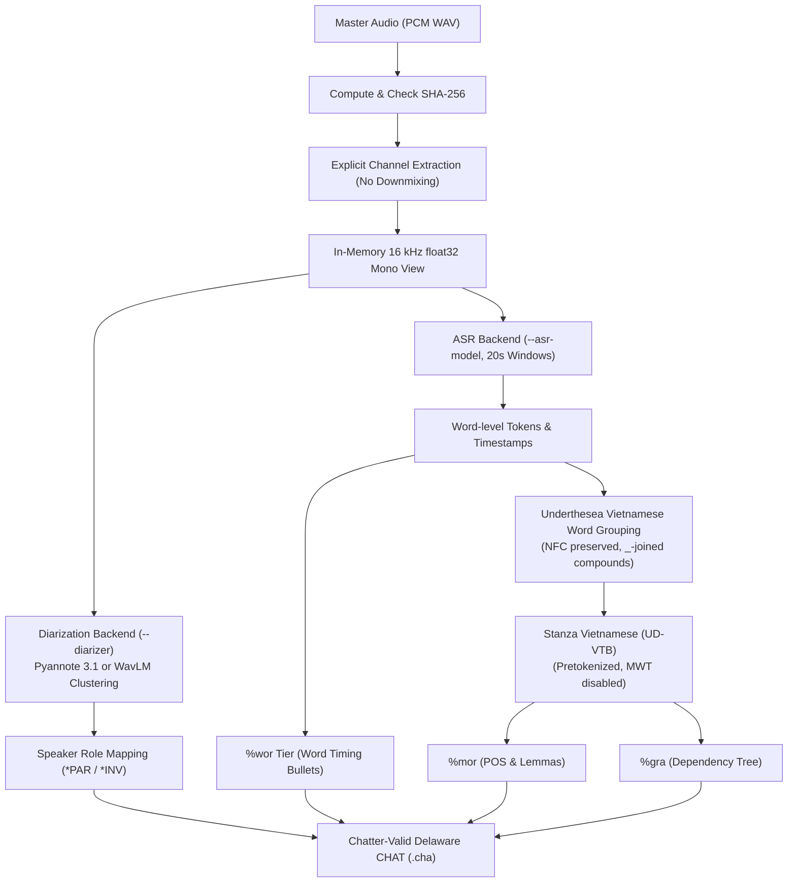

# SAY Automated Transcription (`src/say_transcribe/`)

The **`say_transcribe`** package provides an automated, clinical-grade Vietnamese transcription and tier serialization pipeline adhering to the TalkBank Batchalign and DementiaBank Delaware CHAT formats.

It generates standard Chatter-valid `.cha` transcripts with:
- **Main speaker tiers** (`*PAR:`, `*INV:`) with millisecond timestamp bullets (`•start_ms_end_ms•`).
- **Word alignment tier** (`%wor:`) with word-level start/end timestamps.
- **Morphological tier** (`%mor:`) with Universal Dependencies (UD) part-of-speech tags and preserved Vietnamese compound lemmas.
- **Grammatical dependency tier** (`%gra:`) with head indices and syntactic dependency relations.

Output is a **draft**. Human review is strictly required before `speech_features` consumes it — see [Transcript automation and validation boundary](../../README.md#transcript-automation-and-validation-boundary).

---

## 1. Architecture & Models


```mermaid
flowchart TD
    WAV["Master Audio (PCM WAV)"] --> HASH["Compute & Check SHA-256"]
    HASH --> CH["Explicit Channel Extraction (No Downmixing)"]
    CH --> RESAMP["In-Memory 16 kHz float32 Mono View"]
    
    RESAMP --> ASR["ASR Backend (--asr-model, 20s Windows)"]
    ASR --> WORDS["Word-level Tokens & Timestamps"]
    
    RESAMP --> DIAR["Diarization Backend (--diarizer)\nPyannote 3.1 or WavLM Clustering"]
    DIAR --> SPK["Speaker Role Mapping (*PAR / *INV)"]
    
    WORDS --> GROUP["Underthesea Vietnamese Word Grouping\n(NFC preserved, _-joined compounds)"]
    
    GROUP --> STANZA["Stanza Vietnamese (UD-VTB)\n(Pretokenized, MWT disabled)"]
    STANZA --> MOR["%mor (POS & Lemmas)"]
    STANZA --> GRA["%gra (Dependency Tree)"]
    
    WORDS --> WOR["%wor Tier (Word Timing Bullets)"]
    
    SPK & WOR & MOR & GRA --> CHAT["Chatter-Valid Delaware CHAT (.cha)"]
```

### Models Used

| Stage | Model / Library | Checkpoint / Authority | Role |
|---|---|---|---|
| **ASR & Word Timing** | **PhoWhisper-medium** (default) | [`vinai/phowhisper-medium`](https://huggingface.co/vinai/phowhisper-medium) | 20s-windowed inference, repetition loop heuristic guard, word timestamps |
| **ASR (alternative)** | **PhoWhisper-large** | [`vinai/phowhisper-large`](https://huggingface.co/vinai/phowhisper-large) | Larger PhoWhisper; the pinned ASR arm in both benchmark tasks |
| **ASR (alternative)** | **Qwen3-ASR** | [`Qwen/Qwen3-ASR-1.7B-hf`](https://huggingface.co/Qwen/Qwen3-ASR-1.7B-hf) | Transformers-native multimodal checkpoint. **Has no Vietnamese forced aligner**, so segments carry text with *null* word timings — scoring is text-based and unaffected |
| **Speaker Diarization** | **Pyannote Audio 3.1** (default) | [`pyannote/speaker-diarization-3.1`](https://huggingface.co/pyannote/speaker-diarization-3.1) | Multi-speaker diarization for participant vs investigator clustering; requires an accepted-conditions Hugging Face token |
| **Diarization (alternative)** | **WavLM Embedding Cluster** | [`microsoft/wavlm-base-plus-sv`](https://huggingface.co/microsoft/wavlm-base-plus-sv) | Ungated clustering fallback, selectable via `--diarizer wavlm` |
| **Word Segmentation** | **Underthesea** | `underthesea>=6.8.0` | Vietnamese compound word grouping (`_`-joined), preserves tones, NFC, $d/đ$ |
| **Morphosyntax & Syntax** | **Stanza Vietnamese** | `stanza` (`UD-VTB` treebank) | Pretokenized UPOS tagging (`%mor`) and dependency parsing (`%gra`) |
| **VAD (Research Spike)** | **Silero VAD** | `silero-vad[onnx-cpu]==6.2.3` | Speech activity detection for ASR windowing (`say-transcribe compare`) |
| **CTC Alignment (Spike)** | **Wav2Vec2 Vietnamese CTC** | [`nguyenvulebinh/wav2vec2-base-vi-vlsp2020`](https://huggingface.co/nguyenvulebinh/wav2vec2-base-vi-vlsp2020) | High-resolution forced alignment (`say-transcribe compare`) |

**ASR and diarization are explicit selections, never implicit fallbacks.**
`--asr-model {phowhisper-medium,phowhisper-large,qwen3-asr}` defaults to
`phowhisper-medium`; `--diarizer {pyannote,wavlm}` defaults to `pyannote`. When
pyannote cannot run, the CLI reports the stable code `PYANNOTE_TOKEN_MISSING`
and exits `3` — it does not silently swap in a different diarizer, because a
quiet backend change would change the study arm.

---

## 2. Source Code Modules

| Module | Description | Key Functions & Classes |
|---|---|---|
| [`__init__.py`](__init__.py) | Package entry point; re-exports the audio contract so the pipeline is usable without the CLI | `read_wav()`, `extract_channel()`, `resample_to_16kHz()`, `Audio`, `AudioPreparationError` |
| [`audio.py`](audio.py) | Audio I/O, strict channel selection, and in-memory resampling | `read_wav()`, `extract_channel()`, `resample_to_16kHz()` |
| [`asr.py`](asr.py) | ASR backend factory and transcription, repetition guard, segment normalization | `transcribe()`, `make_asr_backend()`, `ASR_MODEL_CHOICES`, `PhoWhisperBackend`, `Qwen3AsrBackend`, `compute_sha256()` |
| [`vad.py`](vad.py) | Silero VAD detection and greedy window merging for ASR chunking | `get_speech_windows()`, `merge_asr_windows()` |
| [`diarize.py`](diarize.py) | Diarization execution, WavLM fallback, and PAR/INV role assignment | `assign_speakers()`, `PyannoteBackend`, `WavlmClusterBackend` |
| [`alignment.py`](alignment.py) | Wav2Vec2 CTC forced alignment for fine word timestamp boundaries | `align_words()`, `_Wav2Vec2Backend` |
| [`word_grouping.py`](word_grouping.py) | Underthesea tokenization, multi-syllable word grouping, span aggregation | `group_utterance_words()`, `GroupedWord` |
| [`morphosyntax.py`](morphosyntax.py) | Stanza UD-VTB projection into `%mor` and `%gra` format strings | `project_morphosyntax()`, `StanzaBackend`, `UtteranceMorphosyntax` |
| [`chat_writer.py`](chat_writer.py) | Serialization of Chatter-valid Delaware-style CHAT format | `format_chat_session()`, `write_chat_file()` |
| [`evaluate.py`](evaluate.py) | Evaluation metrics: CER, WER, SyER, and DER with bootstrap resampling | `run_evaluation()`, `score_uncapped()`, `compute_der()`, `items_from_texts()`, `levenshtein()` |
| [`manifest.py`](manifest.py) | Study manifest loading. Rows are private inputs: errors name **row indexes and field names only**, never values, paths, or transcript content | `load_manifest()`, `load_denoiser_specs()`, `ManifestRow`, `ManifestError` |
| [`profile.py`](profile.py) | The P0 preprocessing profile: zero-phase 200 Hz–3.4 kHz band-pass → 8 kHz → FFmpeg `libgsm` round trip → 16 kHz → two-pass EBU R128 `loudnorm` (`linear=true, I=-23, TP=-1, LRA=50`). All intermediates stay in memory or pipes; **nothing is written to disk and the master audio is never touched** | `bandpass_narrowband()`, `gsm_roundtrip()`, `loudnorm_two_pass()`, `ProfileResult`, `LoudnessReport` |
| [`denoise.py`](denoise.py) | Denoiser dispatch to subprocess workers in isolated, pinned environments. Never imports torch/torchaudio/DeepFilterNet and never touches the network | `denoise_pcm()`, `DenoiserSpec`, `DenoiseError` |
| [`workers/`](workers/README.md) | Standalone worker scripts plus the numpy-only chunking math that makes them testable offline | `chunk_bounds()`, `overlap_add()` |
| [`study.py`](study.py) | Opt-in preprocessing A/B study: manifest-driven arms (N0 baseline, N1 `vad_asr`, P0 profile, PF/PD denoise), coverage scoring, and per-arm records. **Re-implements no ASR, VAD, or DSP stage** — arms reuse the exact `compare` code paths | `verify_source()`, `prepare_views()`, `compute_vad_arm()`, `reference_intervals()`, `StudyError` |
| [`benchmark.py`](benchmark.py) | ASR and diarization benchmark against reference transcripts. Every report row carries a pseudonymous session id, scores, and stable error codes only — **never paths, transcript text, or raw exception details** | `run_asr_benchmark()`, `run_diarization_benchmark()`, `render_markdown()`, `write_report()` |
| [`cli.py`](cli.py) | Command-line interface with stable error codes | `main()`, `build_parser()`, `cmd_diagnose()`, `cmd_run()`, `cmd_tag()`, `cmd_compare()`, `cmd_evaluate()`, `cmd_preprocess_study()`, `cmd_benchmark()` |

---

## 3. CLI Usage

```bash
# 1. Diagnose environment and model availability
say-transcribe diagnose

# 2. Transcribe a master WAV file on a specific channel
say-transcribe run session_001.wav --channel 0 --out output/ --device cuda

# 3. Choose the ASR model and the diarizer explicitly
say-transcribe run session_001.wav --channel 0 --out output/ --asr-model qwen3-asr

# 4. Compare baseline vs VAD-guided vs CTC-aligned variants
say-transcribe compare session_001.wav --channel 0 --out comparison/ \
  --expected-sha256 <64-char-hex-hash> --device cuda

# 5. Evaluate generated transcripts against gold annotations
say-transcribe evaluate gold_transcripts/ predicted_transcripts/ --out eval_report.json

# 6. Benchmark ASR models or diarization backends over a study manifest
say-transcribe benchmark --task asr --manifest manifest.json --out reports/
say-transcribe benchmark --task diarization --manifest manifest.json --out reports/
```

### Two-phase transcription

`%mor`/`%gra` describe the *reviewed* text, so they can be deferred until after
hand-correction: transcribe without them, review the main tiers, then tag.

```bash
# Phase 1: main tiers + %wor only (Stanza never loads)
say-transcribe run session_001.wav --channel 0 --out draft/ --no-morphosyntax

# ... hand-correct speakers and text in draft/session_001.cha ...

# Phase 2: add %mor/%gra to the corrected transcript (writes a new file)
say-transcribe tag draft/session_001.cha --out final/session_001.cha
```

`compare` accepts `--no-morphosyntax` too, and `tag` refuses to overwrite an
existing file. `%wor` word timings carried by the draft survive into the tagged
transcript.

### Benchmark reports

`benchmark` scores against reference transcripts and writes
`benchmark-<task>.json` plus a readable `benchmark-<task>.md`:

| Task | Arms compared | Notes |
|---|---|---|
| `asr` | `phowhisper-large`, `qwen3-asr` | Pinned to `phowhisper-large` for the comparison even though the CLI default stays `phowhisper-medium` |
| `diarization` | `pyannote`, `wavlm` | Both diarizers run over one fixed `phowhisper-large` ASR front-end, so the numbers isolate the diarization variable |

Each row's source audio SHA-256 is verified first (`SOURCE_HASH_MISMATCH`
otherwise), unmapped diarization clusters score as `UNKNOWN` rather than being
attributed to `PAR`, and every failure is recorded as a stable code. Models are
released between arms — two coexisting backends OOM the shared GPU (measured
crash at 6.6 GiB).

### Exit codes

| Code | Meaning |
|---|---|
| `0` | Success |
| `2` | Usage / argument error |
| `3` | Environment or model unavailable (`GPU_UNAVAILABLE`, `MODEL_UNAVAILABLE`, `PYANNOTE_TOKEN_MISSING`) |
| `4` | Pipeline failure |

Codes `3` and `4` print **static** messages only. A backend's own message is
never surfaced because it may carry private details.

---

## 4. Related

- [Feature extraction package](../speech_features/README.md) — the consumer of a *reviewed* transcript
- [Denoise workers](workers/README.md) — the isolated-environment worker contract
- [Repository README](../../README.md) — installation, outputs, and development
